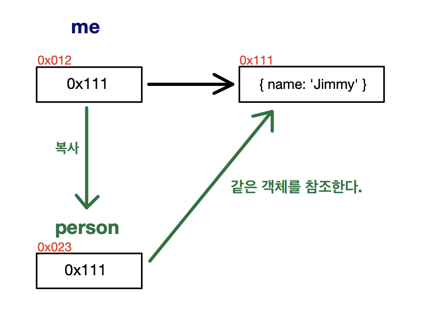

## 11.2 객체

- 프로퍼티
  - 동적으로 추가되고 삭제할 수 있음
  - 프로퍼티의 값은 제약이 없음
- 객체 공간의 크기는 사전에 정해 둘 수 없음
- 객체의 관리 방식
  - 해시 테이블과 유사한 방식으로 프로퍼티를 관리하지만, 일반적인 해시 테이블 보다 나은 방법으로 객체를 구현 함
  - 일반적인 클래스 기반의 객체지향 언어에서는 프로퍼티를 동적으로 추가/삭제하는 것이 불가능
  - 자바스크립트의 경우는 동적으로 프로퍼티를 추가/삭제 할 수 있지만, 생성과 접근에 더 많은 비용이 든다.
  - V8 엔진에서는 프로퍼티에 접근하기 위해 동적 탐색 대신에 `히든 클래스`라는 방식을 사용해서 높은 성능을 낸다.
    -  https://engineering.linecorp.com/ko/blog/v8-hidden-class/

### 11.2.1 변경 가능한 값

객체(참조) 타입의 값, 즉 객체는 변경 가능한 값이다.

- 원시 타입 값을 할당한 변수 : 변수가 가리키는 메모리 공간 자체에 값이 담겨 있음
- 참조 타입 값을 할당한 변수 : 변수가 가리키는 메모리 공간에는 실제 참조될 객체가 있는 주소 메모리 공간 값을 가지고 있음
  - 실제 참조될 객체의 메모리 공간 주소를 `참조 값`  이라 함
  - 객체를 할당한 변수를 참조하면, 메모리에 저장되어 있는 참조 값을 통해 실제 객체에 접근


- 원시 값은 변경이 불가능하기 때문에 변수의 값을 변경하기 위해 재할당을 해야함 

- 객체는 변경 가능한 값이기 때문에 변수의 값을 변경시에 재할당이 필요 없음

  - 즉, 재할당 없이 프로퍼티를 동적으로 추가/삭제/갱신 할 수 있음
  - 프로퍼티를 변경하더라도 객체를 할당한 변수의 참조 값은 변경되지 않음

- 객체는 값을 변경 할 수 있기 때문에 성능적으로는 유리하지만, 부작용도 있다.

  - 여러개의 식별자가 하나의 객체를 공유할 수 있기 때문에 문제가 발생함

  

  - 얕은 복사 : 얕은 복사는 객체가 중첩되어 있어도 한 단계까지만 복사를 함

  - 깊은 복사 : 깊은 복사는 중첩되어 있는 객체까지 모두 복사함

    ```js
    const o = {x: {y: 1}};
    
    //shallow copy
    const c1 = { ...o };
    console.log(o === c1) // false
    console.log(o.y === c1.y) // true
    
    //shallow copy
    const c2 = _.cloneDeep(o);
    console.log(o === c2) // false
    console.log(o.y === c2.y) // false
    ```

  - 얕은 복사와 깊은 복사 모두 원복 객체와는 다른 객체이다

  - 프로퍼티로 중첩된 객체가 존재한다면, 얕은 복사의 경우 중첩된 객체에 대해서는 원본과 같은 객체를 가리킨다.

### 11.2.2 참조에 의한 전달

여러개의 식별자가 하나의 객체를 공유할 떄 생길 수 있는 부작용

```js
var me = {
  name: 'Jimmy'
};
var person = me; // shallow copy
```



- me가 참조하는 객체의 참조 값(객체의 메모리 주소)을 person에 할당함

- 즉, me와 person은 같은 객체를 참조하게 됨

- 같은 객체를 공유할 경우, 한 쪽에서 객체의 프로퍼티를 변경하면 서로 영향을 받게 됨

  ```js
  var me = {
    name: 'Jimmy'
  };
  
  var person = me; // shallow copy
  
  console.log(me === person); // true
  
  me.name = "Jordy";
  person.address = "Seoul";
  
  console.log(me); // {name: : "Jordy", address : "Seoul"}
  console.log(person); // {name: : "Jordy", address : "Seoul"}
  ```

- 참조에 의한 전달은 사실, 값에 의한 전달과 동일함
  - 객체가 저장되어 있는 주소를 복사한다는 차이점만 빼면 똑같은 매커니즘으로 복사가 이루어짐
  - 즉, 자바스크립트에는 사실 참조에 의한 전달은 존재하지 않고, 값에 의한 전달 만이 존재한다고 볼 수 있다.
  - 공유에 의한 전달이라고 표현하는 경우도 있음
