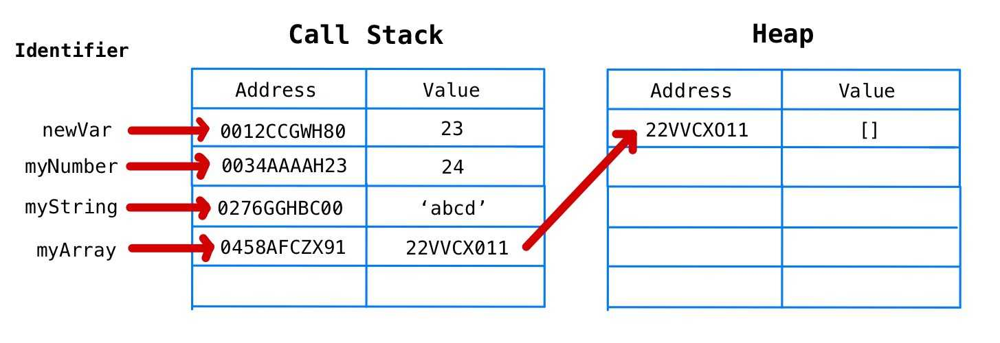
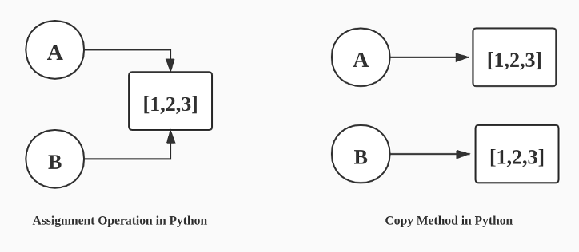

## 11.2 객체

- 프로퍼티
  - 동적으로 추가되고 삭제할 수 있음
  - 프로퍼티의 값은 제약이 없음
- 객체 공간의 크기는 사전에 정해 둘 수 없음
- 객체의 관리 방식
  - 해시 테이블과 유사한 방식으로 프로퍼티를 관리하지만, 일반적인 해시 테이블 보다 나은 방법으로 객체를 구현 함
  - 일반적인 클래스 기반의 객체지향 언어에서는 프로퍼티를 동적으로 추가/삭제하는 것이 불가능
  - 자바스크립트의 경우는 동적으로 프로퍼티를 추가/삭제 할 수 있지만, 생성과 접근에 더 많은 비용이 든다.
  - V8 엔진에서는 프로퍼티에 접근하기 위해 동적 탐색 대신에 `히든 클래스`라는 방식을 사용해서 높은 성능을 낸다.
    -  https://engineering.linecorp.com/ko/blog/v8-hidden-class/

### 11.2.1 변경 가능한 값

객체(참조) 타입의 값, 즉 객체는 변경 가능한 값이다.

- 원시 타입 값을 할당한 변수 : 변수가 가리키는 메모리 공간 자체에 값이 담겨 있음
- 참조 타입 값을 할당한 변수 : 변수가 가리키는 메모리 공간에는 실제 참조될 객체가 있는 주소 메모리 공간 값을 가지고 있음
  - 실제 참조될 객체의 메모리 공간 주소를 `참조 값`  이라 함
  - 객체를 할당한 변수를 참조하면, 메모리에 저장되어 있는 참조 값을 통해 실제 객체에 접근



- 원시 값은 변경이 불가능하기 때문에 변수의 값을 변경하기 위해 재할당을 해야함 

- 객체는 변경 가능한 값이기 때문에 변수의 값을 변경시에 재할당이 필요 없음

  - 즉, 재할당 없이 프로퍼티를 동적으로 추가/삭제/갱신 할 수 있음
  - 프로퍼티를 변경하더라도 객체를 할당한 변수의 참조 값은 변경되지 않음

- 객체는 값을 변경 할 수 있기 때문에 성능적으로는 유리하지만, 부작용도 있다.

  - 여러개의 식별자가 하나의 객체를 공유할 수 있기 때문에 문제가 발생함

  

  - 얕은 복사 : 얕은 복사는 객체가 중첩되어 있어도 한 단계까지만 복사를 함

  - 깊은 복사 : 깊은 복사는 중첩되어 있는 객체까지 모두 복사함

    ```js
    const o = {x: {y: 1}};
    
    //shallow copy
    const c1 = { ...o };
    console.log(o === c1) // false
    console.log(o.y === c1.y) // true
    
    //shallow copy
    const c2 = _.cloneDeep(o);
    console.log(o === c2) // false
    console.log(o.y === c2.y) // false
    ```

  - 얕은 복사와 깊은 복사 모두 원복 객체와는 다른 객체이다

  - 프로퍼티로 중첩된 객체가 존재한다면, 얕은 복사의 경우 중첩된 객체에 대해서는 원본과 같은 객체를 가리킨다.

### 11.2.2 참조에 의한 전달

여러개의 식별자가 하나의 객체를 공유할 떄 생길 수 있는 부작용

```js
var me = {
  name: 'Jimmy'
};

var person = me; // shallow copy
```


- me가 참조하는 객체의 참조 값(객체의 메모리 주소)을 person에 할당함

- 즉, me와 person은 같은 객체를 참조하게 됨

- 같은 객체를 공유할 경우, 한 쪽에서 객체의 프로퍼티를 변경하면 서로 영향을 받게 됨

  ```js
  var me = {
    name: 'Jimmy'
  };
  
  var person = me; // shallow copy
  
  console.log(me === person); // true
  
  me.name = "Jordy";
  person.address = "Seoul";
  
  console.log(me); // {name: : "Jordy", address : "Seoul"}
  console.log(person); // {name: : "Jordy", address : "Seoul"}
  ```

- 참조에 의한 전달은 사실, 값에 의한 전달과 동일함
  - 객체가 저장되어 있는 주소를 복사한다는 차이점만 빼면 똑같은 매커니즘으로 복사가 이루어짐
  - 즉, 자바스크립트에는 사실 참조에 의한 전달은 존재하지 않고, 값에 의한 전달 만이 존재한다고 볼 수 있다.
  - 공유에 의한 전달이라고 표현하는 경우도 있음

# 12. 함수

## 12.1 함수란?

함수 : 입력을 받아 출력을 내보내는 일련의 과정을 정의한 것

```js
function add(x,y) {
  return x+y;
}

add(2,5);
```

- add : 함수이름
- x,y : 매개변수
- x+y : 반환값
- function {~} : 함수 정의
- add(2,5) : 함수 호출

함수를 정의하고, 함수 이름으로 인수를 매개변수를 통해 함수에 전달하여 함수를 호출하고, 함수는 정의된 대로 동작한 후 값을 반환한다.

## 12.2 함수를 사용하는 이유

- 코드의 재사용성 : 동일한 기능을 하는 경우 코드를 중복으로 작성하지 않고 함수를 호출하면 됨
- 유지보수의 편의성 : 기능을 수정할 경우 함수 하나만 수정하면 됨
- 코드의 신뢰성 : 실수가 줄어듦
- 코드의 가독성 : 코드를 읽지 않고 함수이름만 보고도 기능을 유추할 수 있음

## 12.3 함수 리터럴

- 자바스크립트의 함수는 객체

- 함수도 객체 처럼 함수 리터럴로 생성할 수 있음

- 함수 리터럴

  function 키워드, 함수 이름, 매개변수 목록, 함수 몸체로 구성

  ```js
  // 변수에 함수 리터럴을 할당
  var f = function add(x, y) {
    return a+b;
  };
  ```

- 함수 리터럴 구성 요소

  - 함수 이름
    - 식별자 네이밍 규칙을 준수
    - 함수 이름은 함수 몸체 내에서만 촘조할 수 있는 식별자
    - 함수 이름은 생략가능하고, 이름이 있는 함수를 기명함수, 없는 함수를 무명/익명 함수라 함
  - 매개변수 목록
    - 0개 이상의 매개변수를 소괄호로 감싸고 쉼표로 구분
    - 순서에 의미가 있다.
    - 매개변수는 함수 몸체 내에서 변수와 동일하게 취급
  - 함수 몸체
    - 함수가 호출되었을 때 일괄적으로 실행될 문들을 하나의 실행단위로 정희한 코드 블록
    - 함수 몸체는 함수 호출에 의해 실행됨

- 리터럴은 값을 생성하기 위한 표기법으로, 함수 리터럴도 평가되어 값을 생성하고, 이 값은 객체가 된다. 즉, 함수는 객체이다.

- 함수는 객체이면서 일반적인 객체와는 다르다.

  - 객체는 호출할 수 없지만, 함수는 호출할 수 있음
  - 함수만의 고유한 프로퍼티가 존재함

## 12.4 함수 정의

함수를 정의하는 4가지 방법이 있음

- 함수 선언문 : `function add(x, y) { return x + y; }`
- 함수 표현식 : ` var add = function (x, y) { return x + y; };`
- Function 생성자 함수 : `var add  = new Function('x', 'y', 'return x + y');
- 화살표 함수(ES6) : `var add = (x, y) => x + y`

함수 정의 방식에 따른 미묘한 차이가 존재한다.

### 12.4.1 함수 선언문

```js
//함수 선언문
function add(x, y) {
  return x + y;
}

// 함수 참조 cf. console.dir 은 함수 객체의 프로퍼티까지 출력함
console.dir(add); // f add(x, y)

// 함수 호출
console.dir(add(2, 5)); // 7
```

함수 선언문은 함수 리터럴과 형태가 동일함

- 단, 함수 리터럴은 함수 이름을 생략할 수 있으나 함수 선언문은 함수 이름을 생략할 수 없음

`함수 선언문은 표현식이 아닌 문이다.` 

- 크롬 개발자 도구의 콘솔에서 함수 선언문 작성하면, 완료 값으로  `undefined`가 출력된다. 함수 선언문이 만약 표현식인 문이라면 완료 값 undefiend 대신 표현식이 평가되어 생성된 함수가 출력되어야 함

- 표현식인 문과 표현식이 아닌문의 차이는, 변수의 할당 가능 여부이고, 표현식만이 변수에 할당이 가능하다. 하지만 아래는 함수 선언문이 변수에 할당되는 것 처럼 보인다.

  ```js
  var add = function add(x, y) {
    return x + y;
  };
  
  console.dir(add(2, 5)); // 7
  ```

  이렇게 동작하는 이유는 자바스크립트 엔진이 코드의 문맥에 따라 동일한 함수 리터럴을 다르게 해석하기 떄문이다. 즉, 위의 경우에는 문맥상 함수 선언문으로 판단하기 보다는 `함수 리터럴` 로 판단하고 있는 것이다.

  기명 함수 리터럴은 이처럼 중의적인 코드이다. 변수에 할당되면 함수 리터럴 표현식으로 해석되고, 단독으로 쓰이면 함수 선언문으로 해석된다.

  이 둘은 함수를 생성하는 내부 동작에서 차이가 존재한다.

  ```js
  // 함수 선언문 (함수 이름 생략 불가능)
  function foo() { console.log('foo') }
  foo(); // foo
  
  // 함수 리터럴 : 함수 리터럴을 피연산자로 사용하면 함수 선언문이 아닌 함수 리터럴 표현식으로 해석됨 (함수 이름 생략 가능)
  (function bar() { console.log('bar'); });
  bar(); // ReferenceError: bar is not defined
  ```

  - 소괄호 안에서 함수 리터럴은 함수 리터럴 표현식으로 해석됨. (그룹 연산자의 피연사자는 값으로 평가될 수 있는 표현식이어야 함)
  - 왜 foo는 호출이 되고, bar는 호출이 안될까?
    - 함수 리터럴에서의 "함수 이름은 `함수 몸체` 내에서만 참조할 수 있는 식별자"라고 했는데, 이는 함수 외부에서는 함수 이름을 참조할 수 없다는 의미이다. 즉, bar 함수를 호출할 수 없다.
    - 그렇다면, foo는 어떻게 식별자가 생성이 되었을까? 이는 자바스크립트 엔진이 암묵적으로 식별자를 생성해주기 때문이다. 자바스크립트 엔진은 함수 선언문으로 함수를 생성하면, 함수 이름으로 변수를 만들어주고 함수 객체를 참조하도록 참조 값을 할당한다.

### 12.4.2 함수 표현식

자바스크립트의 함수는 일급객체 => 즉, 변수에 할당이 가능하다.

- 리터럴로 생성한 함수 객체를 변수에 할당

  ```js
  var add = function(x,y) {
    return x + y;
  }
  ```

  - 함수 표현식의 함수 리터럴은 함수 이름을 생략하는 것이 일반적임

함수 선언문과 함수 표현식이 유사하게 보이지만, 둘 사이에는 큰 차이점이 있다.

### 12.4.3 함수 생성 시점과 함수 호이스팅

```js
//함수 참조
console.dir(add); // f add(x,y)
console.dir(sub); // undefined

//함수 호출
console.dir(add(2, 5)); // 7
console.dir(sub(2, 5)); // TypeError: sub is not a function

//함수 선언문
function add(x,y) {
  return x + y;
}

//함수 표현식
var sub = function (x,y) {
  return x - y;
};
```

- 함수 선언문은 호이스팅이 되고, 함수 표현식은 호이스팅 되지 않는다.
  - 함수 호이스팅 : 함수 선언문이 코드 선두로 끌어 올려진 것처럼 동작하는 자바스크립트 고유의 특징
    - cf 변수 호이스팅 : var로 선언된 변수는 최상위로 올라가서 undefined로 초기화 된다. 
  - 함수 선언문으로 정의한 함수와 함수 표현식으로 정의한 함수의 생성 시점이 다르기 때문
- 함수 선언문 : 런타임 이전에 함수 객체가 먼저 생성
- 함수 표현식 : 변수에 할당문의 값은 할당문이 실행되는 시점, 즉 런타임에 평가가 되기 때문에 함수 객체가 미리 생성되지 않는다.
  - 다면, var로 선언되었기에 변수 호이스팅은 발생한다.

`함수 선언문 대신에 함수 표현식을 쓰는 것이 좋다. 함수가 선언되기 이전에 함수를 사용할 수 있게 되는 것은 문제를 야기 할 수 있고 예상치 못한 결과를 내는 코드가 될 수 있다.`

### 12.4.4 Function 생성자 함수

- 자바 스크립트의 기본 빌트인 함수인 Function 생성자 함수에 매개변수 목록과 함수 몸체를 문자열로 전달하면서 new 연산자와 함께 호출하면 함수 객체를 생성해서 반환함

  ```js
  var add = new Function('x', 'y', 'return x + y');
  
  console.log(add(2,5)); // 7
  ```

  - Function 생성자 함수로 함수를 생성하는 방식은 일반적이지 않으며, 권장되지도 않음

  - Function 생성자 함수로 함수를 생성하면, 클로저를 생성하지 않음

    ```js
    var add1 = (function() {
      var a = 10;
      return function(x, y) {
        return x + y + a;
      }
    }());
    
    console.log(add1(1,2)) // 13
    
    var add2 = (function() {
      var a = 10;
      return new Function('x', 'y', 'return x + y + a;');
    }());
    
    console.log(add1(1,2)) // ReferenceError: a is not defined
    ```

### 12.4.5 화살표 함수

- ES6에서 도입된 화살표 함수는 function 키워드 대신 화살표 `=>` 를 사용해 좀 더 간략한 방법으로 함수를 선언할 수 있다.

  ```js
  const add = (x,y) => x + y;
  console.log(add(2,3)); // 5
  ```

- 기존의 함수 선언문, 함수 표현식을 완전히 대체하기 위해 디자인 된 것은 아님

- 화살표 함수는 표현뿐만 아니라, 내부 동작 또한 간략화 되어 있어 차이가 존재한다.

  - 화살표 함수는 생성자 함수로 사용할 수 없음
  - this 바인딩 방식이 기존 함수와는 다름
  - prototype 프로퍼티가 없음
  - arguments 객체를 생성하지 않음

