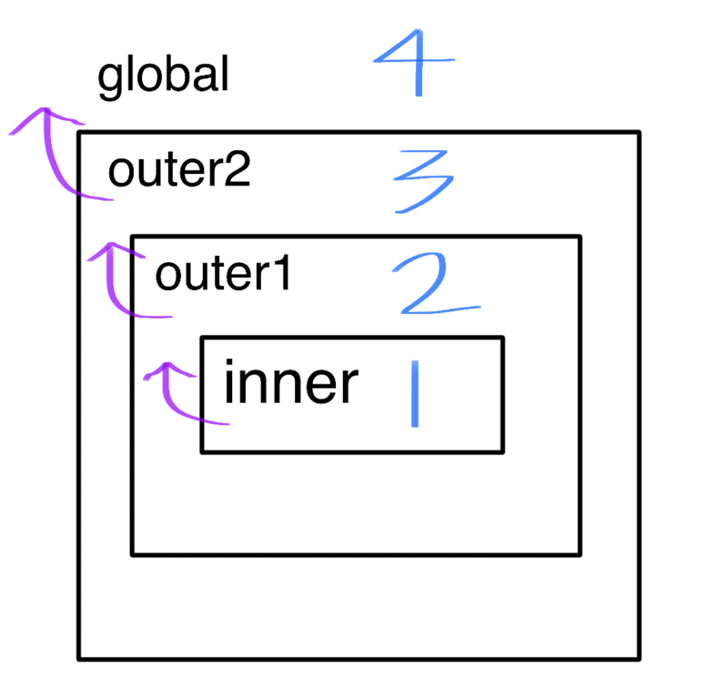

# 13 스코프

## 13.1 스코프란?

스코프는 유효범위. 

함수의 매개변수는 함수 내부에서만 참조 가능하고 외부에선 참조가 불가능하였다. 이게 바로 스코프!

```javascript
var var1 = 1; // 코드의 가장 바깥 영역에서 선언한 변수

if(true){
  var var2 = 2; // 코드 블록 내에서 선언한 변수
  if(true){
    var var3 = 3; // 중첩된 코드 블록 내에서 선언한 변수
  }
}

function foo() {
  var var4 = 4; // 함수 내에서 선언한 변수
  function bar(){
   var var5 = 5; // 중첩된 함수 내에서 선언한 변수
  }
}

console.log(var1); // 1
console.log(var2); // 2
console.log(var3); // 3
console.log(var4); // Reference Error: var4 is not defined
console.log(var5); // Reference Error: var5 is not defined
```

모든 식별자(변수 이름, 함수 이름, 클래스 이름 등) **자신이 선언된 위치에 의해 다른 코드가 식별자 자신을 참조할 수 있는 유효범위**가 결정된다. 이를 **스코프**라 한다.


```javascript
var x = 'global';

function foo(){
  var x = 'local';
  console.log(x); // 1)
}
foo();
console.log(x); // 2)
```

1)과 2)는 똑같은 x 변수를 참조한다.

자바스크립트 엔진은 이름이 같은 두 개의 변수중에 어떤 변수를 참조해야 할 것인지를 결정해야 한다. 이를 **식별자 결정**이라한다.

따라서 스코프는 **자바스크립트 엔진이 식별자를 검색할 때 사용하는 규칙**이다.

스코프의 개념이 없다면 같은 이름을 갖는 변수는 충돌을 일으키기 때문에 프로그램에서 하나밖에 사용할 수 없다.

프로그래밍 언어에서는 스코프를 통해 식별자인 변수 이름의 충돌을 방지하여 같은 이름의 변수를 사용할 수 있게 한다.

즉 스코프는 **네임스페이스**다.


### 13.2 스코프의 종류

코드는 전역과 지역으로 구분 가능하다.

이때 변수는 자신이 선언된 위치에 따라 자신이 유효한 범위인 스코프가 결정된다.

전역에서 선언된 변수 => 전역 스코프를 갖는 전역 변수

지역에서 선언된 변수 => 지역 스코프를 갖는 지역 변수

### 13.2.1 전역과 전역 스코프

전역이란 코드의 가장 바깥 영역을 의미한다. 전역은 전역 스코프를 만든다.

전역에서 선언된 변수는 **어디서든지 참조가능**하다.


### 13.2.2 지역과 지역 스코프

지역이란 **함수 몸체 내부**를 의미한다. 지역은 지역 스코프를 만든다.

지역 변수는 **자신의 지역 스코프와 하위 스코프에서 유효하다.**


## 13.3 스코프 체인

함수 몸체 내부에서 함수가 정의된 것을 '함수의 중첩'이라 한다.

함수는 중첩될 수 있으므로 함수의 지역 스코프도 중첩될 수 있다. 이느 **스코프가** **함수의 중첩에 의해 계층적 구조**를 갖는다.



이렇게 스코프가 계층적으로 연결된 것을 **스코프 체인**이라 한다.

**변수를 참조할 때 자바스크립트 엔진은 스코프 체인을 통해 변수를 참조하는 코드의 스코프에서 시작하여 상위 스코프 방향으로 이동하며 선언된 변수를 검색한다.**

스코프 체인은 물리적인 실체로도 존재하는데 자바스크립트 엔진은 코드를 실행하기 앞서 렉시컬 환경을 실제로 생성하여 번수 선언이 실행되면 변수 식별자가 자료구조에 키로 등록되고, 변수 할당이 일어나면 변수 식별자에 해당하는 값을 변경한다. 변수의 검색도 이 렉시컬 환경에서 이루어진다.

**자바스크립트는 상위 스코프에서 유효한 변수는 하위 스코프에서 자유롭게 참조할 수 있지만 하위 스코프에서 유효한 변수를 상위 스코프에서 참조할 수 없다!**


### 13.3.2 스코프 체인에 의한 함수 검색

```javascript
function foo() {
  console.log('global function foo');
}

function bar(){
  // 중첩 함수
  function foo(){
    console.log('local function foo');
  }
  foo(); // 1)
}

bar();
```

1)에서 함수를 호출하면 함수 내부의 foo가 실행된다. 이는 내부 스코프에서 먼저 식별자를 검색 후에 찾았기 때문이다.

따라서 스코프를 "**식별자를 검색하는 규칙**" 이라 표현할 수 있다.


## 13.4 함수 레벨 스코프

지역스코프는 코드 블록이 아닌 **함수에 의해서 지역 스코프가 생성**된다.

javascript에서는 **var 키워드로 선언된 변수는 오로지 함수의 코드블록(함수 몸체)만을 지역스코프로 인정**한다.

이러한 특성을 **함수 레벨 스코프**라 한다.

var는 함수 레벨 스코프이기 때문에 전역 변수의 값을 재할당시킨다. 그렇기 때문에 다음과 같은 현상이 발생한다.

```javascript
var x = 1;
if(true){
  var x = 10;
}

console.log(x); // 10

var i = 10;

for(var i = 0; i < 5; i++){
  console.log(i); // 0 1 2 3 4
}

console.log(i); // 5
```


## 13.5 렉시컬 스코프

```
var x = 1;
function foo(){
 var x = 10;
 bar();
}

function bar(){
  console.log(x);
}

foo(); // ?
bar(); // ?
```

위 예제의 실행 결과는 bar 함수의 상위 스코프가 무엇인지에 따라 결정된다.

2가지로 예측 가능한데, 

1. **함수를 어디서 호출했는지**에 따라 함수 상위 스코프를 결정한다.
2. **함수를 어디서 정의했는지**에 따라 함수 상위 스코프를 결정한다.

첫번째 방식은 동적 스코프라 한다. 함수를 정의하는 시점에서는 언제 호출할 지 알수 없기 때문에 함수가 호출되는 시점에 동적으로 상위 스코프를 결정하는 방식이다.

두번째 방식은  렉시컬 스코프 또는 정적 스코프라 한다. 함수 정의가 평가되는 시점에 상위 스코프가 정적으로 결정되기 때문에 정적 스코프라 부른다.

자바스크립트는 **렉시컬 스코프**를 따르므로 함수를 어디서 호출했는지가 아니라 **함수를 어디서 정의했는지**에 따라 상위 스코프를 결정한다. 함수가 호출된 위치는 상위 스코프 결정에 어떠한 영향도 주지 않는다. 즉, **함수의 상위 스코프는 언제나 자신이 정의된 스코프**이다.

예에서 bar함수가 호출되면 호출된 곳이 어디인지 관계없이 자신이 기억하고 있는 전역 스코프를 상위 스코프로 사용한다.

렉시컬 스코프는 클로저와 깊은 관계가 있다.