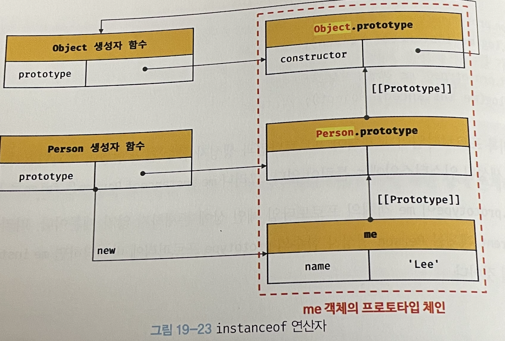
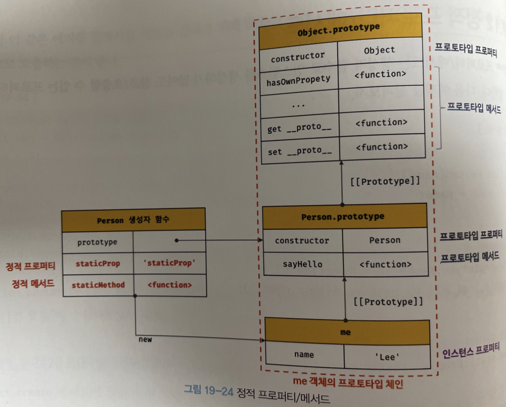

## 19.10 instanceof 연산자

```js
객체 instanceof 생성자 함수
```

- 우변의 피연산자가 함수가 아닌경우 TypeError  발생
- 

**우변의 생성자 함수의 prototype에 바인딩된 객체가 좌변의 객체의 프로토타입 체인 상에 존재하면 true, 그렇지 않은 경우 false로 평가**

```js
// 생성자 함수
function Person(name) {
  this.name = name;
}

const me = new Person('Lee');

// Person.prototype이 me 객체의 프로토타입 체인 상에 존재하므로 true로 평가된다.
console.log(me instanceof Person); // true

// Object.prototype이 me 객체의 프로토타입 체인 상에 존재하므로 true로 평가된다.
console.log(me instanceof Object); // true
```


**프로토 타입 교체**

```js
// 생성자 함수
function Person(name) {
  this.name = name;
}

const me = new Person('Lee');

// 프로토타입으로 교체할 객체
const parent = {};

// 프로토타입의 교체
Object.setPrototypeOf(me, parent);

// Person 생성자 함수와 parent 객체는 연결되어 있지 않다.
console.log(Person.prototype === parent); // false
console.log(parent.constructor === Person); // false

// Person.prototype이 me 객체의 프로토타입 체인 상에 존재하지 않기 때문에 false로 평가된다.
console.log(me instanceof Person); // false

// Object.prototype이 me 객체의 프로토타입 체인 상에 존재하므로 true로 평가된다.
console.log(me instanceof Object); // true
```

- me 객체는 프로토타입이 교체되어, 프로토타입과 생성자 함수 간의 연결이 파괴되었지만 Person 생성자 함수에 의해 생성된 인스턴스임에는 틀림 없음

- 그러나, me instanceof Person은 false로 평가됨

- 이는 me객체의 프로토타입 체인 상에 Person.prototype이 존재하지 않기 떄문임

- 만약, parent 객체를 Person 생성자 함수의 prototpye 프로퍼티에 바인딩 하면,  me instanceof Person은 true로 평가 됨

  ```js
  // 생성자 함수
  function Person(name) {
    this.name = name;
  }
  
  const me = new Person('Lee');
  
  // 프로토타입으로 교체할 객체
  const parent = {};
  
  // 프로토타입의 교체
  Object.setPrototypeOf(me, parent);
  
  // Person 생성자 함수와 parent 객체는 연결되어 있지 않다.
  console.log(Person.prototype === parent); // false
  console.log(parent.constructor === Person); // false
  
  // parent 객체를 Person 생성자 함수의 prototype 프로퍼티에 바인딩한다.
  Person.prototype = parent;
  
  // Person.prototype이 me 객체의 프로토타입 체인 상에 존재하므로 true로 평가된다.
  console.log(me instanceof Person); // true
  
  // Object.prototype이 me 객체의 프로토타입 체인 상에 존재하므로 true로 평가된다.
  console.log(me instanceof Object); // true
  ```

  - 이처럼 instanceof 연산자는 프로토타입의 constructor 프로퍼티가 가리키는 생성자 함수를 찾는 것이 아니라, 생성자 함수의 prototype에 바인딩된 객체가 프로토타팁 체인 상에 존재하는지 확인함



- me instance Person의 경우  me 객체의 프로토타입 체인 상에 Person.prototype에 바인딩된 객체가 존재하는지 확인함
- me instance Obejct의 경우도 마찬가지


**instanceof 연산자를 함수로 구현해보기**

```js
function isInstanceof(instance, constructor) {
  // 프로토타입 취득
  const prototype = Object.getPrototypeOf(instance);

  // 재귀 탈출 조건
  // prototype이 null이면 프로토타입 체인의 종점에 다다른 것이다.
  if (prototype === null) return false;

  // 프로토타입이 생성자 함수의 prototype 프로퍼티에 바인딩된 객체라면 true를 반환한다.
  // 그렇지 않다면 재귀 호출로 프로토타입 체인 상의 상위 프로토타입으로 이동하여 확인한다.
  return prototype === constructor.prototype || isInstanceof(prototype, constructor);
}

console.log(isInstanceof(me, Person)); // true
console.log(isInstanceof(me, Object)); // true
console.log(isInstanceof(me, Array));  // false
```


**생성자 함수에 의해 프로토타입이 교체되어 constructor 프로퍼티와 생성자 함수 간의 연결이 파괴되어도 생성자 함수의 prototpye 프로퍼티와 프로토타입 간의 연결은 파괴되지 않으므로 instanceof는 아무런 영향을 받지 않음**

```js
const Person = (function () {
  function Person(name) {
    this.name = name;
  }

  // 생성자 함수의 prototype 프로퍼티를 통해 프로토타입을 교체
  Person.prototype = {
    sayHello() {
      console.log(`Hi! My name is ${this.name}`);
    }
  };

  return Person;
}());

const me = new Person('Lee');

// constructor 프로퍼티와 생성자 함수 간의 연결은 파괴되어도 instanceof는 아무런 영향을 받지 않는다.
console.log(me.constructor === Person); // false

// Person.prototype이 me 객체의 프로토타입 체인 상에 존재하므로 true로 평가된다.
console.log(me instanceof Person); // true
// Object.prototype이 me 객체의 프로토타입 체인 상에 존재하므로 true로 평가된다.
console.log(me instanceof Object); // true
```


## 19.11 직접 상속 

### 19.11.1 Object.create에 의한 직접 상속

**Object.create 메서드는 명시적으로 프로토타입을 지정하여 새로운 객체를 생성함**

- Object.create 메서드도 다른 객체 생성 방식과 마찬가지로 추상 연산 `OrdinaryObjectCreate` 를 호출함
  - 매개변수 : (생성할 객체의 프로토타입, 생성할 객체의 프로퍼티 키와 프로퍼티 디스크립터 객체로 이뤄진 객체)
  - 두 번쨰 인수는 생략 가능

```js
// 프로토타입이 null인 객체를 생성한다. 생성된 객체는 프로토타입 체인의 종점에 위치한다.
// obj → null
let obj = Object.create(null);
console.log(Object.getPrototypeOf(obj) === null); // true
// Object.prototype을 상속받지 못한다.
console.log(obj.toString()); // TypeError: obj.toString is not a function

// obj → Object.prototype → null
// obj = {};와 동일하다.
obj = Object.create(Object.prototype);
console.log(Object.getPrototypeOf(obj) === Object.prototype); // true

// obj → Object.prototype → null
// obj = { x: 1 };와 동일하다.
obj = Object.create(Object.prototype, {
  x: { value: 1, writable: true, enumerable: true, configurable: true }
});
// 위 코드는 다음과 동일하다.
// obj = Object.create(Object.prototype);
// obj.x = 1;
console.log(obj.x); // 1
console.log(Object.getPrototypeOf(obj) === Object.prototype); // true

const myProto = { x: 10 };
// 임의의 객체를 직접 상속받는다.
// obj → myProto → Object.prototype → null
obj = Object.create(myProto);
console.log(obj.x); // 10
console.log(Object.getPrototypeOf(obj) === myProto); // true

// 생성자 함수
function Person(name) {
  this.name = name;
}

// obj → Person.prototype → Object.prototype → null
// obj = new Person('Lee')와 동일하다.
obj = Object.create(Person.prototype);
obj.name = 'Lee';
console.log(obj.name); // Lee
console.log(Object.getPrototypeOf(obj) === Person.prototype); // true
```

- 장점
  - new 연산자 없이 객체 생성
  - 프로토타입을 지정하면서 객체를 생성할 수 있음
  - 객체 리터럴에 의해 생성된 객체도 상속받을 수 있음


**Obejct.prototype의 빌트인 메서드인 hasOwnProperty, isPrototypeOf, propertyIsEnumerable 등은 모든 객체가 상속받아 호출할 수 있음**

```js
const obj = { a: 1 };

obj.hasOwnProperty('a');       // -> true
obj.propertyIsEnumerable('a'); // -> true
19-53
```


**ESLint에서는 Obejct.prototype의 빌트인 메서드를 객체가 직접 호출하는 것을 권장하지 않음**

- Object.create 메서드를 통해 프로토타입 체인의 종점에 위치하는 객체를 생성할 수 있기 때문에, 그런 경우에는 Obejct.prototpye의 빌트인 메서드를 사용할 수 없음

```js
// 프로토타입이 null인 객체, 즉 프로토타입 체인의 종점에 위치하는 객체를 생성한다.
const obj = Object.create(null);
obj.a = 1;

console.log(Object.getPrototypeOf(obj) === null); // true

// obj는 Object.prototype의 빌트인 메서드를 사용할 수 없다.
console.log(obj.hasOwnProperty('a')); // TypeError: obj.hasOwnProperty is not a function
```


**Obejct.protoype의 빌트인 메서드는 다음과 같이 간접적으로 호출하는 것이 좋음**

```js
// 프로토타입이 null인 객체를 생성한다.
const obj = Object.create(null);
obj.a = 1;

// console.log(obj.hasOwnProperty('a')); // TypeError: obj.hasOwnProperty is not a function

// Object.prototype의 빌트인 메서드는 객체로 직접 호출하지 않는다.
console.log(Object.prototype.hasOwnProperty.call(obj, 'a')); // true
```


### 19.11.2 객체 리터럴 내부에서 `__proto__` 에 의한 직접 상속

**ES6에서 객체 리터럴 내부에서 `__proto__` 접근자 프로퍼티를 사용하여 직접 상속을 구현할 수 있음**

```js
const myProto = { x: 10 };

// 객체 리터럴에 의해 객체를 생성하면서 프로토타입을 지정하여 직접 상속받을 수 있다.
const obj = {
  y: 20,
  // 객체를 직접 상속받는다.
  // obj → myProto → Object.prototype → null
  __proto__: myProto
};
/* 위 코드는 아래와 동일하다.
const obj = Object.create(myProto, {
  y: { value: 20, writable: true, enumerable: true, configurable: true }
});
*/

console.log(obj.x, obj.y); // 10 20
console.log(Object.getPrototypeOf(obj) === myProto); // true
```


## 19.12 정적 프로퍼티/메서드

**정적(static) 프로퍼티/메서드는 생성자 함수로 인스턴스 생성없이, 참조/호출할 수 있는 프로퍼티/메서드 이다.**

```js
// 생성자 함수
function Person(name) {
  this.name = name;
}

// 프로토타입 메서드
Person.prototype.sayHello = function () {
  console.log(`Hi! My name is ${this.name}`);
};

// 정적 프로퍼티
Person.staticProp = 'static prop';

// 정적 메서드
Person.staticMethod = function () {
  console.log('staticMethod');
};

const me = new Person('Lee');

// 생성자 함수에 추가한 정적 프로퍼티/메서드는 생성자 함수로 참조/호출한다.
Person.staticMethod(); // staticMethod

// 정적 프로퍼티/메서드는 생성자 함수가 생성한 인스턴스로 참조/호출할 수 없다.
// 인스턴스로 참조/호출할 수 있는 프로퍼티/메서드는 프로토타입 체인 상에 존재해야 한다.
me.staticMethod(); // TypeError: me.staticMethod is not a function
```

- Person 생성자 함수는 객체이므로, 자신의 프로퍼티/메서드를 소유할 수 있음
  - 생성자 함수가 직접 소유한 프로퍼티/메서드를 정적 프로퍼티/메서드라고 함
- !주의 : 정적 프로퍼티/메서드는 생성자 함수가 생성한 인스턴스로 참조/호출할 수 없다.
  - 인스턴스로 참조/호출할 수 있는 프로퍼티/메서드는 프로토타입 체인 상에 존재해야 함




**Object.prototype 메서드는 모든 객체가 호출할 수 있다.**

```js
// Object.create는 정적 메서드다.
const obj = Object.create({ name: 'Lee' });

// Object.prototype.hasOwnProperty는 프로토타입 메서드다.
obj.hasOwnProperty('name'); // -> false
```


**인스턴스가 호출한 인스턴스/프로토타입 메서드 내에서 this는 인스턴스를 가리킨다.**

```js
function Foo() {}

// 프로토타입 메서드
// this를 참조하지 않는 프로토타입 메소드는 정적 메서드로 변경해도 동일한 효과를 얻을 수 있다.
Foo.prototype.x = function () {
  console.log('x');
};

const foo = new Foo();
// 프로토타입 메서드를 호출하려면 인스턴스를 생성해야 한다.
foo.x(); // x

// 정적 메서드
Foo.x = function () {
  console.log('x');
};

// 정적 메서드는 인스턴스를 생성하지 않아도 호출할 수 있다.
Foo.x(); // x
```

- 프로토타입 메서드를 호출하려면 인스턴스를 생성해야함

- 정적 메서드는 인스턴스를 생성하지 않아도 호출할 수 있음


**정적 프로퍼티/메서드를 구분**

- 정적 프로퍼티/메서드 : 생성자함수 또는 클래스.프로퍼티/메서드
- 프로토타입메서드 : 생성자함수 또는 클래스.`prototype`.프로퍼티/메서드


## 19.13 프로퍼티 존재 확인

### 19.13.1 in 연산자

```js
key in object
```

**object 안에 key에 해당하는 프로퍼티의 존재 여부를 boolean 값으로 반환**

```js
const person = {
  name: 'Lee',
  address: 'Seoul'
};

// person 객체에 name 프로퍼티가 존재한다.
console.log('name' in person);    // true
// person 객체에 address 프로퍼티가 존재한다.
console.log('address' in person); // true
// person 객체에 age 프로퍼티가 존재하지 않는다.
console.log('age' in person);     // false
```


**상속받은 모든 프로토타입의 프로퍼티를 확인하기 때문에 주의해야 함**

```js
console.log('toString' in person); // true
```


**in 연산자 대신에 ES6에서 도입된 Reflect.has 메서드를 사용할 수도 있음 (동일한 동작)**\

```js
const person = { name: 'Lee' };

console.log(Reflect.has(person, 'name'));     // true
console.log(Reflect.has(person, 'toString')); // true
```


### 19.13.2 Object.prototype.hasOwnProperty 메서드

**Object.prototype.hasOwnProperty 메서드를 사용해서 확인할 수 있음**

```js
console.log(person.hasOwnProperty('name')); // true
console.log(person.hasOwnProperty('age'));  // false
```


**Object.prototype.hasOwnProperty는 객체 고유의 프로퍼티 키 인경우에만 true를 반환하고, 상속받은 프로토타입의 프로퍼티 키인 경우는 false를 반환함**

```js
console.log(person.hasOwnProperty('toString')); // false
```


## 19.14 프로퍼티 열거

### 19.14.1 for ... in 문

**객체의 모든 프로퍼티를 순회하며 열거**

```js
for (변수선언문 in 객체) {...}
```

```js
const person = {
  name: 'Lee',
  address: 'Seoul'
};

for(const key in person) {
  console.log(key + ': ' person[key]);
}


// name: Lee
// address: Seoul
```


**순회 대상의 프로퍼티 뿐만 아니라 상속받은 프로토타입의 프로퍼티까지 열거**

```js
const person = {
  name: 'Lee',
  address: 'Seoul'
};

console.log('toString' in person) // true

for(const key in person) {
  console.log(key + ': ' person[key]);
}

// name: Lee
// address: Seoul
```

- toString이 person의 프로퍼티에 해당하지만, for in으로 열거가 되지 않는 이유는, toString 메서드가 열거할 수 없도록 정의되어 있는 프로퍼티 이기 때문임
  - Object.prototype.toString 프로퍼티의 프로퍼티 어트리뷰트 `[[Enumerable]]` 의 값이 false 이기 때문

  ```js
  console.log(Object.getOwnPropertyDescriptor(Object.prototype, 'toString').enumerable)
  // false
  ```


조금더 명확하게 for in문을 설명하면, **프로토타입 체인 상에 존재하는 모든 프로토타입의 프로퍼티 중에서 프로퍼티 어트리뷰트의 값이 true**인 프로퍼티를 순회하며 열거한다.

```js
const person = {
  name: 'Lee',
  address: 'Seoul',
  __proto__: {age: 20}
};

for(const key in person) {
  console.log(key + ': ' person[key]);
}

// name: Lee
// address: Seoul
// age: 20
```


**for in 문은 프로퍼티 키가 심벌인 프로퍼티는 열거하지 않음**

```js
const sym = Symbol();
const obj = {
  a: 1,
  [sym]: 10
};

console.log('toString' in person) // true

for(const key in obj) {
  console.log(key + ': ' obj[key]);
}

// a: 1
```


**상속받은 프로퍼티의 열거를 제외하고 싶다면, Object.prototype.hasOwnProperty 메서드를 이용**

```js
const person = {
  name: 'Lee',
  address: 'Seoul',
  __proto__: { age: 20 }
};

for (const key in person) {
  // 객체 자신의 프로퍼티인지 확인한다.
  if (!person.hasOwnProperty(key)) continue;
  console.log(key + ': ' + person[key]);
}
// name: Lee
// address: Seoul
```


**일반적으로, 프로퍼티를 열거할 때 순서를 보장하지는 않지만 대부분의 모던 브라우저는 순서를 보장해주고, 숫자인 프로퍼티 키에 대해서는 정렬을 실시한다.**

```js
const obj = {
  2: 2,
  3: 3,
  1: 1,
  b: 'b',
  a: 'a'
};

for (const key in obj) {
  if (!obj.hasOwnProperty(key)) continue;
  console.log(key + ': ' + obj[key]);
}

/*
1: 1
2: 2
3: 3
b: b
a: a
*/
```


**배열에서는 for in  문 대신에, for문 또는 for of 문 또는 Array,prototype.forEach 메서드를 사용하는 것을 권장한다.** (배열도 객체이므로 프로퍼티와 상속받은 프로퍼티가 포함될 수 있음)

```js
const arr = [1, 2, 3];
arr.x = 10; // 배열도 객체이므로 프로퍼티를 가질 수 있다.

for (const i in arr) {
  // 프로퍼티 x도 출력된다.
  console.log(arr[i]); // 1 2 3 10
};

// arr.length는 3이다.
for (let i = 0; i < arr.length; i++) {
  console.log(arr[i]); // 1 2 3
}

// forEach 메서드는 요소가 아닌 프로퍼티는 제외한다.
arr.forEach(v => console.log(v)); // 1 2 3

// for...of는 변수 선언문에서 선언한 변수에 키가 아닌 값을 할당한다.
for (const value of arr) {
  console.log(value); // 1 2 3
};
```


### 19.14.2 Object.keys/values/entries 메서드

**자신의 고유 프로퍼티만 열거하기 위해서는 for ... in 대신에 Object.keys/values/entries 를 사용하는 것이 좋다.**

**Object.keys** : 프로퍼티 키를 배열로 반환

```js
const person = {
  name: 'Lee',
  address: 'Seoul',
  __proto__: { age: 20 }
};

console.log(Object.keys(person)); // ["name", "address"]
```


**Object.values** : 프로퍼티의 값을 배열로 반환 (ES8)

```js
console.log(Object.values(person)); // ["Lee", "Seoul"]
```


**Object.entries** : 프로퍼티의 키와 값의 배열을 배열에 담아 반환 (ES8)

```js
console.log(Object.entries(person)); // [["name", "Lee"], ["address", "Seoul"]]

Object.entries(person).forEach(([key, value]) => console.log(key, value));
/*
name Lee
address Seoul
*/
```

