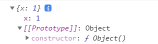

## 19.4 리터럴 표기법에 의해 생성된 객체의 생성자 함수와 프로토타입

- 생성자 함수에 의해 생성된 인스턴스는 프로토타입의 `constructor` 프로퍼티에 의해 생성자 함수와 연결됨.

- `constructor` 프로퍼티가 가리키는 생성자 함수는 인스턴스를 생성한 생성자 함수!

  ```javascript
  // obj 객체를 생성한 생성자 함수는 Object다.
  const obj = new Object();
  console.log(obj.constructor === Object); // true
  
  // add 함수 객체를 생성한 생성자 함수는 Function이다.
  const add = new Function('a', 'b', 'return a + b');
  console.log(add.constructor === Function); // true
  
  // 생성자 함수
  function Person(name) {
      this.name = name;
  }
  
  // me 객체를 생성한 생성자 함수는 Person이다.
  const me = new Person('Lee');
  console.log(me.constructor === Person); // true
  ```

- 리터럴 표기법에 의한 객체 생성 방식과 같이 `new` 연산자와 함께 생성자 함수를 호출하여 인스턴스를 생성하지 않는 객체 생성 방식도 있다.

  ```javascript
  // 객체 리터럴
  const obj = {};
  
  // 함수 리터럴
  const add = function (a, b) { return a + b; };
  
  // 배열 리터럴
  const arr = [1, 2, 3];
  
  // 정규표현식 리터럴
  const regexp = /is/ig;
  ```

- 리터럴 표기법에 의해 생성된 객체도 물론 프로토타입이 존재하지만, 프로토타입의 `constructor` 프로퍼티가 가리키는 생성자 함수가 반드시 객체를 생성한 생성자 함수로 단정할 수 없다.

  ```javascript
  // obj 객체는 Object 생성자 함수로 생성한 객체가 아니라 객체 리터럴로 생성했다.
  const obj = {};
  
  // 하지만 obj 객체의 생성자 함수는 Object 생성자 함수다.
  console.log(obj.constructor === Object); // true
  ```

  - 위 obj 객체는 Object 생성자 함수로 생성한 객체가 아닌 객체 리터럴에 의해 생성된 객체다.
  - 하지만, obj 객체는 Object 생성자 함수와 constructor 프로퍼티로 연결되어 있다.
  - 그 이유는, ECMASCript에 따르면 내부적으로 추상연산 OrdinaryObjectCreate에 의해 Object.prototype을 프로토타입으로 갖는 빈 객체가 생성되기 때문이다.

  > 추상연산
  >
  > ```
  > 추상연산은 ECMAScript 사양에서 내부 동작의 구현알고리즘을 표현한 것. ECMAScript 사양에서 설명을 위해 사용되는 함수와 유사한 의사코드
  > ```

  ```javascript
  // 2. Object 생성자 함수에 의한 객체 생성
  // Object 생성자 함수는 new 연산자와 함께 호출하지 않아도 new 연산자와 함께 호출한 것과 동일하게 동작한다.
  // 인수가 전달되지 않았을 때 추상 연산 OrdinaryObjectCreate를 호출하여 빈 객체를 생성한다.
  let obj = new Object();
  console.log(obj); // {}
  
  // 1. new.target이 undefined나 Object가 아닌 경우
  // 인스턴스 -> Foo.prototype -> Object.prototype 순으로 프로토타입 체인이 생성된다.
  class Foo extends Object {}
  new Foo(); // Foo {}
  
  // 3. 인수가 전달된 경우에는 인수를 객체로 변환한다.
  // Number 객체 생성
  obj = new Object(123);
  console.log(obj); // Number {123}
  
  // String  객체 생성
  obj = new Object('123');
  console.log(obj); // String {"123"}
  ```

- 이처럼 Object 생성자 함수 호출과 객체 리터럴의 평가는 추상 연산 OrdinaryObjectCreate를 호출하여 빈 객체를 생성하는 점에서 동일하지만, new.target의 확인이나 프로퍼티를 추가하는 처리 등 세부 내용은 다르다.

- 즉, 객체 리터럴에 의해 생성된 객체는 Object 생성자 함수가 생성한 객체가 아니다.

- 함수 객체의 경우, Function 생성자 함수를 호출하여 생성한 함수는 렉시컬 스코프를 만들지 않고 스코프를 생성하며 클로저도 만들지 않는다. 따라서 함수 선언문과 함수 표현식을 평가하여 함수 객체를 생성한 것은 Function 생성자 함수가 아니다.

  ```javascript
  // foo 함수는 Function 생성자 함수로 생성한 함수 객체가 아니라 함수 선언문으로 생성했다.
  function foo() {}
  
  // 하지만 constructor 프로퍼티를 통해 확인해보면 함수 foo의 생성자 함수는 Function 생성자 함수다.
  console.log(foo.constructor === Function); // true
  ```

  - 하지만, constructor 프로퍼티를 통해 확인하면 foo 함수의 생성자 함수는 Function 생성자 함수다.

- 리터럴 표기법에 의해 생성된 객체도 상속을 위해 프로토타입이 필요하다. 따라서 리터럴 표기법에 의해 생성된 객체는 가상적인 생성자 함수를 갖는다. 

- **프로토 타입과 생성자 함수는 단독으로 존재할 수 없고 언제나 쌍으로 존재한다.**

- 리터럴 표기법에 의해 생성된 객체는 생성자 함수로 생성한 객체와 본질적인 면에서는 큰 차이는 없기 때문에 다음과 같이 생각해도 큰 무리는 없다. 

| 리터럴 표기법      | 생성자 함수 | 프로토 타입        |
| ------------------ | ----------- | ------------------ |
| 객체 리터럴        | Object      | Object.prototype   |
| 함수 리터럴        | Function    | Function.prototype |
| 배열 리터럴        | Array       | Array.prototype    |
| 정규 표현식 리터럴 | RegExp      | RegExp.prototype   |


## 19.5 프로토 타입의 생성 시점

- 객체는 리터럴 표기법 또는 생성자 함수에 의해 생성되므로 결국 모든 객체는 생성자 함수와 연결되어 있다.

  > Object.create 메서드와 클래스에 의한 객체 생성
  >
  > - Object.create 메서드와 클래스로 객체를 생성하는 방법도 있다. Object.create 메서드와 클래스로 생성한 객체도 생성자 함수와 연결되어 있다. 이에 대해서는 19.11.1절과 25장에서 살펴볼 것.
  
- **프로토타입은 생성자 함수가 생성되는 시점에 더불어 생성**

- 생성자 함수는 다음 두가지로 구분 가능하다.

  - 빌트인 생성자 함수
  - 사용자 정의 생성자 함수

### 19.5.1 사용자 정의 생성자 함수와 프로토타입 생성 시점

- 내부 메서드 [[Construct]]를 갖는 함수 객체, 일반 함수(함수 선언문, 함수 표현식)로 정의한 함수 객체는 new 연산자와 함께 생성자 함수로서 호출할 수 있다.

- **생성자 함수로서 호출할 수 있는 함수, 즉 constructor는 함수 정의가 평가되어 함수 객체를 생성하는 시점에 프로토타입도 더불어 생성된다.**

  ```javascript
  // 함수 정의(constructor)가 평가되어 함수 객체를 생성하는 시점에 프로토타입도 더불어 생성된다.
  console.log(Person.prototype); // {constructor: ƒ}
  
  // 생성자 함수
  function Person(name) {
    this.name = name;
  }
  ```

  - 함수 선언문은 런타임 이전에 자바스크립트 엔진에 의해 먼저 실행된다.

  - 따라서, 함수 선언문으로 정의된 Person 생성자 함수는 어떤 코드보다 먼저 평가되어 함수 객체가 된다. 이 때 프로토타입도 더불어 생성된다.

  - 생성된 프로토타입은 Person 생성자 함수의 prototype 프로퍼티에 바인딩된다.

    

- 생성자 함수로서 호출할 수 없는 함수, 즉 non-constructor는 프로토타입이 생성되지 않음

  ```javascript
  // 화살표 함수는 non-constructor다.
  const Person = name => {
    this.name = name;
  };
  
  // non-constructor는 프로토타입이 생성되지 않는다.
  console.log(Person.prototype); // undefined
  ```

### 19.5.2 빌트인 생성자 함수와 프로토타입 생성 시점

- 빌트인 생성자 함수도 일반 함수와 마찬가지로 빌트인 생성자 함수가 생성되는 시점에 프로토타입이 생성된다.

> 전역 객체
>
> - 전역 객체는 코드가 실행되기 이전 단계에 자바스크립트 엔진에 의해 생성되는 특수한 객체다. 전역객체는 브라우저에서는 window, node.js에서는 global  객체를 의미한다.
>
> - 전역객체는 빌트인 객체들과 환경에 따른 호스트 객체(클라이언트 Web API). 그리고 var 키워드로 선언한 전역 변수와 전역 함수를 프로퍼티로 갖는다. Math, Reflect, JSON을 제외한 표준 필트인 객체는 모두 생성자 함수이다.
>
>   ```javascript
>   // 전역 객체 window는 브라우저에 종속적이므로 아래 코드는 브라우저 환경에서 실행해야 한다.
>   // 빌트인 객체인 Object는 전역 객체 window의 프로퍼티다.
>   window.Object === Object // true
>   ```

- 객체가 생성되기 이전에 생성자 함수와 프로토타입은 이미 객체화 되어 존재한다. **이후 생성자 함수 또는 리터럴 표기법으로 객체를 생성하면 프로토타입은 생성된 객체의 [[Prototype]] 내부 슬롯에 할당된다.** 


## 19.6 객체 생성 방식과 프로토타입의 결정

- 객체는 다양한 방식으로 생성되는데 세부적인 객체 생성 방식의 차이는 있으나 추상 연산 `OrdinaryObjectCreate`에 의해 생성된다는 공통점이 있다.
- 추상연산 `OrdinaryObjectCreate`는 필수적으로 자신이 생성할 객체의 프로토타입을 인수로 전달받는다. 그리고 자신이 생성할 객체에 추가할 프로퍼티 목록을 옵션으로 전달할 수 있다.
  1) 추상 연산 `OrdinaryObjectCreate` 는 빈 객체를 생성한다.
  2) 객체에 추가할 프로퍼티 목록이 인수로 전달된 경우 프로퍼티를 객체에 추가한다.
  3) 인수로 전달받은 프로토타입을 자신이 생성한 객체의 [[Prototype]] 내부 슬롯에 할당한다.
  4) 생성한 객체를 반환한다.
- 즉, 프로토타입은 추상연산 `OrdinaryObjectCreate` 에 전달되는 인수에 의해 결정된다. 이 인수는 객체가 생성되는 시점에 객체 생성 방식에 의해 결정된다.

### 19.6.1 객체 리터럴에 의해 생성된 객체의 프로토타입

- 자바스크립트 엔진은 객체 리터럴을  평가하여 객체를 생성할 때 추상 연산 `OrdinaryObjectCreate`를 호출한다. 

- 이때 추상 연산 `OrdinaryObjectCreate`에 전달되는 프로타입은 `Object.create`이다. 즉 객체 리터럴에 의해 생성되는 객체의 프로토타입은 `Object.prototype`이다.

  ```javascript
  const obj = { x: 1 };
  ```

  1. 위 객체 리터럴이 평가되면 추상 연산 `OrdinaryObjectCreate`에 의해 `Object` 생성자 함수와 `Object.prototype`과 생성된 객체 사이에 연결이 만들어진다.

  

  2. 이처럼 객체 리터럴에 의해 생성된 obj 객체는 Object.prototype을 프로토타입으로 갖게되는데 Object.prototype을 상속받는다. 
  3. obj 객체는 constructor 프로퍼티와 hasOwnProperty 메서드 등을 소유하지 않지만 자신의 프로토타입인 Object.prototype의 constructor 프로퍼티와 hasOwnProperty 메서드를 자신의 자산인 것처럼 자유롭게 사용할 수 있다. 
  4. 이는 obj 객체가 자신의 프로토타입은 Object.prototype 객체를 상속받았기 때문이다.

  ```javascript
  const obj = { x: 1 };
  
  // 객체 리터럴에 의해 생성된 obj 객체는 Object.prototype을 상속받는다.
  console.log(obj.constructor === Object); // true
  console.log(obj.hasOwnProperty('x'));    // true
  ```

  

### 19.6.2 Object 생성자 함수에 의해 생성된 객체의 프로토타입

- Object 생성자 함수를 인수 없이 호출하면 빈 객체가 생성된다. 이때도 마찬가지로 추상연산 `OrdinaryObjectCreate`가 호출되어 Object.prototype이 전달된다.

- 즉, Object 생성자 함수에 의해 생성되는 객체의 프로토타입은 Object.prototype이다.

  ```javascript
  const obj = new Object();
  obj.x = 1;
  
  // Object 생성자 함수에 의해 생성된 obj 객체는 Object.prototype을 상속받는다.
  console.log(obj.constructor === Object); // true
  console.log(obj.hasOwnProperty('x'));    // true
  ```

  

  


### 19.6.3 생성자 함수에 의해 생성된 객체의 프로토타입

- new 연산자와 함께 생성자 함수를 호출하여 인스턴스를 생성하면 다른 객체 생성 방식과 마찬가지로 추상연산 `OrdinaryObjectCreate`가 호출된다. 이때 추상 연산 `OrdinaryObjectCreate` 에 전달되는 프로토타입은 생성자 함수의 prototype 프로퍼티에 바인딩되어 있는 객체다.

- 즉, 생성자 함수에 의해 생성되는 객체의 프로토타입은 생성자 함수의 prototype 프로퍼티에 바인딩 되어 있는 객체다.

  ```javascript
  function Person(name) {
    this.name = name;
  }
  
  const me = new Person('Lee');
  ```


- 프로토타입은 객체이므로 프로토타입에도 프로퍼티를 추가/삭제할 수 있다. 그리고 이렇게 추가/삭제된 프로퍼티는 프로토타입 체인에 즉각 반영된다.

  ```javascript
  function Person(name) {
    this.name = name;
  }
  
  // 프로토타입 메서드
  Person.prototype.sayHello = function () {
    console.log(`Hi! My name is ${this.name}`);
  };
  
  const me = new Person('Lee');
  const you = new Person('Kim');
  
  me.sayHello();  // Hi! My name is Lee
  you.sayHello(); // Hi! My name is Kim
  ```

  

-  Person 생성자 함수를 통해 생성된 모든 객체는 프로토타입에 추가된 sayHello 메서드를 상속받아 자신의 메서드처럼 사용할 수 있다.


## 19.7 프로토타입 체인

```javascript
function Person(name) {
  this.name = name;
}

// 프로토타입 메서드
Person.prototype.sayHello = function () {
  console.log(`Hi! My name is ${this.name}`);
};

const me = new Person('Lee');

// hasOwnProperty는 Object.prototype의 메서드다.
console.log(me.hasOwnProperty('name')); // true
```

- Person 생성자 함수에 의해 생성된 me 객체는 Object.prototype의 메서드인 hasOwnProperty를 호출 할 수 있다. 이것은 me 객체가 Person.prototype 뿐만 아니라 Object.prototype도 상속받았다는 것을 확인할 수 있다.
- me 객체의 프로토타입은 Person.prototype이다.

```javascript
Object.getPrototypeOf(me) === Person.prototype; // -> true
Object.getPrototypeOf(Person.prototype) === Object.prototype; // -> true
```


- 자바스크립트는 객체의 프로퍼티(메서드 포함)에 접근하려 할 때 **해당 객체에 접근하려는 프로퍼티가 없다면 [[Prototype]] 내부 슬롯의 참조를 따라 자신의 부모 역할을 하는 프로토타입의 프로퍼티를 순차적으로 검색**한다. 이를 프로토타입 체인이라 한다. **프로토타입 체인은 자바스크립트가 객체지향 프로그래밍의 상속을 구현하는 메커니즘이다.**

- 프로토타입 체인의 최상위에 위치하는 객체는 언제나 Object.prototype이다. 따라서 모든 객체는 Object.prototype을 상속받는다. **Object.prototype을 프로토타입 체인의 종점(end of prototype chain)이라 한다.** Object.prototype의 프로토타입, 즉 [[Prototype]] 내부 슬롯의 값은 null 이다.

    ```javascript
    console.log(me.foo); // undefined
    ```

    - Object.prototype에서도 프로토타입을 검색할 수 없는 경우, undefined를 반환한다.

- 자바스크립트에서 **프로토타입 체인은 상속과 프로퍼티 검색을 위한 메커니즘**이라고 할 수 있다.

- 이에 반해, 프로퍼티가 아닌 식별자는 스코프 체인에서 검색한다. 따라서 **스코프 체인은 식별자 검색을 위한 메커니즘**이라 할 수 있다.
- 스코프 체인과 프로토타입 체인은 서로 연관없이 별도로 동작 하는 것이 아닌 서로 협력하여 식별자와 프로퍼티를 검색하는 데 사용된다.


### 19.8 오버라이딩과 프로퍼티 섀도잉

```javascript
const Person = (function () {
  // 생성자 함수
  function Person(name) {
    this.name = name;
  }

  // 프로토타입 메서드
  Person.prototype.sayHello = function () {
    console.log(`Hi! My name is ${this.name}`);
  };

  // 생성자 함수를 반환
  return Person;
}());

const me = new Person('Lee');

// 인스턴스 메서드
me.sayHello = function () {
  console.log(`Hey! My name is ${this.name}`);
};

// 인스턴스 메서드가 호출된다. 프로토타입 메서드는 인스턴스 메서드에 의해 가려진다.
me.sayHello(); // Hey! My name is Lee
```

- 프로토타입 프로퍼티와 같은 이름의 프로퍼티를 인스턴스에 추가하면 인스턴스 프로퍼티로 추가한다. 인스턴스 메서드 sayHello는 프로토타입 메서드 sayHello를 오버라이딩했고 프로토타입 메서드 sayHello는 가려진다. 이처럼 **상속관계에 의해 프로퍼티가 가려지는 현상**을 **프로퍼티 섀도잉**이라 한다.                                                                                                             

```javascript
// 인스턴스 메서드를 삭제한다.
delete me.sayHello;
// 인스턴스에는 sayHello 메서드가 없으므로 프로토타입 메서드가 호출된다.
me.sayHello(); // Hi! My name is Lee
```


```javascript
// 프로토타입 체인을 통해 프로토타입 메서드가 삭제되지 않는다.
delete me.sayHello;
// 프로토타입 메서드가 호출된다.
me.sayHello(); // Hi! My name is Lee
```

- 이와 같이 하위 객체를 통해 프로토타입의 프로퍼티를 변경 또는 삭제하는 것이 불가능하다.


```javascript
// 프로토타입 메서드 변경
Person.prototype.sayHello = function () {
  console.log(`Hey! My name is ${this.name}`);
};
me.sayHello(); // Hey! My name is Lee

// 프로토타입 메서드 삭제
delete Person.prototype.sayHello;
me.sayHello(); // TypeError: me.sayHello is not a function
```


### 19.9 프로토타입의 교체

- 프로토타입은 임의의 다른 객체로 변경이 가능하다. 이러한 특징을 활용하여 객체 간의 상속 관계를 동적으로 변경할 수 있다.


### 19.9.1 생성자 함수에 의한 프로토타입의 교체

```javascript
const Person = (function () {
  function Person(name) {
    this.name = name;
  }

  // ① 생성자 함수의 prototype 프로퍼티를 통해 프로토타입을 교체
  Person.prototype = {
    sayHello() {
      console.log(`Hi! My name is ${this.name}`);
    }
  };

  return Person;
}());

const me = new Person('Lee');
```

- 프로토타입으로 교체한 객체 리터럴에는 constructor 프로퍼티가 없다. 따라서 me 객체의 생성자 함수를 검색하면 Person이 아닌 Object가 나온다.


```javascript
// 프로토타입을 교체하면 constructor 프로퍼티와 생성자 함수 간의 연결이 파괴된다.
console.log(me.constructor === Person); // false
// 프로토타입 체인을 따라 Object.prototype의 constructor 프로퍼티가 검색된다.
console.log(me.constructor === Object); // true
```


```javascript
const Person = (function () {
  function Person(name) {
    this.name = name;
  }

  // 생성자 함수의 prototype 프로퍼티를 통해 프로토타입을 교체
  Person.prototype = {
    // constructor 프로퍼티와 생성자 함수 간의 연결을 설정
    constructor: Person,
    sayHello() {
      console.log(`Hi! My name is ${this.name}`);
    }
  };

  return Person;
}());

const me = new Person('Lee');

// constructor 프로퍼티가 생성자 함수를 가리킨다.
console.log(me.constructor === Person); // true
console.log(me.constructor === Object); // false
```

- constructor 프로퍼티를 추가하여 프로토타입의 constructor 프로퍼티를 되살릴 수 있다.


### 19.9.2 인스턴스에 의한 프로토타입의 교체

- 프로토타입은 생성자 함수의 prototype 프로퍼티뿐만 아니라 인스턴스의 `__proto__` 접근자 프로퍼티를 통해 접근할 수 있다.

  ```javascript
  function Person(name) {
    this.name = name;
  }
  
  const me = new Person('Lee');
  
  // 프로토타입으로 교체할 객체
  const parent = {
    sayHello() {
      console.log(`Hi! My name is ${this.name}`);
    }
  };
  
  // ① me 객체의 프로토타입을 parent 객체로 교체한다.
  Object.setPrototypeOf(me, parent);
  // 위 코드는 아래의 코드와 동일하게 동작한다.
  // me.__proto__ = parent;
  
  me.sayHello(); // Hi! My name is Lee
  ```

  - 프로토타입으로 교체한 객체는 constructor가 없으므로 constructor 프로퍼티와 생성자 함수 간의 연결이 파괴된다. 따라서 me 객체의 생성자 함수를 검색하면 Person이 아닌 Object가 나온다.


```javascript
function Person(name) {
  this.name = name;
}

const me = new Person('Lee');

// 프로토타입으로 교체할 객체
const parent = {
  // constructor 프로퍼티와 생성자 함수 간의 연결을 설정
  constructor: Person,
  sayHello() {
    console.log(`Hi! My name is ${this.name}`);
  }
};

// 생성자 함수의 prototype 프로퍼티와 프로토타입 간의 연결을 설정
Person.prototype = parent;

// me 객체의 프로토타입을 parent 객체로 교체한다.
Object.setPrototypeOf(me, parent);
// 위 코드는 아래의 코드와 동일하게 동작한다.
// me.__proto__ = parent;

me.sayHello(); // Hi! My name is Lee

// constructor 프로퍼티가 생성자 함수를 가리킨다.
console.log(me.constructor === Person); // true
console.log(me.constructor === Object); // false

// 생성자 함수의 prototype 프로퍼티가 교체된 프로토타입을 가리킨다.
console.log(Person.prototype === Object.getPrototypeOf(me)); // true
```

이처럼 프로토타입 교체를 통해 객체 간의 상속 관계를 동적으로 변경하는 것은 꽤나 번거롭다.

따라서 프로토타입은 직접 교체를 하지 않는 것이 좋다. 상속 관계를 인위적으로 설정하려면 19.11절의 직접 상속 또는 ES6부터 추가된 class를 활용한 상속을 이용하는 것이 좋다.


## 19.10 instanceof 연산자

```js
객체 instanceof 생성자 함수
```

- 우변의 피연산자가 함수가 아닌경우 TypeError  발생
- 

**우변의 생성자 함수의 prototype에 바인딩된 객체가 좌변의 객체의 프로토타입 체인 상에 존재하면 true, 그렇지 않은 경우 false로 평가**

```js
// 생성자 함수
function Person(name) {
  this.name = name;
}

const me = new Person('Lee');

// Person.prototype이 me 객체의 프로토타입 체인 상에 존재하므로 true로 평가된다.
console.log(me instanceof Person); // true

// Object.prototype이 me 객체의 프로토타입 체인 상에 존재하므로 true로 평가된다.
console.log(me instanceof Object); // true
```


**프로토 타입 교체**

```js
// 생성자 함수
function Person(name) {
  this.name = name;
}

const me = new Person('Lee');

// 프로토타입으로 교체할 객체
const parent = {};

// 프로토타입의 교체
Object.setPrototypeOf(me, parent);

// Person 생성자 함수와 parent 객체는 연결되어 있지 않다.
console.log(Person.prototype === parent); // false
console.log(parent.constructor === Person); // false

// Person.prototype이 me 객체의 프로토타입 체인 상에 존재하지 않기 때문에 false로 평가된다.
console.log(me instanceof Person); // false

// Object.prototype이 me 객체의 프로토타입 체인 상에 존재하므로 true로 평가된다.
console.log(me instanceof Object); // true
```

- me 객체는 프로토타입이 교체되어, 프로토타입과 생성자 함수 간의 연결이 파괴되었지만 Person 생성자 함수에 의해 생성된 인스턴스임에는 틀림 없음

- 그러나, me instanceof Person은 false로 평가됨

- 이는 me객체의 프로토타입 체인 상에 Person.prototype이 존재하지 않기 떄문임

- 만약, parent 객체를 Person 생성자 함수의 prototpye 프로퍼티에 바인딩 하면,  me instanceof Person은 true로 평가 됨

  ```js
  // 생성자 함수
  function Person(name) {
    this.name = name;
  }
  
  const me = new Person('Lee');
  
  // 프로토타입으로 교체할 객체
  const parent = {};
  
  // 프로토타입의 교체
  Object.setPrototypeOf(me, parent);
  
  // Person 생성자 함수와 parent 객체는 연결되어 있지 않다.
  console.log(Person.prototype === parent); // false
  console.log(parent.constructor === Person); // false
  
  // parent 객체를 Person 생성자 함수의 prototype 프로퍼티에 바인딩한다.
  Person.prototype = parent;
  
  // Person.prototype이 me 객체의 프로토타입 체인 상에 존재하므로 true로 평가된다.
  console.log(me instanceof Person); // true
  
  // Object.prototype이 me 객체의 프로토타입 체인 상에 존재하므로 true로 평가된다.
  console.log(me instanceof Object); // true
  ```

  - 이처럼 instanceof 연산자는 프로토타입의 constructor 프로퍼티가 가리키는 생성자 함수를 찾는 것이 아니라, 생성자 함수의 prototype에 바인딩된 객체가 프로토타팁 체인 상에 존재하는지 확인함


- me instance Person의 경우  me 객체의 프로토타입 체인 상에 Person.prototype에 바인딩된 객체가 존재하는지 확인함
- me instance Obejct의 경우도 마찬가지


**instanceof 연산자를 함수로 구현해보기**

```js
function isInstanceof(instance, constructor) {
  // 프로토타입 취득
  const prototype = Object.getPrototypeOf(instance);

  // 재귀 탈출 조건
  // prototype이 null이면 프로토타입 체인의 종점에 다다른 것이다.
  if (prototype === null) return false;

  // 프로토타입이 생성자 함수의 prototype 프로퍼티에 바인딩된 객체라면 true를 반환한다.
  // 그렇지 않다면 재귀 호출로 프로토타입 체인 상의 상위 프로토타입으로 이동하여 확인한다.
  return prototype === constructor.prototype || isInstanceof(prototype, constructor);
}

console.log(isInstanceof(me, Person)); // true
console.log(isInstanceof(me, Object)); // true
console.log(isInstanceof(me, Array));  // false
```


**생성자 함수에 의해 프로토타입이 교체되어 constructor 프로퍼티와 생성자 함수 간의 연결이 파괴되어도 생성자 함수의 prototpye 프로퍼티와 프로토타입 간의 연결은 파괴되지 않으므로 instanceof는 아무런 영향을 받지 않음**

```js
const Person = (function () {
  function Person(name) {
    this.name = name;
  }

  // 생성자 함수의 prototype 프로퍼티를 통해 프로토타입을 교체
  Person.prototype = {
    sayHello() {
      console.log(`Hi! My name is ${this.name}`);
    }
  };

  return Person;
}());

const me = new Person('Lee');

// constructor 프로퍼티와 생성자 함수 간의 연결은 파괴되어도 instanceof는 아무런 영향을 받지 않는다.
console.log(me.constructor === Person); // false

// Person.prototype이 me 객체의 프로토타입 체인 상에 존재하므로 true로 평가된다.
console.log(me instanceof Person); // true
// Object.prototype이 me 객체의 프로토타입 체인 상에 존재하므로 true로 평가된다.
console.log(me instanceof Object); // true
```


## 19.11 직접 상속 

### 19.11.1 Object.create에 의한 직접 상속

**Object.create 메서드는 명시적으로 프로토타입을 지정하여 새로운 객체를 생성함**

- Object.create 메서드도 다른 객체 생성 방식과 마찬가지로 추상 연산 `OrdinaryObjectCreate` 를 호출함
  - 매개변수 : (생성할 객체의 프로토타입, 생성할 객체의 프로퍼티 키와 프로퍼티 디스크립터 객체로 이뤄진 객체)
  - 두 번쨰 인수는 생략 가능

```js
// 프로토타입이 null인 객체를 생성한다. 생성된 객체는 프로토타입 체인의 종점에 위치한다.
// obj → null
let obj = Object.create(null);
console.log(Object.getPrototypeOf(obj) === null); // true
// Object.prototype을 상속받지 못한다.
console.log(obj.toString()); // TypeError: obj.toString is not a function

// obj → Object.prototype → null
// obj = {};와 동일하다.
obj = Object.create(Object.prototype);
console.log(Object.getPrototypeOf(obj) === Object.prototype); // true

// obj → Object.prototype → null
// obj = { x: 1 };와 동일하다.
obj = Object.create(Object.prototype, {
  x: { value: 1, writable: true, enumerable: true, configurable: true }
});
// 위 코드는 다음과 동일하다.
// obj = Object.create(Object.prototype);
// obj.x = 1;
console.log(obj.x); // 1
console.log(Object.getPrototypeOf(obj) === Object.prototype); // true

const myProto = { x: 10 };
// 임의의 객체를 직접 상속받는다.
// obj → myProto → Object.prototype → null
obj = Object.create(myProto);
console.log(obj.x); // 10
console.log(Object.getPrototypeOf(obj) === myProto); // true

// 생성자 함수
function Person(name) {
  this.name = name;
}

// obj → Person.prototype → Object.prototype → null
// obj = new Person('Lee')와 동일하다.
obj = Object.create(Person.prototype);
obj.name = 'Lee';
console.log(obj.name); // Lee
console.log(Object.getPrototypeOf(obj) === Person.prototype); // true
```

- 장점
  - new 연산자 없이 객체 생성
  - 프로토타입을 지정하면서 객체를 생성할 수 있음
  - 객체 리터럴에 의해 생성된 객체도 상속받을 수 있음


**Obejct.prototype의 빌트인 메서드인 hasOwnProperty, isPrototypeOf, propertyIsEnumerable 등은 모든 객체가 상속받아 호출할 수 있음**

```js
const obj = { a: 1 };

obj.hasOwnProperty('a');       // -> true
obj.propertyIsEnumerable('a'); // -> true
19-53
```


**ESLint에서는 Obejct.prototype의 빌트인 메서드를 객체가 직접 호출하는 것을 권장하지 않음**

- Object.create 메서드를 통해 프로토타입 체인의 종점에 위치하는 객체를 생성할 수 있기 때문에, 그런 경우에는 Obejct.prototpye의 빌트인 메서드를 사용할 수 없음

```js
// 프로토타입이 null인 객체, 즉 프로토타입 체인의 종점에 위치하는 객체를 생성한다.
const obj = Object.create(null);
obj.a = 1;

console.log(Object.getPrototypeOf(obj) === null); // true

// obj는 Object.prototype의 빌트인 메서드를 사용할 수 없다.
console.log(obj.hasOwnProperty('a')); // TypeError: obj.hasOwnProperty is not a function
```


**Obejct.protoype의 빌트인 메서드는 다음과 같이 간접적으로 호출하는 것이 좋음**

```js
// 프로토타입이 null인 객체를 생성한다.
const obj = Object.create(null);
obj.a = 1;

// console.log(obj.hasOwnProperty('a')); // TypeError: obj.hasOwnProperty is not a function

// Object.prototype의 빌트인 메서드는 객체로 직접 호출하지 않는다.
console.log(Object.prototype.hasOwnProperty.call(obj, 'a')); // true
```


### 19.11.2 객체 리터럴 내부에서 `__proto__` 에 의한 직접 상속

**ES6에서 객체 리터럴 내부에서 `__proto__` 접근자 프로퍼티를 사용하여 직접 상속을 구현할 수 있음**

```js
const myProto = { x: 10 };

// 객체 리터럴에 의해 객체를 생성하면서 프로토타입을 지정하여 직접 상속받을 수 있다.
const obj = {
  y: 20,
  // 객체를 직접 상속받는다.
  // obj → myProto → Object.prototype → null
  __proto__: myProto
};
/* 위 코드는 아래와 동일하다.
const obj = Object.create(myProto, {
  y: { value: 20, writable: true, enumerable: true, configurable: true }
});
*/

console.log(obj.x, obj.y); // 10 20
console.log(Object.getPrototypeOf(obj) === myProto); // true
```


## 19.12 정적 프로퍼티/메서드

**정적(static) 프로퍼티/메서드는 생성자 함수로 인스턴스 생성없이, 참조/호출할 수 있는 프로퍼티/메서드 이다.**

```js
// 생성자 함수
function Person(name) {
  this.name = name;
}

// 프로토타입 메서드
Person.prototype.sayHello = function () {
  console.log(`Hi! My name is ${this.name}`);
};

// 정적 프로퍼티
Person.staticProp = 'static prop';

// 정적 메서드
Person.staticMethod = function () {
  console.log('staticMethod');
};

const me = new Person('Lee');

// 생성자 함수에 추가한 정적 프로퍼티/메서드는 생성자 함수로 참조/호출한다.
Person.staticMethod(); // staticMethod

// 정적 프로퍼티/메서드는 생성자 함수가 생성한 인스턴스로 참조/호출할 수 없다.
// 인스턴스로 참조/호출할 수 있는 프로퍼티/메서드는 프로토타입 체인 상에 존재해야 한다.
me.staticMethod(); // TypeError: me.staticMethod is not a function
```

- Person 생성자 함수는 객체이므로, 자신의 프로퍼티/메서드를 소유할 수 있음
  - 생성자 함수가 직접 소유한 프로퍼티/메서드를 정적 프로퍼티/메서드라고 함
- !주의 : 정적 프로퍼티/메서드는 생성자 함수가 생성한 인스턴스로 참조/호출할 수 없다.
  - 인스턴스로 참조/호출할 수 있는 프로퍼티/메서드는 프로토타입 체인 상에 존재해야 함


**Object.prototype 메서드는 모든 객체가 호출할 수 있다.**

```js
// Object.create는 정적 메서드다.
const obj = Object.create({ name: 'Lee' });

// Object.prototype.hasOwnProperty는 프로토타입 메서드다.
obj.hasOwnProperty('name'); // -> false
```


**인스턴스가 호출한 인스턴스/프로토타입 메서드 내에서 this는 인스턴스를 가리킨다.**

```js
function Foo() {}

// 프로토타입 메서드
// this를 참조하지 않는 프로토타입 메소드는 정적 메서드로 변경해도 동일한 효과를 얻을 수 있다.
Foo.prototype.x = function () {
  console.log('x');
};

const foo = new Foo();
// 프로토타입 메서드를 호출하려면 인스턴스를 생성해야 한다.
foo.x(); // x

// 정적 메서드
Foo.x = function () {
  console.log('x');
};

// 정적 메서드는 인스턴스를 생성하지 않아도 호출할 수 있다.
Foo.x(); // x
```

- 프로토타입 메서드를 호출하려면 인스턴스를 생성해야함

- 정적 메서드는 인스턴스를 생성하지 않아도 호출할 수 있음


**정적 프로퍼티/메서드를 구분**

- 정적 프로퍼티/메서드 : 생성자함수 또는 클래스.프로퍼티/메서드
- 프로토타입메서드 : 생성자함수 또는 클래스.`prototype`.프로퍼티/메서드


## 19.13 프로퍼티 존재 확인

### 19.13.1 in 연산자

```js
key in object
```

**object 안에 key에 해당하는 프로퍼티의 존재 여부를 boolean 값으로 반환**

```js
const person = {
  name: 'Lee',
  address: 'Seoul'
};

// person 객체에 name 프로퍼티가 존재한다.
console.log('name' in person);    // true
// person 객체에 address 프로퍼티가 존재한다.
console.log('address' in person); // true
// person 객체에 age 프로퍼티가 존재하지 않는다.
console.log('age' in person);     // false
```


**상속받은 모든 프로토타입의 프로퍼티를 확인하기 때문에 주의해야 함**

```js
console.log('toString' in person); // true
```


**in 연산자 대신에 ES6에서 도입된 Reflect.has 메서드를 사용할 수도 있음 (동일한 동작)**\

```js
const person = { name: 'Lee' };

console.log(Reflect.has(person, 'name'));     // true
console.log(Reflect.has(person, 'toString')); // true
```


### 19.13.2 Object.prototype.hasOwnProperty 메서드

**Object.prototype.hasOwnProperty 메서드를 사용해서 확인할 수 있음**

```js
console.log(person.hasOwnProperty('name')); // true
console.log(person.hasOwnProperty('age'));  // false
```


**Object.prototype.hasOwnProperty는 객체 고유의 프로퍼티 키 인경우에만 true를 반환하고, 상속받은 프로토타입의 프로퍼티 키인 경우는 false를 반환함**

```js
console.log(person.hasOwnProperty('toString')); // false
```


## 19.14 프로퍼티 열거

### 19.14.1 for ... in 문

**객체의 모든 프로퍼티를 순회하며 열거**

```js
for (변수선언문 in 객체) {...}
```

```js
const person = {
  name: 'Lee',
  address: 'Seoul'
};

for(const key in person) {
  console.log(key + ': ' person[key]);
}


// name: Lee
// address: Seoul
```


**순회 대상의 프로퍼티 뿐만 아니라 상속받은 프로토타입의 프로퍼티까지 열거**

```js
const person = {
  name: 'Lee',
  address: 'Seoul'
};

console.log('toString' in person) // true

for(const key in person) {
  console.log(key + ': ' person[key]);
}

// name: Lee
// address: Seoul
```

- toString이 person의 프로퍼티에 해당하지만, for in으로 열거가 되지 않는 이유는, toString 메서드가 열거할 수 없도록 정의되어 있는 프로퍼티 이기 때문임

  - Object.prototype.toString 프로퍼티의 프로퍼티 어트리뷰트 `[[Enumerable]]` 의 값이 false 이기 때문

  ```js
  console.log(Object.getOwnPropertyDescriptor(Object.prototype, 'toString').enumerable)
  // false
  ```


조금더 명확하게 for in문을 설명하면, **프로토타입 체인 상에 존재하는 모든 프로토타입의 프로퍼티 중에서 프로퍼티 어트리뷰트의 값이 true**인 프로퍼티를 순회하며 열거한다.

```js
const person = {
  name: 'Lee',
  address: 'Seoul',
  __proto__: {age: 20}
};

for(const key in person) {
  console.log(key + ': ' person[key]);
}

// name: Lee
// address: Seoul
// age: 20
```


**for in 문은 프로퍼티 키가 심벌인 프로퍼티는 열거하지 않음**

```js
const sym = Symbol();
const obj = {
  a: 1,
  [sym]: 10
};

console.log('toString' in person) // true

for(const key in obj) {
  console.log(key + ': ' obj[key]);
}

// a: 1
```


**상속받은 프로퍼티의 열거를 제외하고 싶다면, Object.prototype.hasOwnProperty 메서드를 이용**

```js
const person = {
  name: 'Lee',
  address: 'Seoul',
  __proto__: { age: 20 }
};

for (const key in person) {
  // 객체 자신의 프로퍼티인지 확인한다.
  if (!person.hasOwnProperty(key)) continue;
  console.log(key + ': ' + person[key]);
}
// name: Lee
// address: Seoul
```


**일반적으로, 프로퍼티를 열거할 때 순서를 보장하지는 않지만 대부분의 모던 브라우저는 순서를 보장해주고, 숫자인 프로퍼티 키에 대해서는 정렬을 실시한다.**

```js
const obj = {
  2: 2,
  3: 3,
  1: 1,
  b: 'b',
  a: 'a'
};

for (const key in obj) {
  if (!obj.hasOwnProperty(key)) continue;
  console.log(key + ': ' + obj[key]);
}

/*
1: 1
2: 2
3: 3
b: b
a: a
*/
```


**배열에서는 for in  문 대신에, for문 또는 for of 문 또는 Array,prototype.forEach 메서드를 사용하는 것을 권장한다.** (배열도 객체이므로 프로퍼티와 상속받은 프로퍼티가 포함될 수 있음)

```js
const arr = [1, 2, 3];
arr.x = 10; // 배열도 객체이므로 프로퍼티를 가질 수 있다.

for (const i in arr) {
  // 프로퍼티 x도 출력된다.
  console.log(arr[i]); // 1 2 3 10
};

// arr.length는 3이다.
for (let i = 0; i < arr.length; i++) {
  console.log(arr[i]); // 1 2 3
}

// forEach 메서드는 요소가 아닌 프로퍼티는 제외한다.
arr.forEach(v => console.log(v)); // 1 2 3

// for...of는 변수 선언문에서 선언한 변수에 키가 아닌 값을 할당한다.
for (const value of arr) {
  console.log(value); // 1 2 3
};
```


### 19.14.2 Object.keys/values/entries 메서드

**자신의 고유 프로퍼티만 열거하기 위해서는 for ... in 대신에 Object.keys/values/entries 를 사용하는 것이 좋다.**

**Object.keys** : 프로퍼티 키를 배열로 반환

```js
const person = {
  name: 'Lee',
  address: 'Seoul',
  __proto__: { age: 20 }
};

console.log(Object.keys(person)); // ["name", "address"]
```


**Object.values** : 프로퍼티의 값을 배열로 반환 (ES8)

```js
console.log(Object.values(person)); // ["Lee", "Seoul"]
```


**Object.entries** : 프로퍼티의 키와 값의 배열을 배열에 담아 반환 (ES8)

```js
console.log(Object.entries(person)); // [["name", "Lee"], ["address", "Seoul"]]

Object.entries(person).forEach(([key, value]) => console.log(key, value));
/*
name Lee
address Seoul
*/
```
