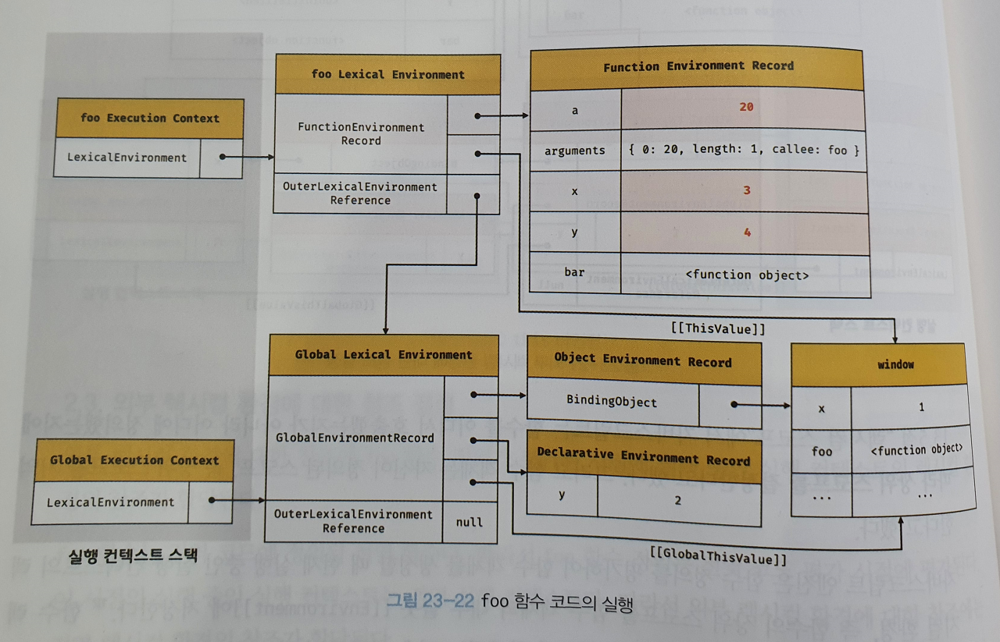
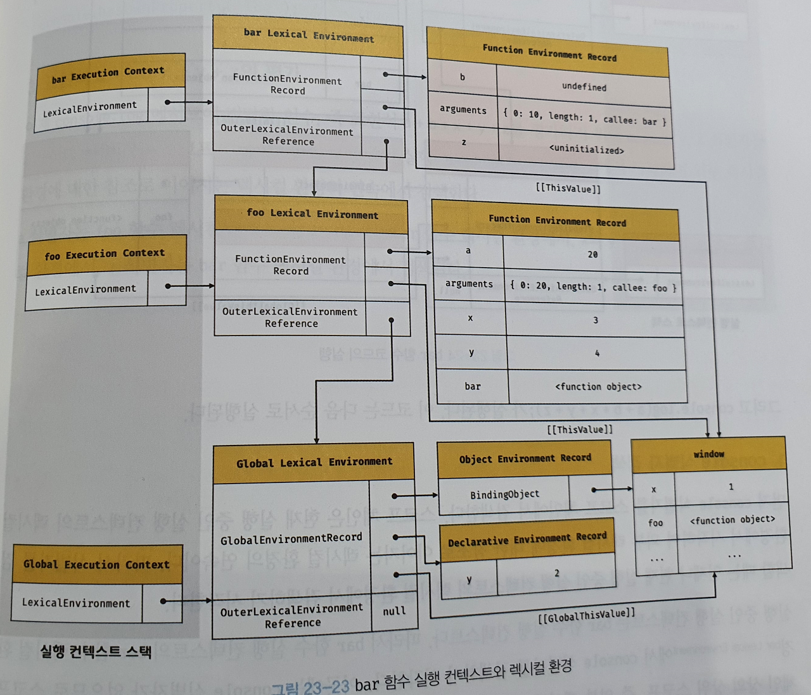
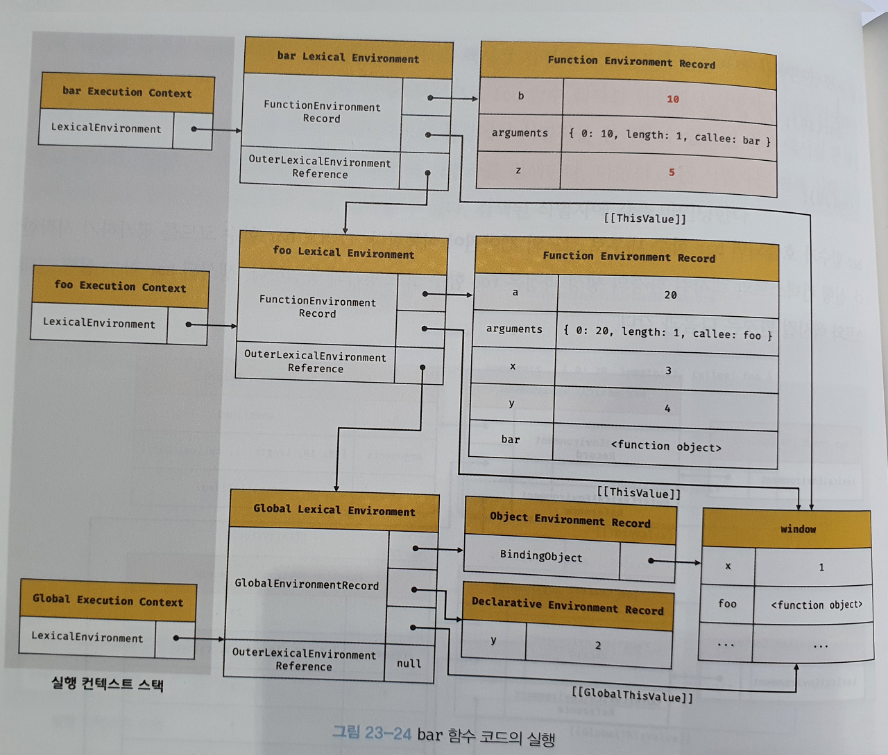

### 23.6.5 foo 함수 실행

```javascript
var x = 1;
const y = 2;

function foo (a) {
  var x = 3;
  const y = 4;

  function bar (b) {
    const z = 5;
    console.log(a + b + x + y + z);
}
  bar(10);
}

foo(20); // ← 호출 직전
```

- 코드 실행과정
  1. 런타임이 시작되어 foo 함수의 코드가  순차적으로 실행
  2. 매개변수에 인수가 할당
  3. 변수 할당문이 실행되어 지역 변수 x, y에 값이 할당
  4. 함수 bar 호출
  5. 이때 식별자 결정을 위해 실행 중인 실행 컨텍스트의 렉시컬 환경에서 식별자를 검색
  6. 만약 실행 중인 실행 컨텍스트의 렉시컬 환경에서 식별자를 검색할 수 없다면, 외부 렉시컬 환경에 대한 참조가 가리키는 렉시컬 환경으로 이동하여 식별자를 검색




### 23.6.6 bar 함수 평가

- bar 함수가 호출되면 bar 함수 내부로 코드 제어권이 이동
- bar 함수를 평가하기 시작하면서 실행 컨텍스트와 렉시컬 환경의 생성과정은 foo 함수의 코드 평가와 동일하다.

```javascript
var x = 1;
const y = 2;

function foo (a) {
  var x = 3;
  const y = 4;

  function bar (b) {
    const z = 5;
    console.log(a + b + x + y + z);
  }
  bar(10); // ← 호출 직전
}

foo(20);
```




### 23.6.7 bar 함수 코드 실행

- 매개변수에 인수가 할당

- 변수 할당문이 실행되어 지역 변수 z에 값이 할당

- console.log(a + b + x + y + z); 실행

  1. console 식별자 검색 (렉시컬 환경에서)
     - bar -> foo -> global 순서로 검색한다. console 식별자는 객체 환경 레코드의 BindingObject에서 찾을 수 있다.

  2. log 메서드 검색

     - console 객체의 프로토타입 체인을 통해 메서드를 검색한다.

       ```javascript
       console.hasOwnProperty('log'); // -> true
       ```

  3. 표현식 `a + b + x + y + z`의 평가
     - console.log 메서드에 전달할 인수,  a + b + x + y + z를 평가하기 위해 식별자를 검색한다.
     - a,x,y => foo b,z  => bar  렉시컬 환경에서 검색

  4. console.log 메서드 호출
     - 표현식 a + b + x + y + z가 평가되어 생성한 값 42를 console.log 메서드에 전달하여 호출한다.




### 23.6.8 bar 함수 코드 실행 종료

- console.log 메서드가 호출되고 종료하면 실행할 코드가 없기 때문에 bar 함수의 코드 실행이 종료된다.
- 실행 컨텍스트 스택에서 bar 함수 실행 컨텍스트가 팝되어 제거되고 foo 실행 컨텍스트가 실행 중인 실행 컨텍스트로 전환된다.
- bar 함수 실행 컨텍스트가 제거되었다하더라도 렉시컬 환경까지 제거되지는 않는다. **객체를 포함한 모든 값은 누군가에 참조되지 않았을 때 GC에 의해 메모리 공간 확보가 해제되어 소멸** (클로저?)


### 23.6.9 foo 함수 코드 실행 종료

- bar 함수 실행 종료 => foo 함수 실행 종료
- 실행 컨텍스트 스택에서 foo 함수 실행 컨텍스트 pop
- 전역 실행 컨텍스트가 실행 중인 실행 컨텍스트로 전환


### 23.6.10 전역 코드 실행 종료

- foo 함수 실행 종료 => 전역 코드 존재 X
- 전역 실행 컨텍스트도 실행 컨텍스트에서 pop


## 23.7 실행 컨텍스트와 블록 레벨 스코프

- var 키워드로 선언한 변수 -> 함수 레벨 스코프

- let, const 키워드로 선언한 변수 -> 블록 레벨 스코프

  ```javascript
  let x = 1;
  
  if (true) {
    let x = 10;
    console.log(x); // 10
  }
  
  console.log(x); // 1
  ```

  - if문 내에 let 키워드로 변수가  선언
  - if문의 코드 블록을 위한 블록 레벨 스코프 생성

- 함수의 상위  스코프는 for 문등 코드 블록이 반복해서 실행될 때마다 식별자의 값을 유지해야 한다.

- 이를 위해 독립적인 렉시컬 환경을 생성하여 식별자 값을 유지한다(클로저)
