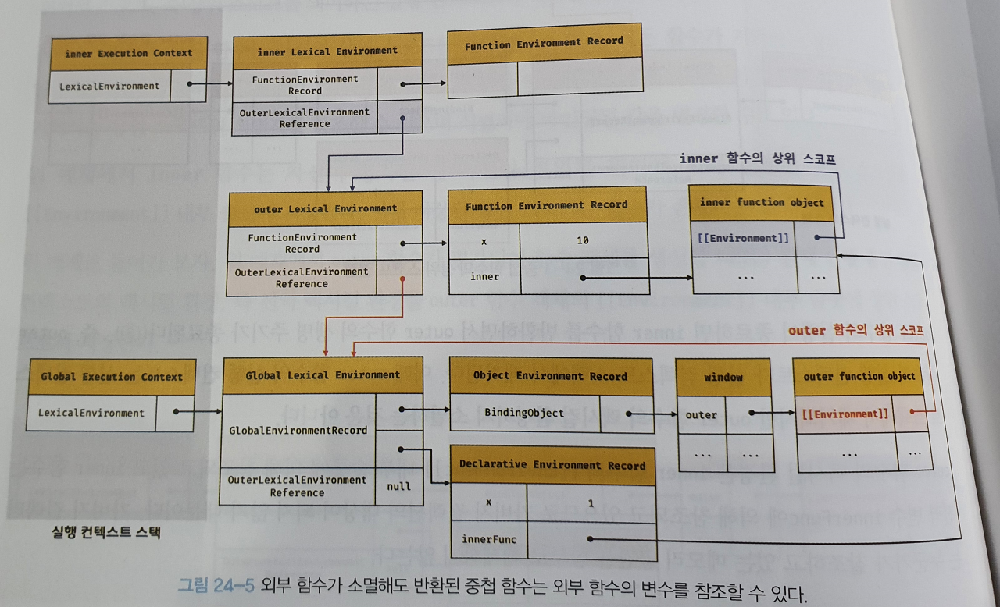

# 24. 클로저

- 클로저는 js문법 중 선뜻 설명하기 어려운 개념
- 하지만 실행 컨텍스트 개념이 숙지되었다면 이해하기 어려운 개념은 아님!
- 클로저는 자바스크립트의 고유 개념이 아니다.(함수형  프로그래밍 언어 - 하스켈, 리스프, 얼랭, 스칼라 등)
- 그러므로 클로저의 정의가 ECMAScript 사양에 등장하지 않는다.

> "A closure is the combination of a function and the lexical environment within which that function was declared"
>
> 클로저는 함수와 그 함수가 선언된 렉시컬 환경과의 조합이다.

- 핵심 키워드는 "함수가 선언된 렉시컬 환경"

```javascript
const x = 1;

function outerFunc() {
  const x = 10;

  function innerFunc() {
    console.log(x); // 10
  }

  innerFunc();
}

outerFunc();
```

- outerFunc 함수 내부에서 중첩 함수 innerFunc가 정의되고 호출됨.
- 중첩 함수 innerFunc의 상위 스코프는 외부 함수 outerFunc의 스코프.
- 중첩 함수 innerFunc 내부에서 자신을 포함하고 있는 외부 함수 outerFunc의 x 변수에 접근가능!


```javascript
const x = 1;

function outerFunc() {
  const x = 10;
  innerFunc();
}

function innerFunc() {
  console.log(x); // 1
}

outerFunc();
```

- innerFunc 함수는 outerFunc 함수의 중첩 함수가 아님. 
- 따라서 x는 innerFunc 함수가 선언된 부분의 렉시컬 환경에서 식별자를 검색함.


## 24.1 렉시컬 스코프

- **자바스크립트 엔진은 함수를 어디서 호출했는지가 아니라 함수를 어디에 정의했는지에 따라 상위 스코프를 결정한다. 이를 렉시컬 스코프 (정적 스코프) 라 한다.**

```javascript
const x = 1;

function foo() {
  const x = 10;
  bar();
}

function bar() {
  console.log(x);
}

foo(); // ?
bar(); // ?
```


- foo 함수 / bar 함수는 모두 전역에서 정의된 전역 함수다.
- 따라서, foo, bar의 상위 스코프는 전역이다. 
- 선언과 함께 렉시컬 스코프가 결정되었기 때문에 foo 함수 내부의 x를 참조할 수 없다.
- "함수의 상위 스코프를 결정한다" = "렉시컬 환경의 외부 렉시컬 환경에 대한 참조를 저장할 참조값을 결정한다"

- 렉시컬 스코프의 재정의 : **렉시컬 환경의 "외부 렉시컬 환경에 대한 참조"에 저장할 참조값, 즉 상위 스코프에 대한 참조는 함수 정의가 평가되는 시점에 함수가 정의된 환경(위치)에 의해 결정된다.** 


## 24.2 함수 객체의 내부 슬롯 [[Environment]]

- 함수가 정의된 환경(위치)과 호출되는 환경(위치)은 다를 수 있다.
- 따라서, 함수는 자신이 정의된 환경, 즉 상위 스코프(함수 정의가 위치하는 스코프)를 기억해야한다.
- 함수는 **자신의 내부 슬롯 [[Environment]]에 자신이 정의된 환경, 즉 상위 스코프의 참조를 저장**한다.
- 자신의 내부 슬롯 [[Environment]]에 저장된 상위 스코프의 참조는 현재 실행 중인 실행 컨텍스트의 렉시컬 환경을 가리킨다.

```javascript
const x = 1;

function foo() {
  const x = 10;

  // 상위 스코프는 함수 정의 환경(위치)에 따라 결정된다.
  // 함수 호출 위치와 상위 스코프는 아무런 관계가 없다.
  bar();
}

// 함수 bar는 자신의 상위 스코프, 즉 전역 렉시컬 환경을 [[Environment]]에 저장하여 기억한다.
function bar() {
  console.log(x);
}

foo(); // ?
bar(); // ?
```


- foo 함수 / bar 함수는 모두 전역에서 함수 선언문으로 정의

- foo 함수 / bar 함수는 전역 코드가 평가되는 시점에 평가되어 함수 객체를 생성하고 전역 객체 window의 메서드가 된다.

- 이때 생성된 함수 객체의 내부 슬롯 [[Environment]]에는 함수 정의가 평가된 시점, 즉 전역 코드 평가 시점에 실행 중인 실행 컨텍스트의 렉시컬 환경인 전역 렉시컬 환경의 참조가 저장된다.

- 함수가 호출되면 함수 내부로 코드의 제어권이 이동한다. 그리고 함수는 평가된다.

  1. 함수 실행 컨텍스트 생성

  2. 함수 렉시컬 환경 생성

     2.1. 함수 환경 레코드 생성

     2.2. this 바인딩

     2.3. 외부 렉시컬 환경에 대한 참조 결정

- 2.3. 과정에서 외부 렉시컬 환경에 대한 참조에는 함수 객체의 내부 슬롯 [[Environment]]에 저장된 렉시컬 환경의 참조가 할당된다.


## 24.3 클로저와 렉시컬 환경

```javascript
const x = 1;

// ①
function outer() {
  const x = 10;
  const inner = function () { console.log(x); }; // ②
  return inner;
}

// outer 함수를 호출하면 중첩 함수 inner를 반환한다.
// 그리고 outer 함수의 실행 컨텍스트는 실행 컨텍스트 스택에서 팝되어 제거된다.
const innerFunc = outer(); // ③
innerFunc(); // ④ 10
```

- outer 함수를 호출하면 outer 함수는 inner 함수를 반환하고 생명 주기를 마감한다.
- outer 함수의 호출을 종료하면 outer 함수의 실행 컨텍스트는 실행 컨텍스트 스택에서 제거된다.
- outer 함수의 변수 x와 x의 값 10을 저장하고 있던 실행 컨텍스트가 제거되었으므로 생명주기를 마감한다.
- 그러나 위 코드의 실행 결과는 outer 함수의 지역 변수 x의 값인 10이다. 이미 생명 주기가 종료되어 실행 컨텍스트 스택에서 제거된 outer 함수의 지역 변수 x가 동작한다.
- 이처럼 **외부 함수보다 중첩 함수가 더 오래 유지되는 경우 중첩 함수는 이미 생명 주기가 종료한 외부 함수의 변수를 참조할 수 있다. 이러한 중첩 함수를 클로저**라고 부른다.
- 자바스크립트의 모든 함수는 자신의 상위  스코프를 기억하고 있기 때문에, 자신이 기억하는 상위 스코프의 식별자를 참조할 수 있고 식별자에 바인딩된 값을 변경할 수도 있다.
- 위 예제에서 inner 함수는 자신이 평가될 때 자신이 정의된 위치에 의해 결정된 상위 스코프를  [[Environment]] 내부 슬롯에 저장한다.
- 위 예제에서 outer 함수가 평가되어 함수 객체를 생성할 때(1) 현재 실행 중인 실행 컨텍스트의 렉시컬 환경, 즉 전역 렉시컬 환경을 outer 함수 객체의 [[Environment]] 내부 슬롯에 상위 스코프로서 저장한다.



- outer 함수의 실행 컨텍스트는 실행 컨텍스트 스택에서 제거되지만 outer 함수의 렉시컬 환경까지 소멸하진 않는다.
- outer 함수가 반환한 inner 함수를 호출하면 inner 함수의 실행 컨텍스트가 생성되고 실행 컨텍스트 스택에 푸시된다.


- 자바스크립트의 모든 함수는 상위 스코프를 기억하므로 이론적으로 모든 함수는 클로저의 성격을 띄고 있다. 하지만 일반적으로 모든 함수를 클로저라고 부르지 않는다.

```html
<!DOCTYPE html>
<html>
<body>
  <script>
    function foo() {
      const x = 1;
      const y = 2;

      // 일반적으로 클로저라고 하지 않는다.
      function bar() {
        const z = 3;

        debugger;
        // 상위 스코프의 식별자를 참조하지 않는다.
        console.log(z);
      }

      return bar;
    }

    const bar = foo();
    bar();
  </script>
</body>
</html>
```

- bar 함수는 유지되지만 상위 스코프의 식별자를 참조하지 않기 때문에 모던 브라우저들은 GC를 통해 상위 스코프를 기억하지 않는다. 참조하지 않는 식별자를 기억하는 것은 메모리 낭비!


```html
<!DOCTYPE html>
<html>
<body>
  <script>
    function foo() {
      const x = 1;

      // 일반적으로 클로저라고 하지 않는다.
      // bar 함수는 클로저였지만 곧바로 소멸한다.
      function bar() {
        debugger;
        // 상위 스코프의 식별자를 참조한다.
        console.log(x);
      }
      bar();
    }

    foo();
  </script>
</body>
</html>
```

- 중첩 함수 bar는 상위 스코프의 식별자를 참조하지만 foo 함수보다 먼저 소멸한다. 따라서 클로저라 부를 수 없다.


```html
<!DOCTYPE html>
<html>
<body>
  <script>
    function foo() {
      const x = 1;
      const y = 2;

      // 클로저
      // 중첩 함수 bar는 외부 함수보다 더 오래 유지되며 상위 스코프의 식별자를 참조한다.
      function bar() {
        debugger;
        console.log(x);
      }
      return bar;
    }

    const bar = foo();
    bar();
  </script>
</body>
</html>
```

- 중첩 함수 bar는 외부 함수보다 더 오래 유지되고 상위 스코프의 식별자를 참조한다. 그리고 외부 함수의 외부로 반환되어 외부 함수보다 오래 살아남는다.
- 클로저는 **중첩 함수가 상위 스코프의 식별자를 참조하고 있고 중첩 함수가 외부 함수보다 더 오래 유지되는 경우에 한정하는 것이 일반적이다.**
- 다만 모던 브라우저에서는 참조하고 있는 식별자만 기억하도록 한다(최적화를 위해)
- 클로저에 의해 참조되는 상위 스코프 변수(foo 함수의 x 변수)를 자유 변수라고 부른다.
- 클로저란 **"자유 변수에 묶여있는 함수"** 라고 표현할 수 있다.
- 이론적으로 클로저는 불필요한 메모리의 점유를 걱정할 수 있지만 모던 자바스크립트 엔진은 최적화가 잘되어 있어 필요한 식별자만 기억하도록하여 메모리 낭비를 최소화 한다.
- 클로저는 자바스크립트의 강력한 기능이기 때문에, 필요하다면 적극적으로 활용해야 한다.
