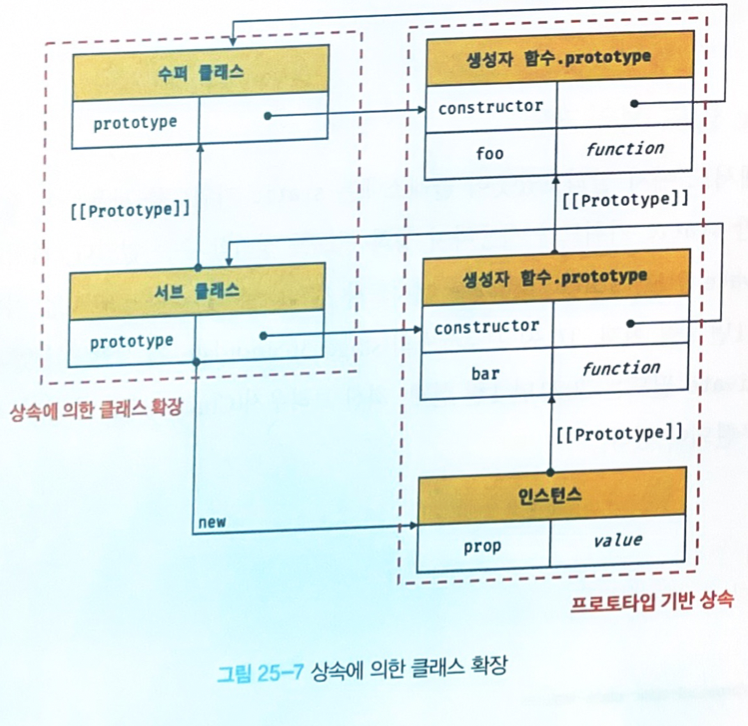
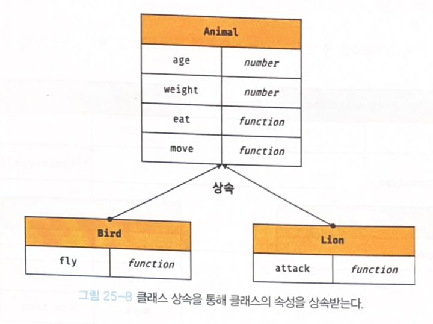
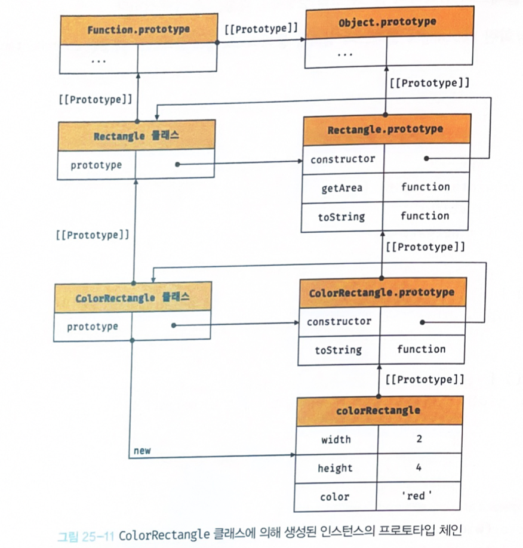

### 25.7.4 private 필드 정의 제안

- 자바스크릅티는 캡슐화를 완전하게 지원하지 않음
- private, public, protected 키워드와 같은 접근 제한자를 지원하지 않음
- 인스턴스의 프로퍼티는 인스턴스를 통해 클래스 외부에서 언제나 참조할 수 있음(항상 public 상태)

```js
class Person {
  constructor(name) {
    this.name = name; // 인스턴스 프로퍼티는 기본적으로 public하다.
  }
}

const me = new Person('Lee');
console.log(me.name); // Lee
```

- 외부에 그대로 노출됨


```js
class Person {
  name = 'Lee'; // 클래스 필드도 기본적으로 public 하다.
}

const me = new Person();
console.log(me.name) // Lee
```

- TC39 프로세스의 stage 3(candidate)에는 private 필드를 정의할 수 있는 새로운 표준 사양이 제안되었고, 최신 브라우저와 노드에서는 이미 구현되어있다.
- private 필드의 선두에는 #을 붙여주고, 참조시에도 #을 붙인다.

```js
class Person {
  // private 필드 정의
  #name = '';
  
  constructor(name) {
    // private 필드 참조
    this.#name = name;
  }
}

const me = new Person('Lee');

//private 필드 #name은 클래스 외부에서 참조할 수 없다.
console.log(me.#name);
// SyntaxError: Private field '#name' must be declared in an enclosing class
```

> 타입스크립트
>
> - public, private, protected 모두 지원
>
>   

- 외부에서 private 필드에 직접 접근할 수 있는 방법은 없지만, 접근자 프로퍼티를 통해 간접적으로 접근하는 방법은 유효함

  ```js
  class Person {
    // private 필드 정의
    #name = '';
    
    constructor(name) {
      // private 필드 참조
      this.#name = name;
    }
  	
  	//name은 접근자 프로퍼티
  	get name() {
      return this.#name.trim();
    }
  }
  
  const me = new Person('Lee');
  console.log(me.name); // Lee
  ```

- private 필드는 반드시 클래스 몸체에 정의해야 함

  - private 필드를 직접 constructor에 정의하면 에러가 발생함

    ``` js
    class Person {
      constructor(name) {
        // private 필드는 클래스 몸체에서 정의해야 함
        this.#name = name;
        // SyntexError..
      }
    }
    ```

### 25.6.7 static 필드 정의 제안

-  static 키워드를 사용하여 정적 메서드만 정의가 가능했고 필드는 정의할 수 없었지만, 최근에 표준 사양에 제안되었고 최신 브라우저와 노드에 이미 구현되어 있다.

  ```  js
  class MyMath {
    //static public 정의
    static PI = 22 / 7;
  	
  	//static private 필드 정의
  	static #num = 10;
    
    //static 메서드
    static increment() {
      return ++MyMath.#num;
    }
  }
  
  console.log(MyMath.PI); // 3.14285
  console.log(MyMath.increment()); // 11
  ```


## 25.8 상속에 의한 클래스 확장

### 25.8.1 클래스 상속과 생성자 함수 상속

- 상속에 의한 클래스 확장은 지금까지 살펴본 프로토타입 기반 상속는 다른 개념

  - 프로토타입 기반 상속은 프로토타입 체인을 통해 다른 객체의 자산을 상속받는 개념

  - 상속에 의한 클래스 확장은 기존 클래스를 상속받아 새로운 클래스를 확장하여 정의하는 것

    

  - 클래스와 생성자 함수는 인스턴스를 생성할 수 있는 함수라는 점에서 매우 유사함

  - 클래스는 상속을 통해 기존 클래스를 확장할 수 있는 문법이 기본적으로 제공되지만 생성자 함수는 그렇지 않음

  - 동물을 추상화한 Animal 클래스와 새와 사자를 추상화한 Bird, Lion 클래스를 각각 정의할 때, 새와 사자는 동물에 속하므로 동물의 속성을 갖지만, 새와 사자는 자신만의 고유한 속성도 갖는다.

    - Animal 클래스는 동물의 속성을 표현하고,  Bird, Lion 클래스는 상속을 통해 Animal 클래스의 속성을 그대로 사용하면서, 자신만의 고유한 속성만 추가하여 확장할 수 있음

      

    -  상속은 코드의 재사용 관점에서 매우 유용함

      ``` js
      class Animal {
        constructor(age, weight) {
          this.age = age;
          this.weight = weight;
        }
      
        eat() { return 'eat'; }
      
        move() { return 'move'; }
      }
      
      // 상속을 통해 Animal 클래스를 확장한 Bird 클래스
      class Bird extends Animal {
        fly() { return 'fly'; }
      }
      
      const bird = new Bird(1, 5);
      
      console.log(bird); // Bird {age: 1, weight: 5}
      console.log(bird instanceof Bird); // true
      console.log(bird instanceof Animal); // true
      
      console.log(bird.eat());  // eat
      console.log(bird.move()); // move
      console.log(bird.fly());  // fly
      ```

       

      - 클래스는 상속을 통해 다른 클래스를 확장할 수 있는 문법인 `extends`  키워드가 기본적으로 제공됨

- 자바스크립트는 클래스 기반의 언어가 아니므로 생성자 함수를 사용하여 클래스를 흉내 내려는 시도를 권장하지는 않지만, 의사 클래스 상속 패턴을 사용하여 상속에 의한 클래스 확장을 흉내 내기도 했음

  ```js
  // 의사 클래스 상속(pseudo classical inheritance) 패턴
  var Animal = (function () {
    function Animal(age, weight) {
      this.age = age;
      this.weight = weight;
    }
  
    Animal.prototype.eat = function () {
      return 'eat';
    };
  
    Animal.prototype.move = function () {
      return 'move';
    };
  
    return Animal;
  }());
  
  // Animal 생성자 함수를 상속하여 확장한 Bird 생성자 함수
  var Bird = (function () {
    function Bird() {
      // Animal 생성자 함수에게 this와 인수를 전달하면서 호출
      Animal.apply(this, arguments);
    }
  
    // Bird.prototype을 Animal.prototype을 프로토타입으로 갖는 객체로 교체
    Bird.prototype = Object.create(Animal.prototype);
    // Bird.prototype.constructor을 Animal에서 Bird로 교체
    Bird.prototype.constructor = Bird;
  
    Bird.prototype.fly = function () {
      return 'fly';
    };
  
    return Bird;
  }());
  
  var bird = new Bird(1, 5);
  
  console.log(bird); // Bird {age: 1, weight: 5}
  console.log(bird.eat());  // eat
  console.log(bird.move()); // move
  console.log(bird.fly());  // fly
  ```

  

### 25.8.2 extends 키워드

상속을 통해 클래스를 확장하려면 extends 키워드를 사용하여 상속받을 클래스를 정의

```  js
// 수퍼(베이스/부모)클래스
class Base {}

// 서브(파생/자식)클래스
class Derived extends Base {}
```


- 수퍼클래스와 서브클래스는 인스턴스의 프로토 타입 체인뿐 아니라 클래스 간의 프로토타입 체인도 생성함 => 이를 통해 프로토타입 메서드, 정적 메서드 모두 상속이 가능함


### 25.8.3 동적 상속

extends 키워드는 클래스뿐만 아니라 생성자 함수를 상속받아 클래스를 확장할 수도 있음

extends 키워드 앞에는 반드시 클래스가 와야 함

``` js
// 생성자 함수
function Base(a) {
  this.a = a;
}

// 생성자 함수를 상속받는 서브클래스
class Derived extends Base {}

const derived = new Derived(1);
console.log(derived); // Derived {a: 1}
```

extends 키워드 다음에는 클래스뿐만 아니라 [[Construct]] 내부 메서드를 갖는 함수 객체로 평가될 수 있는 모든 표현식을 사용할 수 있고, 이를 통해 동적으로 상속받을 대상을 결정할 수 있음

```js
function Base1() {}

class Base2 {}

let condition = true;

// 조건에 따라 동적으로 상속 대상을 결정하는 서브클래스
class Derived extends (condition ? Base1 : Base2) {}

const derived = new Derived();
console.log(derived); // Derived {}

console.log(derived instanceof Base1); // true
console.log(derived instanceof Base2); // false
```


### 25.8.4 서브클래스의  constructor

클래스에서 constructor를 생략하면 클래스에 다음과 같이 비어있는 constructor가 암묵적으로 정의됨

```  js
constructor(...agrs) {
  super(...args);
}
```

- super()는 수퍼클래스의 constructor를 호출하여 인스턴스를 생성한다.

- ... 을 붙이면 rest 파라미터가 되고, 함수에 전달된 인수들의 목록을 배열로 전달받는다.

```js
// 수퍼클래스
class Base {}

// 서브클래스
class Derived extends Base {}


//////////////////위 클래스들은 암묵적으로 아래와 같이 정의된다.
// 수퍼클래스
class Base {
  constructor() {}
}

// 서브클래스
class Derived extends Base {
  constructor(...agrs) { super(...args); }
}

const derived = new Derived();
```


### 25.8.5 super 키워드

super 키워드는 함수처럼 호출할 수도 있고 this와 같이 식별자처럼 참조할 수 있는 특수한 키워드

- super를 호출하면 수퍼클래스의 constructor를 호출
- super를 참조하면 수퍼클래스의 메서드를 호출할 수 있음


**super 호출**

-  상위 클래스의 constuctor를 호출함

```js
// 수퍼클래스
class Base {
  constructor(a, b) {
    this.a = a;
    this.b = b;
  }
}

// 서브클래스
class Derived extends Base {
  // 다음과 같이 암묵적으로 constructor가 정의된다.
  // constructor(...args) { super(...args); }
}

const derived = new Derived(1, 2);
console.log(derived); // Derived {a: 1, b: 2}
```

- 수퍼클래스에서 추가한 프로퍼티와 서브클래스에서 추가한 프로퍼티를 갖는 인스턴스를 생성한다면 서브클래스의 constructor를 생략할 수 없음 => super를 통해 전달해야 함

  ```js
  // 수퍼클래스
  class Base {
    constructor(a, b) { // ④
      this.a = a;
      this.b = b;
    }
  }
  
  // 서브클래스
  class Derived extends Base {
    constructor(a, b, c) { // ②
      super(a, b); // ③
      this.c = c;
    }
  }
  
  const derived = new Derived(1, 2, 3); // ①
  console.log(derived); // Derived {a: 1, b: 2, c: 3}
  ```

super호출 시 주의 사항

1. 서브클래스에서 constructor를 생략하지 않는 경우 서브클래스의 constructor에서는 반드시 super를 호출해야 함

   ```js
   class Base {}
   
   class Derived extends Base {
     constructor() {
       // ReferenceError: Must call super constructor in derived class before accessing 'this' or returning from derived constructor
       console.log('constructor call');
     }
   }
   
   const derived = new Derived();
   ```

   

2. 서브클래스의 constructor에서 super를 호출하기 전에는 this를 참조할 수 없음

   ```js
   lass Base {}
   
   class Derived extends Base {
     constructor() {
       // ReferenceError: Must call super constructor in derived class before accessing 'this' or returning from derived constructor
       this.a = 1;
       super();
     }
   }
   
   const derived = new Derived(1);
   ```

   

3. super는 반드시 서브클래스의 constructor에서만 호출함. 서브클래스가 아닌 클래스의 constructor나 함수에서 super를 호출하면 에러가 발생함

   ```js
   class Base {
     constructor() {
       super(); // SyntaxError: 'super' keyword unexpected here
     }
   }
   
   function Foo() {
     super(); // SyntaxError: 'super' keyword unexpected here
   }
   ```

   

**super 참조**

메서드 내에서 super를 참조하면 수퍼클래스의 메서드를 호출할 수 있다.

1. 서브클래스의 프로토타입 매서드 내에서 super.sayHi는 수퍼클래스의 프로토타입 메서드 sayHi를 가리킨다.

   ```js
   // 수퍼클래스
   class Base {
     constructor(name) {
       this.name = name;
     }
   
     sayHi() {
       return `Hi! ${this.name}`;
     }
   }
   
   // 서브클래스
   class Derived extends Base {
     sayHi() {
       // super.sayHi는 수퍼클래스의 프로토타입 메서드를 가리킨다.
       return `${super.sayHi()}. how are you doing?`;
     }
   }
   
   const derived = new Derived('Lee');
   console.log(derived.sayHi()); // Hi! Lee. how are you doing?
   ```

   - super 참조를 통해 수퍼클래스의 메서드를 참조하려면 super 클래스의 메서드가 바인딩된 객체, 즉 수퍼클래스의 prototype 프로퍼티에 바인딩된 프로토타입을 참조할 수 있어야 함

     위 예제는 아래와 동일하게 동작한다.

     ```js
     // 수퍼클래스
     class Base {
       constructor(name) {
         this.name = name;
       }
     
       sayHi() {
         return `Hi! ${this.name}`;
       }
     }
     
     class Derived extends Base {
       sayHi() {
         // __super는 Base.prototype을 가리킨다.
         const __super = Object.getPrototypeOf(Derived.prototype);
         return `${__super.sayHi.call(this)} how are you doing?`;
       }
     }
     ```

     - super는 자신을 참조하고 있는 메서드(Derived의 sayHi)가 바인딩되어 있는 객체(Derived.prototype)의 프로토타입(Base.prototype)을 가리킴

     - super.sayHi는 Base.prototpye.sayHi를 가리킴

     - 단, Base.prototpye.sayHi를 호출할 때 call 메서드를 사용해 this를 전달해야 함

       >  call 메서드를 사용해 this를 전달하지 않고 Base.prototype.sayHi를 그대로 호출하면 Base.prototype.sayHi 메서드 내부의 this는 Base.prototype을 가리킨다.
       >
       > Base.prototype.sayHi 메서드는 프로토타입 메서드이기 때문에 내부의 this는 Base.prototype이 아닌 인스턴스를 카리켜야 함(name 프로퍼티는 인스턴스에 존재하기 때문)

   super 참조가 동작하기 위해서는 super를 참조하고 있는 메서드가 바인딩되어 있는 객체의 프로토타입을 찾을 수 있어야 함. 이를 위해 메서드는 내부 슬록 [[HomeObject]]를 가지며, 자신을 바인딩하고 있는 객체를 가리킴

   - 의사코드

   ```js
   /*
   [[HomeObject]]는 메서드 자신을 바인딩하고 있는 객체를 가리킨다.
   [[HomeObject]]를 통해 메서드 자신을 바인딩하고 있는 객체의 프로토타입을 찾을 수 있다.
   예를 들어, Derived 클래스의 sayHi 메서드는 Derived.prototype에 바인딩되어 있다.
   따라서 Derived 클래스의 sayHi 메서드의 [[HomeObject]]는 Derived.prototype이고
   이를 통해 Derived 클래스의 sayHi 메서드 내부의 super 참조가 Base.prototype으로 결정된다.
   따라서 super.sayHi는 Base.prototype.sayHi를 가리키게 된다.
   */
   super = Object.getPrototypeOf([[HomeObject]])
   ```

   - 주의)ES6 메서드 축약 표현으로 정의된 함수만 [[HomeObject]]를 가짐

   ```js
   
   const obj = {
     // foo는 ES6의 메서드 축약 표현으로 정의한 메서드다. 따라서 [[HomeObject]]를 갖는다.
     foo() {},
     // bar는 ES6의 메서드 축약 표현으로 정의한 메서드가 아니라 일반 함수다.
     // 따라서 [[HomeObject]]를 갖지 않는다.
     bar: function () {}
   };
   ```

   [[HomeObject]]를 가지는 함수만이 super를 참조할 수 있다. 따라서 ES6의 메서드 축약 표현으로 정의된 함수만 super 참조를 할 수 있다. 단, super 참조는 수퍼클래스의 메서드를 참조하기 위해 사용하므로 서브클래스의 메서드에서 사용해야 함

   super 참조는 클래스의 전유물은 아님. 객체 리터럴에서도 super 참조를 사용할 수 있음(단, 메서드 축약 표현으로 정의된 함수만 가능)

   ```js
   const base = {
     name: 'Lee',
     sayHi() {
       return `Hi! ${this.name}`;
     }
   };
   
   const derived = {
     __proto__: base,
     // ES6 메서드 축약 표현으로 정의한 메서드다. 따라서 [[HomeObject]]를 갖는다.
     sayHi() {
       return `${super.sayHi()}. how are you doing?`;
     }
   };
   
   console.log(derived.sayHi()); // Hi! Lee. how are you doing?
   ```

2. 서브클래스의 정적 메서드 내에서 super.sayHi는 수퍼클래스의 정적 메서드 sayHi를 가리킨다.

   ```js
   // 수퍼클래스
   class Base {
     static sayHi() {
       return 'Hi!';
     }
   }
   
   // 서브클래스
   class Derived extends Base {
     static sayHi() {
       // super.sayHi는 수퍼클래스의 정적 메서드를 가리킨다.
       return `${super.sayHi()} how are you doing?`;
     }
   }
   
   console.log(Derived.sayHi()); // Hi! how are you doing?
   ```

   

### 25.8.6 상속 클래스의 인스턴스 생성 과정

직사각형을 추상화한 Rectangle 클래스와 상속을 통해 Rectangle 클래스를 확장한 colorRectangle 클래스를 정의

```js
// 수퍼클래스
class Rectangle {
  constructor(width, height) {
    this.width = width;
    this.height = height;
  }

  getArea() {
    return this.width * this.height;
  }

  toString() {
    return `width = ${this.width}, height = ${this.height}`;
  }
}

// 서브클래스
class ColorRectangle extends Rectangle {
  constructor(width, height, color) {
    super(width, height);
    this.color = color;
  }

  // 메서드 오버라이딩
  toString() {
    return super.toString() + `, color = ${this.color}`;
  }
}

const colorRectangle = new ColorRectangle(2, 4, 'red');
console.log(colorRectangle); // ColorRectangle {width: 2, height: 4, color: "red"}

// 상속을 통해 getArea 메서드를 호출
console.log(colorRectangle.getArea()); // 8
// 오버라이딩된 toString 메서드를 호출
console.log(colorRectangle.toString()); // width = 2, height = 4, color = red
```



new 연산자와 함께 ColorRectangle을 호출하면 아래 과정을 통해 인스턴스가 생성된다.

1. 서브클래스의 super 호출

   자바스크립트 엔진은 클래스를 평가할 때 수퍼클래스와 서브클래스를 구분하기 위해 base 또는 derived 를 값으로 갖는 내부 슬롯 [[ConstructorKind]]를 갖는다.

   [[ConstructorKind]]의 값

   - 다른 클래스를 상속받지 않는 클래스 : base
   - 다른 클래스를 상속받는 서브 클래스 : derived

   이를 통해 수퍼클래스와 서브클래스는 new 연산자와 함께 호출되었을 때의 동작이 구분됨

   다른 클래스를 상속받지 않는 클래스는 "클래스의 인스턴스 생성 과정"에서 살펴보았듯이 new 연산자와 함께 호출되었을 때 암묵적으로 빈 객체, 즉 인스턴스를 생성하고, 이를  this 바인딩함

   반면에 서브클래스는 자신이 직접 인스턴스를 생성하지 않고, 수퍼클래스에게 인스턴스 생성을 위임한다. => 그렇기 때문에 서브클래스의 constructor에서 super를 반드시 호출해야 한다.

   서브클래스가 new 연산자와 함꼐 호출되면 실제로 super를 호출하면서 수퍼클래스에서 객체를 생성한다.

   

2. 수퍼클래스의 인스턴스 생성과 this 바인딩

   수퍼클래스의 constructor 내부의 코드가 실행되기 이전에 암묵적으로 빈 객체를 생성한다. 이 빈 객체가 바로 클래스가 생성한 인스턴스이며, 암묵적으로 생성된 빈 객체, 즉 인스턴스는 this에 바인딩 된다.

   따라서 수퍼클래스의 constructor 내부의 this는 생성된 인스턴스를 가리킨다.

   ```js
   // 수퍼클래스
   class Rectangle {
     constructor(width, height) {
       // 암묵적으로 빈 객체, 즉 인스턴스가 생성되고 this에 바인딩된다.
       console.log(this); // ColorRectangle {}
       // new 연산자와 함께 호출된 함수, 즉 new.target은 ColorRectangle이다.
       console.log(new.target); // ColorRectangle
   ...
   ```

   이때 인스턴스는 수퍼클래스가 생성했지만, new 연산자와 함께 호출된 클래스가 서브클래스이기 때문에, new.target은 서브클래스를 가리킨다. 따라서, 인스턴스는 new.target이 가리키는 서브클래스가 생성한 것으로 처리된다.

   생성된 인스턴스의 프로토타입은 수퍼클래스의 prototype 프로퍼티가 가리키는 객체(Rectangle.prototype)가 아니라, new.target 즉 서브클래스의 prototpye 프로퍼티가 가리키는 객체 (ColorRectangle.prototype)다.

   ```js
   // 수퍼클래스
   class Rectangle {
     constructor(width, height) {
       // 암묵적으로 빈 객체, 즉 인스턴스가 생성되고 this에 바인딩된다.
       console.log(this); // ColorRectangle {}
       // new 연산자와 함께 호출된 함수, 즉 new.target은 ColorRectangle이다.
       console.log(new.target); // ColorRectangle
   
       // 생성된 인스턴스의 프로토타입으로 ColorRectangle.prototype이 설정된다.
       console.log(Object.getPrototypeOf(this) === ColorRectangle.prototype); // true
       console.log(this instanceof ColorRectangle); // true
       console.log(this instanceof Rectangle); // true
   ...
   ```

   

3. 수퍼클래스의 인스턴스 초기화

   수퍼클래스의 constructor가 실행되어 this에 바인딩되어 있는 인스턴스를 초기화 함

   즉, this에 바인딩 되어 있는 인스턴스에 프로퍼티를 추가하고 constructor가 인수로 전달받은 초기값으로 인스턴스의 프로퍼티를 초기화 함

   ```js
   // 수퍼클래스
   class Rectangle {
     constructor(width, height) {
       // 암묵적으로 빈 객체, 즉 인스턴스가 생성되고 this에 바인딩된다.
       console.log(this); // ColorRectangle {}
       // new 연산자와 함께 호출된 함수, 즉 new.target은 ColorRectangle이다.
       console.log(new.target); // ColorRectangle
   
       // 생성된 인스턴스의 프로토타입으로 ColorRectangle.prototype이 설정된다.
       console.log(Object.getPrototypeOf(this) === ColorRectangle.prototype); // true
       console.log(this instanceof ColorRectangle); // true
       console.log(this instanceof Rectangle); // true
   
       // 인스턴스 초기화
       this.width = width;
       this.height = height;
   
       console.log(this); // ColorRectangle {width: 2, height: 4}
     }
   ...
   ```

   

4. 서브클래스 constructor로의 복귀와 this 바인딩

   super의 호출이 종료되고 제어 흐름이 서브클래스 consturctor로 돌아옴

   이때 super가 반환한 인스턴스가 this에 바인딩됨

   서브클래스는 별도의 인스턴스를 생성하지 않고, super가 반환한 인스턴스를 this에 바인딩하여 그대로 사용

   ```js
   // 서브클래스
   class ColorRectangle extends Rectangle {
     constructor(width, height, color) {
       super(width, height);
   
       // super가 반환한 인스턴스가 this에 바인딩된다.
       console.log(this); // ColorRectangle {width: 2, height: 4}
   ...
   
   ```

   super가 호출되지 않으면 인스턴스가 생성되지 않으며, this 바인딩도 할 수 없음

   (super를 호출하기 전에 this를 참조할 수 없는 이유가 이 때문)

   

5. 서브클래스의 인스턴스 초기화

   super 호출 이후, 서브클래스의 constructor에 기술되어 있는 인스턴스 초기화가 실행됨

   즉, this에 바인딩되어 있는 인스턴스에 프로퍼티를 추가하고 constructor가 인수로 전달받은 초기 값으로 인스턴스의 프로퍼티를 초기화 함

   

6. 인스턴스 반환

   클래스의 모든 처리가 끝나면 완성된 인스턴스가 바인딩된 this 암묵적으로 반환됨

   ```js
   // 서브클래스
   class ColorRectangle extends Rectangle {
     constructor(width, height, color) {
       super(width, height);
   
       // super가 반환한 인스턴스가 this에 바인딩된다.
       console.log(this); // ColorRectangle {width: 2, height: 4}
   
       // 인스턴스 초기화
       this.color = color;
   
       // 완성된 인스턴스가 바인딩된 this가 암묵적으로 반환된다.
       console.log(this); // ColorRectangle {width: 2, height: 4, color: "red"}
     }
   ...
   ```

   

### 25.8.7 표준 빌트인 생성자 함수 확장

extends 키워드 다음에는 클래스뿐만이 아니라 [[Contruct]] 내부 메서드를 갖는 함수 객체로 평가될 수 있는 모든 표현식을 사용할 수 있음

- String, Number, Array 같은 표준 빌트인 객체도 [[Construct]] 내부 메서드를 갖는 생성자 함수이므로 extends 키워드를 사용하여 확장할 수 있음

```js
// Array 생성자 함수를 상속받아 확장한 MyArray
class MyArray extends Array {
  // 중복된 배열 요소를 제거하고 반환한다: [1, 1, 2, 3] => [1, 2, 3]
  uniq() {
    return this.filter((v, i, self) => self.indexOf(v) === i);
  }

  // 모든 배열 요소의 평균을 구한다: [1, 2, 3] => 2
  average() {
    return this.reduce((pre, cur) => pre + cur, 0) / this.length;
  }
}

const myArray = new MyArray(1, 1, 2, 3);
console.log(myArray); // MyArray(4) [1, 1, 2, 3]

// MyArray.prototype.uniq 호출
console.log(myArray.uniq()); // MyArray(3) [1, 2, 3]
// MyArray.prototype.average 호출
console.log(myArray.average()); // 1.75
```

-  Array 를 상속받은 MyArray 클래스가 생성한 인스턴스는 Array.prototype의 모든 메서드를 사용할 수 있음

- 주의할 점은, map, filter와 같이 새로운 배열을 반환하는 메서드는 MyArray 클래스의 인스턴스를 반환한다는 점이다.

  ```js
  console.log(myArray.filter(v => v % 2) instanceof MyArray); // true
  ```

- 만약 새로운 배열을 반환하는 메서드가 MyArray 클래스의 인스턴스를 반환하지 않고, Array의 인스턴스를 반환하면 MyArray 클래스의 메서드와 메서드 체이닝이 불가능하다.

  ``` js
  // 메서드 체이닝
  // [1, 1, 2, 3] => [ 1, 1, 3 ] => [ 1, 3 ] => 2
  console.log(myArray.filter(v => v % 2).uniq().average()); // 2
  ```

  -  myArray.filter가 반환하는 인스턴스는 MyArray 클래스가 생성한 인스턴스, 즉 MyArray 타입임 => 메서드 체이닝 가능

- 만약, MyArray 클래스의 uniq 메서드가 MyArray 클래스가 생성한 인스턴스가 아닌 Array가 생성한 인스턴스를 반환하게 하려면 다음과 같이 Symbol.species를 사용하여 정적 접근자 프로퍼티를 추가해야 함

  ```js
  // Array 생성자 함수를 상속받아 확장한 MyArray
  class MyArray extends Array {
    // 모든 메서드가 Array 타입의 인스턴스를 반환하도록 한다.
    static get [Symbol.species]() { return Array; }
  
    // 중복된 배열 요소를 제거하고 반환한다: [1, 1, 2, 3] => [1, 2, 3]
    uniq() {
      return this.filter((v, i, self) => self.indexOf(v) === i);
    }
  
    // 모든 배열 요소의 평균을 구한다: [1, 2, 3] => 2
    average() {
      return this.reduce((pre, cur) => pre + cur, 0) / this.length;
    }
  }
  
  const myArray = new MyArray(1, 1, 2, 3);
  
  console.log(myArray.uniq() instanceof MyArray); // false
  console.log(myArray.uniq() instanceof Array); // true
  
  // 메서드 체이닝
  // uniq 메서드는 Array 인스턴스를 반환하므로 average 메서드를 호출할 수 없다.
  console.log(myArray.uniq().average());
  // TypeError: myArray.uniq(...).average is not a function
  ```

  

