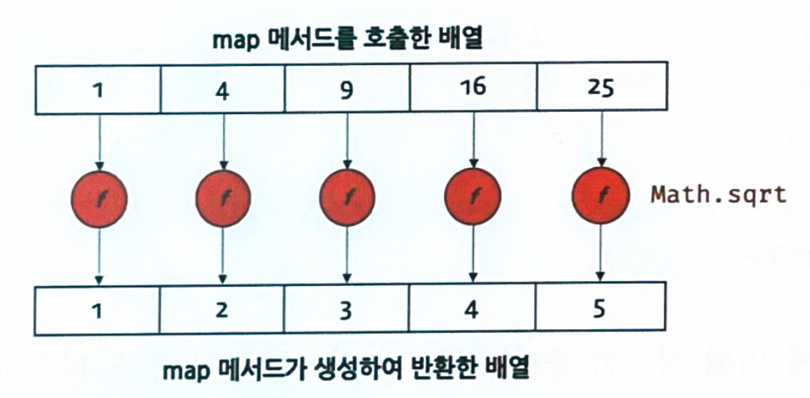
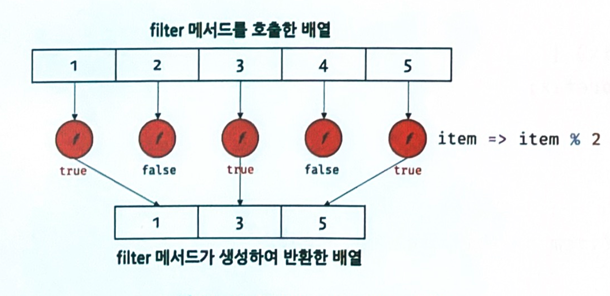
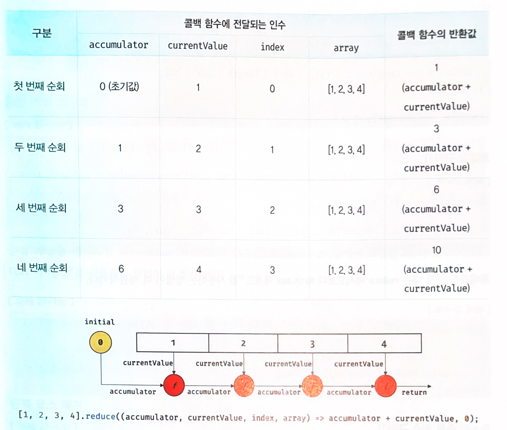
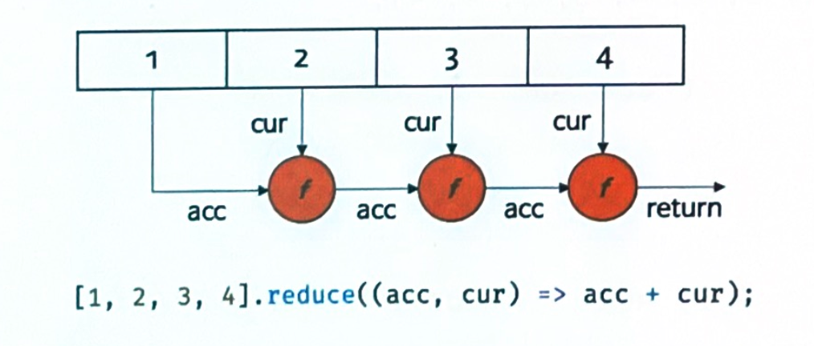

### 27.9.2 Array.prototype.forEach

- 함수형 프로그래밍

  - 순수 함수와 보조 함수의 조합

    - 조건문 과 반복문을 제거하여 복잡성을 해결
    - 변수의 사용을 억제하여 상태 변경을 피함

  - for문 : 함수형 프로그래밍이 추구하는 바와 맞지 않음

    - 반복을 위한 변수를 선언
    - 조건식과 증감식

    ```js
    const numbers = [1, 2, 3]; 
    const pows = [];
    
    // for 문으로 배열 순회
    for (let i = 0; i < numbers.length; i++) {
      pows.push(numbers[i] ** 2);
    }
    console.log(pows); // [1, 4, 9]
    ```

- forEach 메서드

  - for문을 대체할 수 있는 반복문을 추상화한 고차 함수
  - 내부에서 반복문을 통해 자신을 호출한 배열을 순회 하면서 수행 해야할 처리를 콜백 함수로 전달 받아 반복 호출

  ```js
  const numbers = [1, 2, 3]; 
  const pows = [];
  
  // forEach 메서드는 numbers 배열의 모든 요소를 순회하면서 콜백 함수를 반복 호출한다.
  numbers.forEach(item => pows.push(item ** 2)); 
  console.log(pows); // [1, 4, 9]
  ```

  - numbers 배열의 요소가 3개이므로 콜백 함수도 3번 호출

  ```js
  // forEach 메서드는 콜백 함수를 호출하면서 3개(요소값, 인덱스, this)의 인수를 전달한다. 
  [1, 2, 3].forEach((item, index, arr) => {
  	console.log(`요소값: ${item}, 인덱스: ${index}, this: ${JSON.stringify(arr)}`); 
  }); //JSON.stringify 메서드는 객체를 JSON 포맷의 문자열로 변환
  /*
  요소값: 1, 인덱스: 0, this: [1,2,3]
  요소값: 2, 인덱스: 1, this: [1,2,3]
  요소값: 3, 인덱스: 2, this: [1,2,3) 
  */
  ```

  - 호출한 배열의 요소값, 인덱스, forEach 메서드를 호출한 배열(this)을 순차적으로 전달

  ```js
  const numbers = [1, 2, 3];
  // forEach 메서드는 원본 배열을 변경하지 않지만 콜백 함수를 통해 원본 배열을 변경할 수는 있다.
  // 콜백 함수의 세 번째 매개변수 arr은 원본 배열 numbers를 가리킨다.
  // 따라서 콜백 함수의 세 번째 매개변수 arr을 직접 변경하면 원본 배열 numbers가 변경된다. 
  
  numbers.forEach((item, index, arr) => { arr[index] = item ** 2; }); console.log(numbers); // (1, 4, 9)
  ```

  - forEach 메서드는 원본 배열(forEach 메서드를 호출한 배열, 즉 this)을 변경하지 않지만, 콜백 함수를 통해 원본을 변경할 수 있음

  ```js
  const result = [1, 2, 3].forEach(console.log); 
  console.log(result); // undefined
  ```

  - forEach 메서드의 반환값은 언제나 undefined

- forEach 메서드의 두 번째 인수로 forEach 메서드의 콜백 함수 내부에서 this로 사용할 객체를 전달할 수 있음

  ```js
  class Numbers { 
    numberArray = [];
   	multiply(arr) { 
      arr.forEach(function (item) {
  			// TypeError: Cannot read property 'numberArray' of undefined
  			this.numberArray.push(item * item); 
    	});
    } 
  }
  
  const numbers = new Numbers(); 
  numbers.multiply([1, 2, 3]);
  ```

  - forEach 메서드의 콜백 함수는 **일반 함수**로 호출되므로 콜백 함수 내부의 this는 **undefined**를 가리킴
  - this가 전역 객체가 아닌 undefined를 가리키는 이유는 **클래스 내부의 모든 코드에는 암묵적으로 strict mode가 적용**되기 때문

  ```js
  class Numbers { 
    numberArray = [];
  
  	multiply(arr) { 
    	arr.forEach(function (item) {
      	this.numberArray.push(item * item);
   	 	}, this); // forEach 메서드의 콜백 함수 내부에서 this로 사용할 객체를 전달 
    }
  }
  
  const numbers = new Numbers(); 
  numbers.multiply([1, 2, 3]);
  console.log(numbers.numberArray); // [1, 4, 9]
  ```

  - forEach 메서드의 콜백 함수 내부의 this와 multiply 메서드 내부의 this를 일치시키려면 forEach 메서드 의 두 번째 인수로 forEach 메서드의 콜백 함수 내부에서 **this로 사용할 객체를 전달**
  - 더나은방법은 ES6의 **화살표함수**를사용
    - 화살표 함수는 함수 자체의 this 바인딩을 갖지 않음
    - 화살표 함수 내부에서 this를 참조하면 상위 스코프, 즉 multiply 메서드 내부의 this를 그대로 참조

  ```js
  class Numbers { 
    numberArray = [];
  
  	multiply(arr) { 
    	// 화살표 함수 내부에서 this를 참조하면 상위 스코프의 this를 그대로 참조한다.
  		arr.forEach(item => this.numberArray.push(item * item));
    }
  }
  
  const numbers = new Numbers(); 
  numbers.multiply([1, 2, 3]);
  console.log(numbers.numberArray); // [1, 4, 9]
  ```

- forEach 메서드의 폴리필

  ```js
  // 만약 Array.prototype에 forEach 메서드가 존재하지 않으면 폴리필을 추가한다. 
  if (!Array.prototype.forEach) {	
    Array.prototype.forEach = function (callback, thisArg) {     
    // 첫 번째 인수가 함수가 아니면 TypeError를 발생시킨다.	
    if (typeof callback !== 'function') {		
      throw new TypeError(callback + ' is not a function'); }        
    // this로 사용할 두 번째 인수를 전달받지 못하면 전역 객체를 this로 사용한다.     
    thisArg = thisArg || window;    
    // for 문으로 배열을 순회하면서 콜백 함수를 호출한다.     
    for (var i = 0; i < this.length; i++) {			
      // call 메서드를 통해 thisArg를 전달하면서 콜백 함수를 호출한다.       
      // 이때 콜백 함수의 인수로 배열 요소, 인덱스, 배열 자신을 전달한다.       
      callback.call(thisArg, this[i], i, this);    
    }  
  };}
  ```

  - forEach 메서드도 내부에서는 반복문(for 문)을 통해 배열을 순회

    반복문을 메서 드 내부로 은닉하여 로직의 흐름을 이해하기 쉽게 하고 복잡성을 해결

- break,continue문을 사용할 수 없음

  ```js
  [1, 2, 3].forEach(item => {   console.log(item);  if (item > 1) break; 
                             // SyntaxError: Illegal break statement 
                            });
                             [1, 2, 3].forEach(item => {	console.log(item);	if (item > 1) continue;	
                                                        // SyntaxError: Illegal continue statement: no surrounding iteration statement });
  ```

- 희소배열의 경우 존재하지 않는 요소는 순회대상에서 제외 (map. filter, reduce 메서드 등에서도 마찬가지)

  - ? 폴리필에서는 그런내용은 없는거 같은데

  ```js
  // 희소 배열
  const arr = [1, , 3];
  // for 문으로 희소 배열을 순회
  for (let i = 0; i < arr.length; i++) {  console.log(arr[i]); 
                                    // 1, undefined, 3 }// forEach 메서드는 희소 배열의 존재하지 않는 요소를 순회 대상에서 제외한다. 
                                        arr.forEach(v => console.log(v)); // 1, 3
  ```

-  forEach 메서드는 for 문에 비해 성능은 좋지 않지만 가독성이 더 좋음


### 27.9.3 Array.prototype.map

- 배열의 모든 요소를 순회하면서 인수로 전달받은 콜백 함수를 반복 호출

- 콜백함수의 반환값들로 구성된 새로운 배열을 반환

  ```js
  const numbers = [1, 4, 9];// map 메서드는 numbers 배열의 모든 요소를 순회하면서 콜백 함수를 반복 호출한다. // 그리고 콜백 함수의 반환값들로 구성된 새로운 배열을 반환한다.const roots = numbers.map(item => Math.sqrt(item));// 위 코드는 다음과 같다.// const roots = numbers.map(Math.sqrt);;// map 메서드는 새로운 배열을 반환한다.console.log(roots); // [ 1, 2, 3] // map 메서드는 원본 배열을 변경하지 않는다. console.log(numbers); // [ 1, 4, 9 ]
  ```

- forEach vs map

  - forEach : 단순히 반복 문을 대체

  - map : 요소값을 다른 값으로 매핑mapping한 새로운 배열을 생성

    

    

- 콜백함수의 인자로 (요소값, 인덱스, 호출한 배열 this) 를 순차적으로 전달

  ```js
  // map 에서드는 콜백 함수를 호출하면서 3개(요소값, 인덱스, this)의 인수를 전달한다. 
  [1, 2,3].map((item, index, arr) => {
    console.log( `요소값: ${item}, 인덱스: ${index}, this: ${JSON.stringify(arr)}` ); 
  	return item;
  });
  
   /*
  요소값: 1, 인덱스: 0, this: [1,2,3] 
  요소값: 2, 인덱스: 1, this: [1,2,3] 
  요소값: 3, 인덱스: 2, this: [1,2,3]
  */
  ```

- map 메서드의 두 번째 인수로 map 메서드의 콜백 함수 내부에서 this로 사용할 객체를 전달

  ```js
  class Prefixer {
    constructor(prefix) { 
      this.prefix = prefix;
    }
    
    add(arr) {
      return arr.map(function (item) {
        // 외부에서 this를 전달하지 않으면 this는 undefined를 가리킨다. 
        return this.prefix + item;
      }, this); // map 메서드의 콜백 함수 내부에서 this로 사용할 객체를 전달 
    }
  }
    
  const prefixer = new Prefixer('-webkit-');
  console.log(prefixer.add(['transition', 'user-select'])); 
  // ['-webkit-transition', '-webkit-user-select']
  ```

- 화살표 함수를 사용하면, this 참조가 가능하다.

  ```js
  class Prefixer {
    constructor(prefix) { 
      this.prefix = prefix;
    }
    
    add(arr) {
      // 화살표 함수 내부에서 this를 참조하면 상위 스코프의 this를 그대로 참조한다.
      return arr.map(item => this.prefix + item);
    }
  }
    
  const prefixer = new Prefixer('-webkit-');
  console.log(prefixer.add(['transition', 'user-select'])); 
  // ['-webkit-transition', '-webkit-user-select']
  ```


### 27.9.4 Array.prototype.filter

- 콜백 함수의 반환값이 true인 요소로만 구성된 새로운 배열을 반환

```js
const numbers = [1, 2, 3, 4. 5];

// filter 메서드는 numbers 배열의 모든 요소를 순회하면서 콜백 함수를 반복 호출한다. 
// 그리고 콜백 함수의 반환값이 true인 요소로만 구성된 새로운 배열을 반환한다.
// 다음의 경우 numbers 배열에서 홀수인 요소만 필터링한다(1은 true로 평가된다).
const odds = numbers.filter(item => item % 2); 
console.log(odds); // [1, 3, 5]
```



- 콜백함수의 인자로 (요소값, 인덱스, 호출한 배열 this) 를 순차적으로 전달

```js
// filter 메서드는 콜백 함수를 호출하면서 3개(요소값, 인덱스, this)의 인수를 전달한다. 
[1, 2, 3].filter((item, index, arr) => {
  console.log(요소값: ${item}, 인덱스: ${index}, this: ${JSON.stringify(arr)});
  return item % 2; 
});
/*
요소값: 1, 인덱스: 0, this: [1,2,3]
요소값: 2, 인덱스: 1, this: [1,2,3]
요소값: 3, 인덱스: 2, this: [1,2,3] 
*/
```

- 자신을 호출한 배열에서 특정요소를 제거

```js
class Users { 
  constructor() {
		this.users - [
			{ id: 1, name: 'Lee' }, 
      { id: 2, name: 'Kim' }
		]; 
  }
	
  // 요소 추출 
  findById(id) {
  	// id가 일치하는 사용자만 반환한다.
    return this.users.filter(user => user.id === id); 
  }
  
  // 요소 제거
  remove(id) {
    // id가 일치하지 않는 사용자를 제거한다.
     this.users = this.users.filter(user => user.id !== id);
  }
}
const users = new Users();

let user = users.findById(1); 
console.log(user); // [{ id: 1, name: 'Lee' }]

// id가 1인 사용자를 제거한다. 
users.remove(1);
user = users.findById(1); 
console.log(user); // []
```

- 특정 요소가 중복되어 있다면 중복된 요소가 모두 제거
  - 특정 요소를 하나만 제거하려면 **indexOf** 메서드를 통해 특정요소의 인덱스를 취득한 다음 **splice**메서드를 사용 


### 27.9.5 Array.prototype.reduce

- 콜백함수의 반환값을 다음 순회시에 콜백함수의 첫번째 인수로 전달하면서, 콜백함수를 호출하여 하나의 결과값을 만들어 반환

  - reduce의 두개의 인수
    - 1 : 콜백 함수
    - 2 : 초기값
  - reduce 메서드의 **콜백 함수에는 4개의 인수**
    - 1: 초기값 또는 콜백함수의 이전반환 값
    - 2 : reduce메서드를 호출한 배열의 요소값
    - 3 : 인덱스
    - 4 : reduce 메서드를 호출한 배열 자체, 즉 this

  ```js
  // 1부터 4까지 누적을 구한다.
  const sum = (1, 2, 3, 4].reduces(accumulator, currentValue, index, array) => accumula
  tor + currentValue, 0); 
  
  console.log(sum); // 10
  ```

  

- 평균 구하기

  ```js
  const values = [1, 2, 3, 4, 5, 6];
  
  const average = values.reduce((acc, cur, i, { length }) => {
  // 마지막 순회가 아니면 누적값을 반환하고 마지막 순회면 누적값으로 평균을 구해 반환한다. 
    return i === length - 1 ? (acc + cur) / length : acc + cur:
  }, 0);
  
  console.log(average); // 3.5
  ```

- 최대값 구하기

  ```js
  const values = [1, 2, 3, 4, 5];
  
  const max = values.reduce((acc, cur) => (acc > cur ? acc : cur), 0);
  console.log(max); // 5
  ```

  > Math.max 를 사용하는게 더 직관적

- 요소의 중복 횟수 구하기

  ```js
  const fruits = ['banana', 'apple', 'orange', 'orange', 'apple'];
  
  const count = fruits.reduce((acc, cur) => {
    // 첫 번째 순회 시 acc는 초기값인 {}이고 cur은 첫 번째 요소인 'banana'다.
    // 초기값으로 전달받은 빈 객체에 요소값인 cur을 프로퍼티 키로, 요소의 개수를 프로퍼티 값으로 할당한다. 
    // 만약 프로퍼티 값이 undefined(처음 등장하는 요소)이면 프로퍼티 값을 1로 초기화한다.
    acc[cur] = (acc[cur] || 0) + 1;
    return acc;
  }, {});
  
   // 콜백 함수는 총 5번 호출되고 다음과 같이 결과값을 반환한다. 
  /*
  {banana: 1} => {banana: 1, apple: 1} => {banana: 1, apple: 1, orange: 1}
  => {banana: 1, apple: 1, orange: 2} => {banana: 1, apple: 2, orange: 2} 
  */
  
  console.log(count); // { banana: 1, apple: 2, orange: 2 }
  ```

- 중첩 배열 평탄화

  ```js
  const values = [1, [2, 3], 4, [5, 6]];
  
  const flatten = values.reduce((acc, cur) => acc.concat(cur), []);
  // [1] => [1, 2, 3] => [1, 2, 3, 4] => [1, 2, 3, 4, 5, 6]
  
  console.log(flatten); // [1, 2, 3, 4, 5, 6]
  ```

  - reduce 메서드보다 ES10(ECMAScript 2019)에서 도입된 Array.prototype. flat 메서드를 사용하는 방법

  ```js
  [1, [2, 3, 4, 5]].flat(); // -> [1, 2, 3, 4, 5]
  
  // 인수 2는 중첩 배열을 평탄화하기 위한 깊이 값이다.
  [1, [2, 3, [4, 5]]].flat(2); // -> [1, 2, 3, 4, 5]
  27-120
  ```

- 중복 요소 제거

  ```js
  const values = [1, 2, 1, 3, 5, 4, 5, 3, 4, 4];
  
  const result = values.reduce((acc, cur, i, arr) => {
    // 순회 중인 요소의 인덱스가 자신의 인덱스라면 처음 순회하는 요소다.
    // 이 요소만 초기값으로 전달받은 배열에 담아 반환한다.
    // 순회 중인 요소의 인덱스가 자신의 인덱스가 아니라면 중복된 요소다.
    if (arr.indexOf(cur) === i) acc.push(cur);
    return acc;
  }, []);
  
  console.log(result); // [1, 2, 3, 5, 4]
  ```

  - filter가 더 직관적

    ```js
    const values = [1, 2, 1, 3, 5, 4, 5, 3, 4, 4];
    
    // 순회중인 요소의 인덱스가 자신의 인덱스라면 처음 순회하는 요소이다. 이 요소만 필터링한다.
    const result = values.filter((v, i, arr) => arr.indexOf(v) === i);
    console.log(result); // [1, 2, 3, 5, 4]
    ```

  - Set을 사용할 수도 있음

    ```js
    const values = [1, 2, 1, 3, 5, 4, 5, 3, 4, 4];
    
    // 중복을 허용하지 않는 Set 객체의 특성을 활용하여 배열에서 중복된 요소를 제거할 수 있다.
    const result = [...new Set(values)];
    console.log(result); // [1, 2, 3, 5, 4]
    ```

  >  reduce로 map, filter, some, every, find같은 배열의 고차함를 구현할 수 있음

- 두번째 인수로 전달하는 초기값은 생략 가능하고, 생략하면 배열의 첫 번째 요소가 초기값이 된다.

  ```js
  // reduce 메서드의 두 번째 인수, 즉 초기값을 생략했다.
  const sum = [1, 2, 3, 4].reduce((acc, cur) => acc + cur);
  console.log(sum); // 10
  ```

  

  - reduce 메서드를 호출할 때는 언제나 초기값을 전달하는 것이 안전

    ```js
    const sum = [].reduce((acc, cur) => acc + cur);
    // TypeError: Reduce of empty array with no initial value
    ```

    - 빈 배열로 호출하게 되면 에러가 발생함

    ```js
    const sum = [].reduce((acc, cur) => acc + cur, 0);
    console.log(sum); // 0
    ```

  - 특정 프로퍼티 값을 합산하는 경우

    ```js
    const products = [
      { id: 1, price: 100 },
      { id: 2, price: 200 },
      { id: 3, price: 300 }
    ];
    
    // 1번째 순회 시 acc는 { id: 1, price: 100 }, cur은 { id: 2, price: 200 }이고
    // 2번째 순회 시 acc는 300, cur은 { id: 3, price: 300 }이다.
    // 2번째 순회 시 acc에 함수에 객체가 아닌 숫자값이 전달된다. 이때 acc.price는 undefined다.
    const priceSum = products.reduce((acc, cur) => acc.price + cur.price);
    
    console.log(priceSum); // NaN
    ```

    - 초기값을 반드시 전달해야 함

    ```js
    const products = [
      { id: 1, price: 100 },
      { id: 2, price: 200 },
      { id: 3, price: 300 }
    ];
    
    /*
    1번째 순회 : acc => 0,   cur => { id: 1, price: 100 }
    2번째 순회 : acc => 100, cur => { id: 2, price: 200 }
    3번째 순회 : acc => 300, cur => { id: 3, price: 300 }
    */
    const priceSum = products.reduce((acc, cur) => acc + cur.price, 0);
    
    console.log(priceSum); // 600
    ```

###  27.9.6 Array.prototype.some

- 콜백함수의반환값이단한번이라도참이면true,모두거짓이면false를반환

  ```js
  // 배열의 요소 중에 10보다 큰 요소가 1개 이상 존재하는지 확인
  [5, 10, 15].some(item => item > 10); // -> true
  
  // 배열의 요소 중에 0보다 작은 요소가 1개 이상 존재하는지 확인
  [5, 10, 15].some(item => item < 0); // -> false
  
  // 배열의 요소 중에 'banana'가 1개 이상 존재하는지 확인
  ['apple', 'banana', 'mango'].some(item => item === 'banana'); // -> true
  
  // some 메서드를 호출한 배열이 빈 배열인 경우 언제나 false를 반환한다.
  [].some(item => item > 3); // -> false
  ```

###  

### 27.9.7 Array.prototype.every

- 콜백 함수의 반환값이 모두 참 이면 true, 단 한 번이라도 거짓이면 false를 반환

  ```js
  // 배열의 모든 요소가 3보다 큰지 확인
  [5, 10, 15].every(item => item > 3); // -> true
  
  // 배열의 모든 요소가 10보다 큰지 확인
  [5, 10, 15].every(item => item > 10); // -> false
  
  // every 메서드를 호출한 배열이 빈 배열인 경우 언제나 true를 반환한다.
  [].every(item => item > 3); // -> true
  ```


### 27.9.8 Array.prototype.find

- 콜백 함수를 호출 하여 반환값이 true인 첫 번째 요소를 반환

  ```js
  const users = [
    { id: 1, name: 'Lee' },
    { id: 2, name: 'Kim' },
    { id: 2, name: 'Choi' },
    { id: 3, name: 'Park' }
  ];
  
  // id가 2인 첫 번째 요소를 반환한다. find 메서드는 배열이 아니라 요소를 반환한다.
  users.find(user => user.id === 2); // -> {id: 2, name: 'Kim'}
  ```


### 27.9.9 Array.prototype.findIndex

- 콜백 함수를 호출하여 반환값이 true인 첫 번째 요소의 인덱스를 반환

  ```js
  const users = [
    { id: 1, name: 'Lee' },
    { id: 2, name: 'Kim' },
    { id: 2, name: 'Choi' },
    { id: 3, name: 'Park' }
  ];
  
  // id가 2인 요소의 인덱스를 구한다.
  users.findIndex(user => user.id === 2); // -> 1
  
  // name이 'Park'인 요소의 인덱스를 구한다.
  users.findIndex(user => user.name === 'Park'); // -> 3
  
  // 위와 같이 프로퍼티 키와 프로퍼티 값으로 요소의 인덱스를 구하는 경우
  // 다음과 같이 콜백 함수를 추상화할 수 있다.
  function predicate(key, value) {
    // key와 value를 기억하는 클로저를 반환
    return item => item[key] === value;
  }
  
  // id가 2인 요소의 인덱스를 구한다.
  users.findIndex(predicate('id', 2)); // -> 1
  
  // name이 'Park'인 요소의 인덱스를 구한다.
  users.findIndex(predicate('name', 'Park')); // -> 3
  ```

  

### 27.9.10 Array.prototype.flatMap

- ES10(ECMAScript 2019)에서 도입된 flatMap 메서드로, map메서드를 통해 생성된 새로운 배열을 평탄화

  - map 메서드와 flat 메서드를 순차적으로 실행하는 효과

  ```js
  const arr = ['hello', 'world'];
  
  // map과 flat을 순차적으로 실행
  arr.map(x => x.split('')).flat();
  // -> ['h', 'e', 'l', 'l', 'o', 'w', 'o', 'r', 'l', 'd']
  
  // flatMap은 map을 통해 생성된 새로운 배열을 평탄화한다.
  arr.flatMap(x => x.split(''));
  // -> ['h', 'e', 'l', 'l', 'o', 'w', 'o', 'r', 'l', 'd']
  ```

- flatMap 메서드는 flat 메서드처럼 인수를 전달하여 평탄화 깊이를 지정할 수는 없고 **1단계만 평탄화**함

  - 단계 지정이 필요하면, map과  flat을 사용

  ```js
  const arr = ['hello', 'world'];
  
  // flatMap은 1단계만 평탄화한다.
  arr.flatMap((str, index) => [index, [str, str.length]]);
  // -> [[0, ['hello', 5]], [1, ['world', 5]]] => [0, ['hello', 5], 1, ['world', 5]]
  
  // 평탄화 깊이를 지정해야 하면 flatMap 메서드를 사용하지 말고 map 메서드와 flat 메서드를 각각 호출한다.
  arr.map((str, index) => [index, [str, str.length]]).flat(2);
  // -> [[0, ['hello', 5]], [1, ['world', 5]]] => [0, 'hello', 5, 1, 'world', 5]
  ```

  
