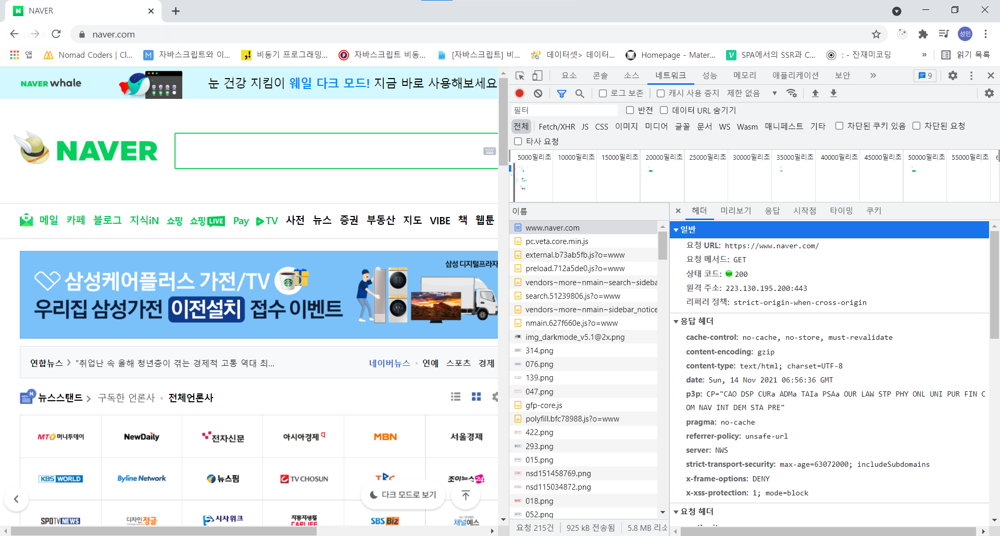
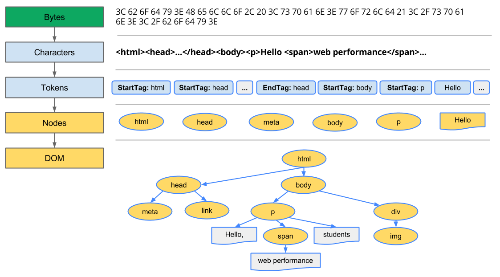
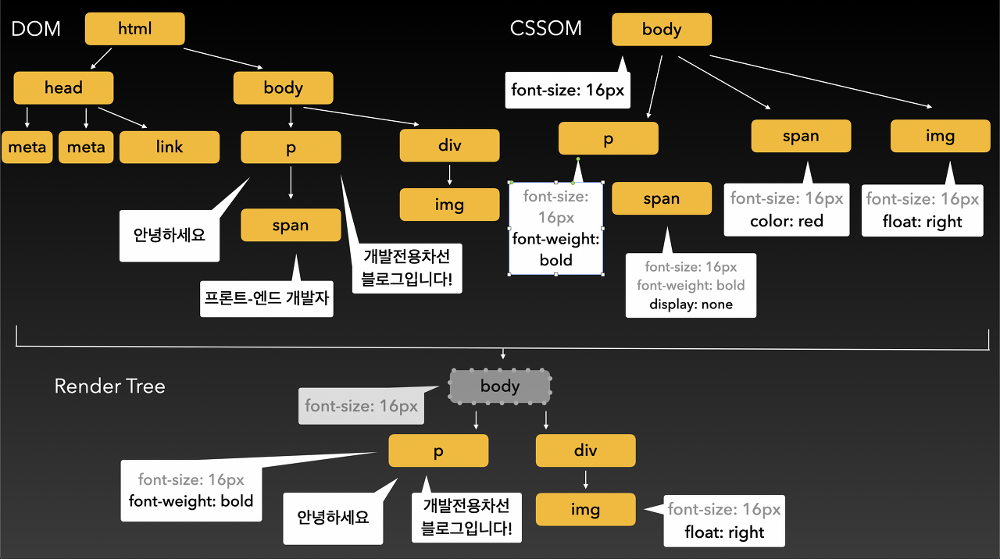

# 38. 브라우저 렌더링 과정

- 대부분의 프로그래밍 언어는 운영체제나 가상머신 위에서 실행되지만 자바스크립트는 **브라우저**에서 HTML, CSS와 함께 실행된다.

- 브라우저가 HTML, CSS, 자바스크립트로 작성된 텍스트 문서를 어떻게 파싱(해석)하여 브라우저에 렌더링하는지 알아보자!

  > 파싱(parsing)
  >
  > 파싱(구문 분석)은 프로그래밍 언어의 문법에 맞게 작성된 텍스트 문서를 읽어 들여 실행하기 위해 텍스트 문서의 문자열을 토큰으로 분해(어휘 분석)하고, 토근에 문법적 의미와 구조를 반영하여 트리 구조의 자료구조인 파스 트리(parse tree)를 생성하는 일련의 과정을 뜻한다.

  > 렌더링(rendering)
  >
  > 렌더링은 HTML, CSS, 자바스크립트로 작성된 문서를 파싱하여 브라우저에 시각적으로 출력하는 것.

  

  브라우저는 다음과 같은 과정을 거쳐 렌더링을 수행한다.

  1. 브라우저는 HTML, CSS, 자바스크립트, 이미지, 폰트 파일 등 렌더링에 필요한 리소스를 요청하고, 서버로부터 응답을 받는다.
  2. 브라우저의 렌더링 엔진은 서버로부터 응답된 HTML과 CSS를 파싱하여 DOM, CSSOM을 생성하고 이들을 결합하여 렌더 트리를 생성한다.
  3. 브라우저의 자바스크립트 엔진은 서버로부터 응답된 자바스크립트를 파싱하여 AST(Abstract Syntax Tree)를 생성하고 바이트코드로 변환하여 실행한다. 이때 자바스크립트는 DOM API를 통해 DOM이나 CSSOM을 변경할 수 있다. 변경된 DOM과 CSSOM은 다시 렌더 트리로 결합된다.
  4. 렌더 트리를 기반으로 HTML 요소의 레이아웃(위치와 크기)을 계산하고 브라우저 화면에 HTML 요소를 페인팅한다.

## 38.1 요청과 응답

- 브라우저의 핵심 기능은 **필요한 리소스**(HTML, CSS, 자바스크립트, 이미지, 폰트 등의 정적 파일 또는 서버가 동적으로 생성한 데이터)를 서버에 **요청**하고 서버로부터 **응답**을 받아 브라우저에 시각적으로 렌더링하는 것.

- 서버에 요청을 전송하기 위해 브라우저는 주소창을 제공한다.  브라우저의 주소창에 URL을 입력하고 엔터 키를 누르면 URL의 호스트 이름이 DNS를 통해 IP 주소로 변환되고 이 IP 주소를 갖는 서버에게 요청을 전송한다.

  > DNS(Domain Name System)
  >
  >  인터넷 도메인 주소 체계로서 [TCP/IP](https://ko.wikipedia.org/wiki/TCP/IP)의 응용에서, www.example.com과 같은 주 컴퓨터의 도메인 이름을 192.168.1.0과 같은 IP 주소로 변환하고 라우팅 정보를 제공하는 분산형 [데이터베이스](https://ko.wikipedia.org/wiki/데이터베이스) 시스템이다.


- 예를 들어, 브라우저 주소창에 https://poiemaweb.com을 입력하고 엔터 키를 누르면 루트 요청(/, 스킴과 호스트만으로 구성된 URI에 의한 요청)이 poiemaweb.com 서버로 전송된다. 일반적으로 서버는 루트 요청에 대해 암묵적으로 index.html을 응답하도록 기본 설정되어 있다.
- 따라서 서버는 루트 요청에 대해 서버의 루트 폴더에 존재하는 정적 파일 index.html을 클라이언트(브라우저)로 응답한다. 만약 index.html이 아닌 다른 정적 파일을 서버에 요청하려면 브라우저의 주소창에 https://poiemaweb.com/assets/data/data.json과 같이 요청할 정적 파일의 경로와 파일 이름을 URI의 호스트 뒤에 패스에 기술하여 서버에 요청한다.



- 요청과 응답은 브라우저의 개발자 도구의 Network 패널에서 확인할 수 있다.
- 브라우저의 렌더링 엔진이 HTML(index.html)을 파싱하는 도중에 외부 리소스를 로드하는 태그, 즉 CSS 파일을 로드하는 link 태그, 이미지 파일을 로드하는 img 태그 등을 만나면 HTML 파싱을 중단하고 해당 리소스 파일을 서버로 요청한다.


## 38.2 HTTP 1.1과 HTTP 2.0

- HTTP는 웹에서 **브라우저와 서버가 통신하기 위한 프로토콜**이다. 
- **HTTP/1.1**은 기본적으로 커넥션당 **하나의 요청과 응답만 처리**한다. 즉, 여러 개의 요청을 한 번에 전송할 수 없고 응답 또한 마찬가지다. 따라서 HTML 문서 내에 포함된 여러 개의 리소스 요청이 개별적으로 전송되고 응답 또한 개별적으로 전송된다.
- HTTP/1.1은 다중 요청/응답이 불가능하지만 **HTTP/2.0**는 커넥션당 여러 개의 요청과 응답, **다중 요청/응답이 가능**하다. HTTP/2.0은 HTTP/1.1에 비해 **페이지 로드 속도가 약 50% 빠르다.**


## 38.3 HTML 파싱과 DOM 생성

- 브라우저 요청에 의해 서버가  응답한 HTML 문서는 문자열로 이루어진 순수한 텍스트다. HTML 문서를 브라우저에 시각적인 픽셀로 렌더링하려면 브라우저가 이해할 수 있는 자료구조(객체)로 변환하여 메모리에 저장해야한다.

  ```html
  <!DOCTYPE html>
  <html>
    <head>
      <meta charset="UTF-8">
      <link rel="stylesheet" href="style.css">
    </head>
    <body>
      <ul>
        <li id="apple">Apple</li>
        <li id="banana">Banana</li>
        <li id="orange">Orange</li>
      </ul>
      <script src="app.js"></script>
    </body>
  </html>
  ```

    브라우저는 다음과 같은 과정을 통해 응답받은 HTML 문서를 파싱하여 브라우저가 이해할 수 있는 자료구조인 **DOM(Document Object Model)**을 생성한다.



1. 서버에 존재하던 HTML 파일이 브라우저 요청에 의해 응답된다. 서버는 브라우저가 요청한 HTML 파일을 메모리에 저장한다음, 메모리에 저장된 바이트를 인터넷에 경유하여 응답한다.
2. 브라우저는 서버가 응답한 HTML 문서를 바이트 형태로 응답받아 meta 태그의 charset 어트리뷰트에 선언된 인코딩 방식(예: UTF-8)을 기준으로 **문자열을 변환**한다. charset에 선언된 인코딩 방식은 응답 헤더의 content-type 에서 확인할 수 있다.
3. 문자열로 변환된 HTML 문서를 읽어 문법적 의미를 갖는 코드의 최소 단위인 **토큰**으로 분해한다.
4. 각 토큰들을 객체로 변환하여 **노드**들을 생성한다. 토큰의 내용에 따라 문서 노드, 요소 노드, 어트리뷰트 노드, 텍스트 노드가 생성된다. 노드는 이후 DOM을 구성하는 기본 요소가 된다.
5. HTML 문서는 HTML 요소들의 집합으로 이루어지며 HTML 요소는 중첩 관계를 갖는다. HTML 요소 간의 부자 관계를 반영하여 모든 노드들을 **트리 자료구조**로 구성한다. 이 노드들로 구성된 트리 자료구조를 **DOM**이라 부른다.

- 즉, **DOM은 HTML 문서를 파싱한 결과물**이다.


## 38.4 CSS 파싱과 CSSOM 생성

- 렌더링 엔진은 HTML을 처음부터 한 줄씩 순차적으로 파싱하여 DOM을 생성해나간다. 이처럼 렌더링 엔진은 DOM을 생성해 나가다가 CSS를 로드하는 link 태그나 style 태그를 만나면 DOM 생성을 일시 중단한다.

- 그리고 link 태그의 href 어트리뷰트에 지정된 CSS 파일을 서버에 요청하여 로드한 CSS파일이나 style 태그 내의 CSS를 HTML과 동일한 파싱 과정(바이트 -> 문자 -> 토큰 -> 노드 ->CSSOM)을 거치며 해석하여 **CSSOM을 생성**한다. 

  ```html
  <!DOCTYPE html>
  <html>
    <head>
      <meta charset="UTF-8">
      <link rel="stylesheet" href="style.css">
  ...
  ```

  렌더링 엔진은 meta태그까지 순차적으로 해석한다음, link 태그를 만나면 DOM 생성을 일시 중단하고 link 태그의 href 어트리뷰트에 지정된 CSS파일을 서버에 요청한다. 다음과 같은 style.css파일이 서버로부터 응답되었다고 가정하자.

  ```css
  body {
    font-size: 18px;
  }
  
  ul {
    list-style-type: none;
  }
  ```

  서버로부터 CSS파일이 응답되면 렌더링 엔진은 HTML과 동일한 해석 과정을 거쳐 CSS를 파싱하여 CSSOM을 생성한다.


## 38.5 렌더 트리 생성

- 렌더링 엔진은 서버로부터 응답된 HTML과 CSS를 파싱하여 DOM과 CSSOM을 생성한다. 그리고 DOM과 CSSOM은 렌더링을 위해 렌더 트리로 결합된다.

- 렌더 트리는 렌더링을 위한 트리 구조의 자료구조다. 따라서 브라우저 화면에 **렌더링 되지 않는 노드(예: meta태그, script 태그 등)과 CSS에 의해 비표시(예: display: none)되는 노드들은 포함되지 않는다.** 다시 말해, 렌더 트리는 브라우저 화면에 렌더링 되는 노드만으로 구성된다.

  

- 이후 완성된 렌더 트리는 각 HTML 요소의 레이아웃을 계산하는 데 사용되며 브라우저 화면에 픽셀을 렌더링하는 페인팅 처리에 입력된다.
- 브라우저 렌더링은 다음과 같은 경우 반복해서 실행된다.
  - 자바스크립트에 의한 노드 추가 또는 삭제
  - 브라우저 창의 리사이징에 의한 뷰포트 크기 변경
  - HTML 요소의 레이아웃에 변경을 발생시키는 스타일의 변경
- 레이아웃 계산과 페인팅을 다시 실행하는 리렌더링은 성능에 악영향을 주는 작업이다. 따라서 가급적 리렌더링이 빈번하게 발생하지 않도록 주의할 필요가 있다.


## 38.6 자바스크립트 파싱과 실행

- HTML 문서를 파싱한 결과물로서 생성된 DOM은 HTML 문서의 구조와 정보뿐만 아니라 HTML 요소의 스타일 등을 변경할 수 있는 프로그래밍 인터페이스로서 DOM API를 제공한다. 즉, 자바스크립트 코드에서 DOM API를 사용하면 이미 생성된 DOM을 동적으로 조작할 수 있다.
- 자바스크립트의 파싱과 실행은 브라우저의 렌더링 엔진이 아닌 자바스크립트 엔진이 처리한다. 자바스크립트엔진은 자바스크립트 코드를 파싱하여 CPU가 이해할 수 있는 저수준 언어(low level)로 변환하고 실행하는 역할을 한다. 모든 자바스크립트 엔진은 ECMAScript 사양을 준수한다.
- 렌더링 엔진으로부터 제어권을 넘겨받은 자바스크립트 엔진은 자바스크립트 코드를 파싱하기 시작한다. 자바스크립트 엔진은 자바스크립트를 해석하여 **AST(Abstract Syntax Tree) 추상적 구문 트리**를 생성한다. 그리고 AST를 기반으로 인터프리터가 실행할 수 있는 중간 코드인 바이트 언어를 생성하여 실행한다. 

> 토크나이징
>
> 단순한 문자열인 자바스크립트 소스 코드를 어휘 분석하여 문법적 의미를 갖는 코드의 최소 단위인 토큰들로 분해한다.


> 파싱
>
> 토큰들의 집합을 구문 분석하여 AST(추상적 구문 트리)를 생성한다. AST는 토큰에 문법적 의미와 구조를 반영한 트리 구조의 자료구조다. AST를 사용하면 Typescript, Babel 같은 트랜스파일러를 구현할  수도 있다.


> 바이트코드 생성과 실행
>
> 파싱의 결과물로서 생성된 AST는 인터프리터가 실행할 수 있는 중간 코드인 바이트 코드로 변환되고 인터프리터에 의해 실행된다. V8 엔진의 경우 자주 사용되는 코드는 터보팬이라고 불리는 컴파일러에 의해 최적화된 머신 코드로 컴파일되어 성능을 최적화한다.


## 38.7 리플로우와 리페인트

- 만약 자바스크립트 코드에 DOM이나 CSSOM을 변경하는 DOM API가 사용된 경우 DOM이나 CSSOM이 변경된다. 이 떄 변경된 DOM과 CSSOM은 다시 렌더 트리로 결합되고 변경된 렌더 트리를 기반으로 레이아웃과 페인트 과정을 거쳐 브라우저의 화면에 다시 렌더링한다. 이를 리플로우, 리페인트라고 한다.

  > 리플로우(reflow)
  >
  > **레이아웃을 다시 계산**하는 것을 말한다. 노드 추가/삭제, 요소의 크기/위치 변경, 윈도우 리사이징 등 레이아웃에 영향을 주는 변경이 발생한 경우에 한하여 발생한다.

  > 리페인트(repaint)
  >
  > 재결합된 렌더 트리를 기반으로 다시 페인트를 하는 것을 말한다.

- 레이아웃에 영향이 없는 변경은 리플로우 없이 리페인트만 실행된다.


## 38.8 자바스크립트 파싱에 의한 HTML 파싱 중단

```html
<!DOCTYPE html>
<html>
  <head>
    <meta charset="UTF-8">
    <link rel="stylesheet" href="style.css">
    <script>
      /*
      DOM API인 document.getElementById는 DOM에서 id가 'apple'인 HTML 요소를
      취득한다. 아래 DOM API가 실행되는 시점에는 아직 id가 'apple'인 HTML 요소를 파싱하지
      않았기 때문에 DOM에는 id가 'apple'인 HTML 요소가 포함되어 있지 않다.
      따라서 아래 코드는 정상적으로 id가 'apple'인 HTML 요소를 취득하지 못한다.
      */
      const $apple = document.getElementById('apple');

      // id가 'apple'인 HTML 요소의 css color 프로퍼티 값을 변경한다.
      // 이때 DOM에는 id가 'apple'인 HTML 요소가 포함되어 있지 않기 때문에 에러가 발생한다.
      $apple.style.color = 'red'; // TypeError: Cannot read property 'style' of null
    </script>
  </head>
  <body>
    <ul>
      <li id="apple">Apple</li>
      <li id="banana">Banana</li>
      <li id="orange">Orange</li>
    </ul>
  </body>
</html>
```

- 다음과 같은 예제는 script의 위치 때문에 블로킹이 발생한다.
- 이러한 문제를 회피하기 위해 body 요소에 가장 아래에 자바스크립트를 위치시킨다.
  - DOM이 완성되지 않은 상태에서 자바스크립트가 DOM을 조작하면 에러가 발생한다.
  - 자바스크립트 로딩 / 파싱 / 실행으로 인해 HTML 요소들의 렌더링에 지장받는 일이 발생하지 않아 페이지 로딩 시간이 단축된다.

```html
<!DOCTYPE html>
<html>
  <head>
    <meta charset="UTF-8">
    <link rel="stylesheet" href="style.css">
  </head>
  <body>
    <ul>
      <li id="apple">Apple</li>
      <li id="banana">Banana</li>
      <li id="orange">Orange</li>
    </ul>
    <script>
      /*
      DOM API인 document.getElementById는 DOM에서 id가 'apple'인 HTML 요소를
      취득한다. 아래 코드가 실행되는 시점에는 id가 'apple'인 HTML 요소의 파싱이 완료되어
      DOM에 포함되어 있기 때문에 정상적으로 동작한다.
      */
      const $apple = document.getElementById('apple');

      // apple 요소의 css color 프로퍼티 값을 변경한다.
      $apple.style.color = 'red';
    </script>
  </body>
</html>
```


## 38.9 script 태그의 async / defer 어트리뷰트

- 앞에서 살펴본 자바스크립트 파싱에 의한 DOM 생성이 중단되는 문제를 근본적으로 해결하기 위해 HTML5부터 script 태그에 async와 defer 어트리뷰트가 추가되었다.

- async와 defer 어트리뷰트는 외부 자바스크립트를 로드하는 경우에만 사용이 가능하다.

  ```html
  <script async src="extern.js"></script>
  <script defer src="extern.js"></script>
  ```


> async 어트리뷰트
>
> HTML 파싱과 외부 자바스크립트 파일의 로드가 비동기적으로 동시에 진행된다. 단, **자바스크립트의 파싱과 실행은 자바스크립트 파일이 로드가 완료된 직후** 진행하며, 이 때 HTML 파싱은 중단된다.
>
> 여러 개의 script 태그에 async 어트리뷰트를 지정하면 script 태그의 순서와 상관없이 로드가 완료되므로 순서가 보장되지 않는다. 
>
> 


> defer 어트리뷰트
>
> async 어트리뷰트와 마찬가지로 HTML 파싱과 외부 자바스크립트 파일의 로드가 비동기적으로 동시에 진행된다. 단, **자바스크립트의 파싱과 실행은 HTML 파싱이 완료된 직후**, 즉 DOM 생성이 완료된 직후(이 때 DOMContentLoaded 이벤트가 발생한다.) 진행된다. 따라서 DOM 생성이 완료된 이후 실행되어야 할 자바스크립트에 유용하다.
>
> 