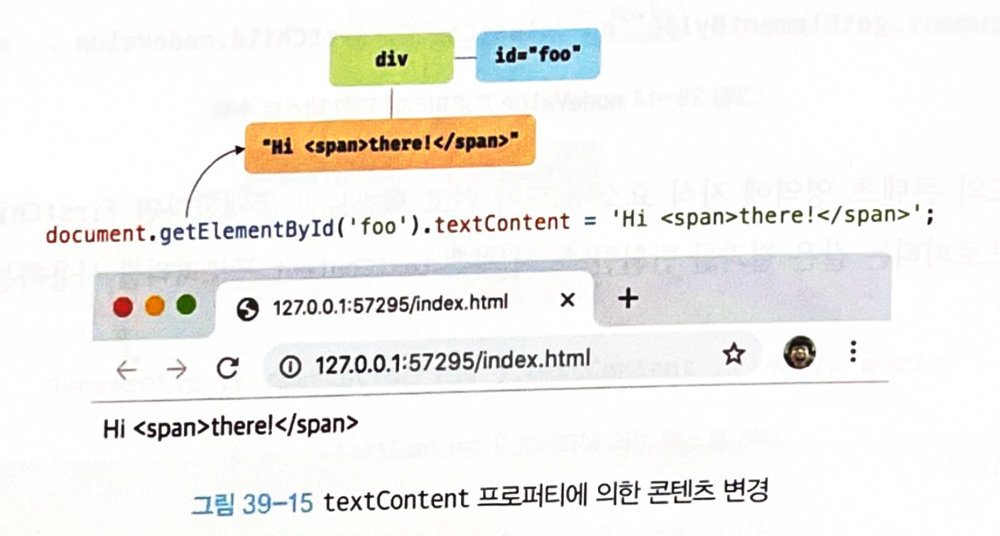

## 39.3 노드 탐색

취득한 요소 노드를 기점으로 DOM 트리상의 부모, 형제, 자식 노드를 탐색해야 하는 경우가 존재함

```html
<ul id="fruits">
  <li class="apple">Apple</li>
  <li class="banana">Banana</li>
  <li class="orange">Orange</li>
</ul>
```

- ul#fruits 요소는 3개의 자식 요소를 가짐
  - 자식 노드를 모두 탐색하거나 자식 노드 중ㅈ 하나만 탐색할 수 있음
- li.banana 요소는 2개의 형제 요소와 부모 요소를 가짐
  - 먼저 li.banana요소 노드를 취득한 다음, 형제 노드를 탐색하거나 부모노드를 탐색할 수 있음


DOM 트리 상의 노드를 탐색할 수 있도록 Node, Element 인터페이스는 트리 탐색 프로퍼티를 제공


Node.prototype : `parentNode, previoussibling, firstchild, childNodes` 

Element. prototyp : `previousElementSibling, nextElementSibling, children`


노드 탐색 프로퍼티는 모두 **접근자 프로퍼티**

- **setter없이 getter만 존재**하여 참조만 가능한 읽기 전용 접근자 프로퍼티
- 읽기 전용 접근자 프로퍼티에 값을 할당하면 아무런 에러 없이 무시


### 39.3.1 공백 텍스트 노드

공백 텍스트 노드 : HTML 요소 사이의 스페이스, 탭, 줄바꿈(개행) 등의 공백 문자는 텍스트 노드를 생성함

```html
<!DOCTYPE html>
<html>
  <body>
    <ul id="fruits">
      <li class="apple">Apple</li>
      <li class="banana">Banana</li>
      <li class="orange">Orange</li>
    </ul>
  </body>
</html>
```

위 html에도 공백 문자가 포함되어 있고, 아래와 같은 DOM 이 생성 됨


- 노드를 탐색할 때는 공백문자가 생성한 공백 텍스트 노드에 주의해야 함

- 인위적으로 HTML 문서의 공백 문자를 제거하면 공백 텍스트 노드를 생성하지 않지만, 가독성이 좋지않아 권장하지 않음

  ```html
  <ul id="fruits"><li
    class="apple">Apple</li><li
    class="banana">Banana</li><li
    class="orange">Orange</li></ul>
  ```

  

### 39.3.2 자식 노드 탐색

| 프로퍼티                            | 설명                                                         |
| ----------------------------------- | ------------------------------------------------------------ |
| Node.prototype.childNodes           | 자식 노드를 모두 탐색하여 DOM 컬렉션 객체인 NodeList에 담아 반환<br />요소 노드뿐만 아니라 텍스트 노드도 포함 |
| Element.prototype.children          | 자식 노드 중에서 요소 노드만 모두 탐색하여 DOM  컬렉션 객체인 HTMLCollection에 담아 반환<br />텍스트 노드가 포함되지 않음 |
| Node.prototype.firstChild           | 첫 번째 자식 노드를 반환<br />텍스트 노드 이거나 요소 노드를 반환 |
| Node.prototype.lastChild            | 마지막 자식 노드를 반환<br />텍스트 노드 이거나 요소 노드를 반환 |
| Element.prototype.firstElementChild | 첫 번째 자식 요소 노드를 반환<br />요소 노드만 반환          |
| Element.prototype.lastElementChild  | 마지막 자식 요소 노드를 반환<br />요소 노드만 반환           |

```html
<!DOCTYPE html>
<html>
  <body>
    <ul id="fruits">
      <li class="apple">Apple</li>
      <li class="banana">Banana</li>
      <li class="orange">Orange</li>
    </ul>
  </body>
  <script>
    // 노드 탐색의 기점이 되는 #fruits 요소 노드를 취득한다.
    const $fruits = document.getElementById('fruits');

    // #fruits 요소의 모든 자식 노드를 탐색한다.
    // childNodes 프로퍼티가 반환한 NodeList에는 요소 노드뿐만 아니라 텍스트 노드도 포함되어 있다.
    console.log($fruits.childNodes);
    // NodeList(7) [text, li.apple, text, li.banana, text, li.orange, text]

    // #fruits 요소의 모든 자식 노드를 탐색한다.
    // children 프로퍼티가 반환한 HTMLCollection에는 요소 노드만 포함되어 있다.
    console.log($fruits.children);
    // HTMLCollection(3) [li.apple, li.banana, li.orange]

    // #fruits 요소의 첫 번째 자식 노드를 탐색한다.
    // firstChild 프로퍼티는 텍스트 노드를 반환할 수도 있다.
    console.log($fruits.firstChild); // #text

    // #fruits 요소의 마지막 자식 노드를 탐색한다.
    // lastChild 프로퍼티는 텍스트 노드를 반환할 수도 있다.
    console.log($fruits.lastChild); // #text

    // #fruits 요소의 첫 번째 자식 노드를 탐색한다.
    // firstElementChild 프로퍼티는 요소 노드만 반환한다.
    console.log($fruits.firstElementChild); // li.apple

    // #fruits 요소의 마지막 자식 노드를 탐색한다.
    // lastElementChild 프로퍼티는 요소 노드만 반환한다.
    console.log($fruits.lastElementChild); // li.orange
  </script>
</html>
```


### 39.3.3 자식 노드 존재 확인

**hasChildNodes** 메서드는 자식 노드가 존재하면 true, 자식 노드가 존재하지 않으면 false를 반환

- 텍스트노드를포함하여자식노드의존재를확인

```html
<!DOCTYPE html>
<html>
  <body>
    <ul id="fruits">
    </ul>
  </body>
  <script>
    // 노드 탐색의 기점이 되는 #fruits 요소 노드를 취득한다.
    const $fruits = document.getElementById('fruits');

    // #fruits 요소에 자식 노드가 존재하는지 확인한다.
    // hasChildNodes 메서드는 텍스트 노드를 포함하여 자식 노드의 존재를 확인한다.
    console.log($fruits.hasChildNodes()); // true
  </script>
</html>
```

텍스트 노드가 아닌 요소 노드가 존재하는지는 확인하려면 hasChilanodes 메서드 대신 **children.length**또는Element인터페이스의 **chilcElementCount**프로퍼티를사용

```html
<!DOCTYPE html>
<html>
  <body>
    <ul id="fruits">
    </ul>
  </body>
  <script>
    // 노드 탐색의 기점이 되는 #fruits 요소 노드를 취득한다.
    const $fruits = document.getElementById('fruits');

    // hasChildNodes 메서드는 텍스트 노드를 포함하여 자식 노드의 존재를 확인한다.
    console.log($fruits.hasChildNodes()); // true

    // 자식 노드 중에 텍스트 노드가 아닌 요소 노드가 존재하는지는 확인한다.
    console.log(!!$fruits.children.length); // 0 -> false
    // 자식 노드 중에 텍스트 노드가 아닌 요소 노드가 존재하는지는 확인한다.
    console.log(!!$fruits.childElementCount); // 0 -> false
  </script>
</html>
```


### 39.3.4 요소 노드의 텍스트 노드 탐색

**firstChild** : 첫 번째 자식 노드를 반환

- 텍스트 노드이거나 요소 노드

```html
<!DOCTYPE html>
<html>
<body>
  <div id="foo">Hello</div>
  <script>
    // 요소 노드의 텍스트 노드는 firstChild 프로퍼티로 접근할 수 있다.
    console.log(document.getElementById('foo').firstChild); // #text
  </script>
</body>
</html>
```


### 39.3.5 부모 노드 탐색

**Node.prototype.parentNode**

텍스트 노드는 DOM 트리의 최종단노드인 리프 노드이므로 부모 노드가 텍스트 노드인 경우는 없음

```html
<!DOCTYPE html>
<html>
  <body>
    <ul id="fruits">
      <li class="apple">Apple</li>
      <li class="banana">Banana</li>
      <li class="orange">Orange</li>
    </ul>
  </body>
  <script>
    // 노드 탐색의 기점이 되는 .banana 요소 노드를 취득한다.
    const $banana = document.querySelector('.banana');

    // .banana 요소 노드의 부모 노드를 탐색한다.
    console.log($banana.parentNode); // ul#fruits
  </script>
</html>
```


### 39.3.6 형제 노드 탐색

| 프로퍼티                                 | 설명                                                         |
| ---------------------------------------- | ------------------------------------------------------------ |
| Node.prototype.previousSibling           | 부모노드가 같은 형제 노드 중 자신의 이전 형제 노드를 탐색하여 반환<br />요소 노드 뿐만 아니라 텍스트 노드도 반환 |
| Node.prototype.nextSibling               | 부모노드가 같은 형제 노드 중 자신의 다음 형제 노드를 탐색하여 반환<br />요소 노드 뿐만 아니라 텍스트 노드도 반환 |
| Element.prototype.previousElementSibling | 부모노드가 같은 형제 노드 중 자신의 이전 형제 노드를 탐색하여 반환<br />요소 노드만 반환 |
| Element.prototype.nextElementSibling     | 부모노드가 같은 형제 노드 중 자신의 다음 형제 노드를 탐색하여 반환<br />요소 노드만 반환 |

어트리뷰트노드는 요소 노드와 연결되어 있지만 부모노드가 같은 형제 노드가 아니기 때문에 반환되지않음

텍스트 노드 또는 요소 노드만 반환

```html
<!DOCTYPE html>
<html>
  <body>
    <ul id="fruits">
      <li class="apple">Apple</li>
      <li class="banana">Banana</li>
      <li class="orange">Orange</li>
    </ul>
  </body>
  <script>
    // 노드 탐색의 기점이 되는 #fruits 요소 노드를 취득한다.
    const $fruits = document.getElementById('fruits');

    // #fruits 요소의 첫 번째 자식 노드를 탐색한다.
    // firstChild 프로퍼티는 요소 노드뿐만 아니라 텍스트 노드를 반환할 수도 있다.
    const { firstChild } = $fruits;
    console.log(firstChild); // #text

    // #fruits 요소의 첫 번째 자식 노드(텍스트 노드)의 다음 형제 노드를 탐색한다.
    // nextSibling 프로퍼티는 요소 노드뿐만 아니라 텍스트 노드를 반환할 수도 있다.
    const { nextSibling } = firstChild;
    console.log(nextSibling); // li.apple

    // li.apple 요소의 이전 형제 노드를 탐색한다.
    // previousSibling 프로퍼티는 요소 노드뿐만 아니라 텍스트 노드를 반환할 수도 있다.
    const { previousSibling } = nextSibling;
    console.log(previousSibling); // #text

    // #fruits 요소의 첫 번째 자식 요소 노드를 탐색한다.
    // firstElementChild 프로퍼티는 요소 노드만 반환한다.
    const { firstElementChild } = $fruits;
    console.log(firstElementChild); // li.apple

    // #fruits 요소의 첫 번째 자식 요소 노드(li.apple)의 다음 형제 노드를 탐색한다.
    // nextElementSibling 프로퍼티는 요소 노드만 반환한다.
    const { nextElementSibling } = firstElementChild;
    console.log(nextElementSibling); // li.banana

    // li.banana 요소의 이전 형제 요소 노드를 탐색한다.
    // previousElementSibling 프로퍼티는 요소 노드만 반환한다.
    const { previousElementSibling } = nextElementSibling;
    console.log(previousElementSibling); // li.apple
  </script>
</html>
```


## 39.4 노드 정보 취득

| 프로퍼티                | 설명                                                         |
| ----------------------- | ------------------------------------------------------------ |
| Node.prototype.nodeType | 노드 객체의 종류, 즉 노드 타입을 나타내는 상수를 반환<br />노드타입상수는 Node에 정의되어 있음<br />- Node.ELEMENT_NODE: 요소 노드 타입을 나타내는 상수 1을 반환<br />- Node.TEXT_NODE: 텍스트 노드 타입을 나타내는 상수 3을 반환<br />- Node.DOCUMENT_NODE: 문서노드타입을 나타내는 상수 9를 반환 |
| Node.prototype.nodeName | 노드의 이름을 문자열로 반환<br />- 요소 노드 대문자 문자열로 태그 이름 ("UL","LI"등)을 반환<br />- 텍스트 노드: 문자열 "#text"를 반환<br />- 문서 노드 문자열 "#document"를 반환 |

```html
<!DOCTYPE html>
<html>
  <body>
    <div id="foo">Hello</div>
  </body>
  <script>
    // 문서 노드의 노드 정보를 취득한다.
    console.log(document.nodeType); // 9
    console.log(document.nodeName); // #document

    // 요소 노드의 노드 정보를 취득한다.
    const $foo = document.getElementById('foo');
    console.log($foo.nodeType); // 1
    console.log($foo.nodeName); // DIV

    // 텍스트 노드의 노드 정보를 취득한다.
    const $textNode = $foo.firstChild;
    console.log($textNode.nodeType); // 3
    console.log($textNode.nodeName); // #text
</script>
</html>
```


## 39.5 요소 노드의 텍스트 조작

### 39.5.1 nodeValue

**Node.prototype.nodeValue** : setter와 getter 모두 존재하는 접근자 프로퍼티


노드 객체의 nodeValue 프로퍼티를 참조하면 노드 객체의 값을 반환

- 노드 객체의 값 이란 텍스트 노드의 텍스트
- 문서 노드나 요소 노드의 nodevalue 프로퍼티를 참조하면 null을 반환

```html
<!DOCTYPE html>
<html>
  <body>
    <div id="foo">Hello</div>
  </body>
  <script>
    // 문서 노드의 nodeValue 프로퍼티를 참조한다.
    console.log(document.nodeValue); // null

    // 요소 노드의 nodeValue 프로퍼티를 참조한다.
    const $foo = document.getElementById('foo');
    console.log($foo.nodeValue); // null

    // 텍스트 노드의 nodeValue 프로퍼티를 참조한다.
    const $textNode = $foo.firstChild;
    console.log($textNode.nodeValue); // Hello
  </script>
</html>
```


텍스트노드의 nodeValue 프로퍼티에 값을 할당하면 텍스트 노드의 값, 즉 텍스트를 변경할 수 있음

요소노드의 텍스트를 변경 하려면 다음과 같은 순서의 처리가 필요함

- 텍스트를 변경할 요소 노드를 취득 
- 취득한 요소 노드의 텍스트 노드를 탐색 (텍스트 노드는 요소노드의 자식 노드이므로 **firstChild** 프로퍼티를 사용하여 탐색)

- 탐색한 텍스트 노드의 **nodeValue**프로퍼티를 사용하여 텍스트 노드의 값을 변경

```html
<!DOCTYPE html>
<html>
  <body>
    <div id="foo">Hello</div>
  </body>
  <script>
    // 1. #foo 요소 노드의 자식 노드인 텍스트 노드를 취득한다.
    const $textNode = document.getElementById('foo').firstChild;

    // 2. nodeValue 프로퍼티를 사용하여 텍스트 노드의 값을 변경한다.
    $textNode.nodeValue = 'World';

    console.log($textNode.nodeValue); // World
  </script>
</html>
```


### 39.5.2 textContent

**Node.prototype.textContent** 프로퍼티는 setter와 getter 모두 존재하는 접근자 프로퍼티

- 요소 노드의 텍스트와 모든 자손 노드의 텍스트를 모두 취득하거나 변경
- 요소노드의 textContent프로퍼티를 참조하면 요소노드의 콘텐츠 영역(시작태그와 종료태그 사이)의 텍스트를 모두 반환
  - 요소 노드의 childNodes 프로퍼티가 반환한 모든 노드들의 텍스트 노드의 값, 즉 텍스트를 모두 반환 (HTML 마크업은 무시)

```html
<!DOCTYPE html>
<html>
  <body>
    <div id="foo">Hello <span>world!</span></div>
  </body>
  <script>
    // #foo 요소 노드의 텍스트를 모두 취득한다. 이때 HTML 마크업은 무시된다.
    console.log(document.getElementById('foo').textContent); // Hello world!
  </script>
</html>

```


앞에서 본 nodeValue 프로퍼티를 참조하여도 텍스트를 취득할 수 있었지만, 텍스트 노드가 아닌 노드의 nodeValue프로퍼티는**null을 반환**하므로 의미가 없고 텍스트 노드의 nodeValue프로퍼티를 참조할 때만 텍스트 노드의 값, 즉 텍스트를 반환한다.

다만 nodeValue프로퍼티를 사용하면 textContent 프로퍼티를 사용 할 때와 비교해서 코드가 더 복잡해짐

```html
<!DOCTYPE html>
<html>
  <body>
    <div id="foo">Hello <span>world!</span></div>
  </body>
  <script>
    // #foo 요소 노드는 텍스트 노드가 아니다.
    console.log(document.getElementById('foo').nodeValue); // null
    // #foo 요소 노드의 자식 노드인 텍스트 노드의 값을 취득한다.
    console.log(document.getElementById('foo').firstChild.nodeValue); // Hello
    // span 요소 노드의 자식 노드인 텍스트 노드의 값을 취득한다.
    console.log(document.getElementById('foo').lastChild.firstChild.nodeValue); // world!
  </script>
</html>
```


만약 요소 노드의 콘텐츠 영역에 자식 요소 노드가 없고 텍스트만 존재한다면 firstChild.nodevalue와 textContent 프로퍼티는 같은 결과를 반환

- 이 경우는 textContent 프로퍼티를 사용하는 편이 코드가 더 간단함

```html
<!DOCTYPE html>
<html>
  <body>
    <!-- 요소 노드의 콘텐츠 영역에 다른 요소 노드가 없고 텍스트만 존재 -->
    <div id="foo">Hello</div>
  </body>
  <script>
    const $foo = document.getElementById('foo');

    // 요소 노드의 콘텐츠 영역에 자식 요소 노드가 없고 텍스트만 존재한다면
    // firstChild.nodeValue와 textContent는 같은 결과를 반환한다.
    console.log($foo.textContent === $foo.firstChild.nodeValue); // true
  </script>
</html>
```


요소노드의 textContent 프로퍼티에 문자열을 할당하면 요소노드의 모든자식노드가 제거되고 할당한 문자열이 텍스트로 추가됨

- 할당한 문자열에 HTML 마크업이 포함되어 있더라도 문자열 그대로 인식되어 텍스트로 취급됨
- HTML 마크업이 파싱되지 않음

```html
<!DOCTYPE html>
<html>
  <body>
    <div id="foo">Hello <span>world!</span></div>
  </body>
  <script>
    // #foo 요소 노드의 모든 자식 노드가 제거되고 할당한 문자열이 텍스트로 추가된다.
    // 이때 HTML 마크업이 파싱되지 않는다.
    document.getElementById('foo').textContent = 'Hi <span>there!</span>';
  </script>
</html>
```



참고로 textContent 프로퍼티와 유사한 동작을 하는 innerText 프로퍼티가 있지만, innerText 프로퍼티는 다음과 같은 이유로 사용하지 않는 것이 좋음

- innerText프로퍼티는 CSS에 순종적이다.
  - 예를들어,innerText 프로퍼티는 CSS에 의해 비표시(visibility:hidden;) 로 지정된 요소 노드의 텍스트를 반환하지 않음
  - innerText프로퍼티는 CSS를 고려해야 하므로 textContent 프로퍼티 보다 느리다.