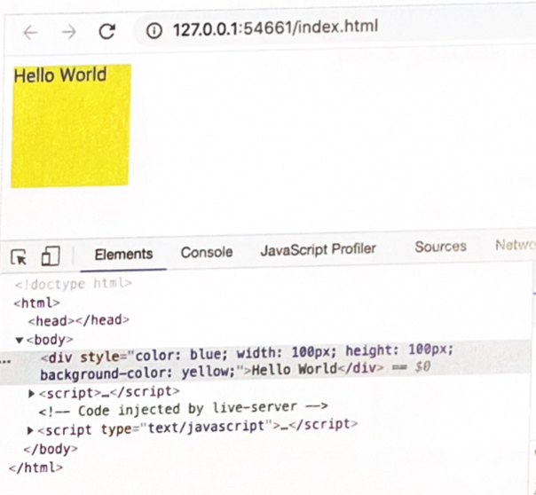

### 39.7.3

#### DOM 프로퍼티

- 사용자가 입력한 최신 상태는 HTML 어트리뷰트에 대응하는 요소 노드의 DOM 프로퍼티가 관리
- DOM 프로퍼티는 사용자의 입력에 의한 상태 변화에 반응하여 항상 최신 상태를 유지함

- 즉,  DOM 프로퍼티로 취득한 값은 HTML 요소의 최신 상태 값을 의미
- 최신 상태 값은 사용자의 입력에 의해 언제든지 동적으로 변경

> getAtrribute 메서드로 취득한 HTML 어트리뷰트 값, 즉 초기 상태 값은 변하지 않고 유지

```html
<!DOCTYPE html>
<html>
<body>
  <input id="user" type="text" value="ungmo2">
  <script>
    const $input = document.getElementById('user');

    // 사용자가 input 요소의 입력 필드에 값을 입력할 때마다 input 요소 노드의
    // value 프로퍼티 값, 즉 최신 상태 값을 취득한다. value 프로퍼티 값은 사용자의 입력에
    // 의해 동적으로 변경된다.
    $input.oninput = () => {
      console.log('value 프로퍼티 값', $input.value);
    };

    // getAttribute 메서드로 취득한 HTML 어트리뷰트 값, 즉 초기 상태 값은 변하지 않고 유지된다.
    console.log('value 어트리뷰트 값', $input.getAttribute('value'));
  </script>
</body>
</html>

```

- DOM 프로퍼티에 값을 할당하는 것은 HTML 요소의 최신 상태 값을 변경하는 것을 의미
  - HTML 요소에 지정한 어트리뷰트 값에는 어떠한 영향도 주지 않음

```html
<!DOCTYPE html>
<html>
<body>
  <input id="user" type="text" value="ungmo2">
  <script>
    const $input = document.getElementById('user');

    // DOM 프로퍼티에 값을 할당하여 HTML 요소의 최신 상태를 변경한다.
    $input.value = 'foo';
    console.log($input.value); // foo

    // getAttribute 메서드로 취득한 HTML 어트리뷰트 값, 즉 초기 상태 값은 변하지 않고 유지된다.
    console.log($input.getAttribute('value')); // ungmo2
  </script>
</body>
</html>
```

- HTML 어트리뷰트는 HTML 요소의 초기 상태 값을 관리
- DOM 프로퍼티는 사용자의 입력에 의해 변경되는 최신상태를 관리
  - 단, 모든 DOM 프로퍼티가 사용자의 입력에 의해 변경되어 최신 상태를 관리하는 것은 아님
    - input요소의 사용자입력에 의한 상태변화는 value 프로퍼티가 관리
    - checkbox 요소의 사용자 입력에 의한 상태 변화는 checked 프로퍼티가 관리
    - id 어트리뷰트에 대응하는 **id 프로퍼티는 사용자의 입력과 아무런 관계가 없음**
      - id 프로퍼티는 사용자 입력과 관계없이 항상 동일한값을 유지
      - 즉, id어트리뷰트값이 변하면 id프로퍼티값도 변하고 그반대도 마찬가지임

```html
<!DOCTYPE html>
<html>
<body>
  <input id="user" type="text" value="ungmo2">
  <script>
    const $input = document.getElementById('user');

    // id 어트리뷰트와 id 프로퍼티는 사용자 입력과 관계없이 항상 동일한 값으로 연동한다.
    $input.id = 'foo';

    console.log($input.id); // foo
    console.log($input.getAttribute('id')); // foo
  </script>
</body>
</html>
```

- 이처럼 사용자 입력에 의한 상태변화와 관계있는 DOM프로퍼티만 최신상태값을 관리
- **그 외의 사용자 입력에 의한 상태 변화와 관계 없는 어트리뷰트와  DOM 프로퍼티는 항상 동일한 값으로 연동**

#### HTML 어트리뷰트와 DOM 프로퍼티의 대응 관계

 대부분 HTML 어트리뷰트는 동일한 DOM 프로퍼티와 1:1로 대응하지만, 항상 그런것은 아니다.

- | HTML 어트리뷰트    | DOM 프로퍼티         |      |
  | ------------------ | -------------------- | ---- |
  | id                 | id                   |      |
  | input 요소의 value | input 요소의 value   |      |
  | class              | className, classList |      |
  | for                | htmlFor              |      |
  | td 요소의 colspan  | 존재하지 않음        |      |
  | 존재하지 않음      | textContent          |      |

  어트리뷰트 이름은 대소문자를 구별하지 않지만 대응하는 프로퍼티키는 카멜케이스를 따름(maxlength => maxLength)

#### DOM  프로퍼티 값의 타입

- getAttribute 메서드로 취득한 어트리뷰트 값은 언제나 문자열임

- DOM 프로퍼티로 취득한 최신상태값은 문자열이 아닐 수도 있음
  - ex) checkbox 요소의 checked 어트리뷰트 값은 문자열이지만, 프로퍼티 값은 불리언

``` html
<!DOCTYPE html>
<html>
<body>
  <input type="checkbox" checked>
  <script>
    const $checkbox = document.querySelector('input[type=checkbox]');

    // getAttribute 메서드로 취득한 어트리뷰트 값은 언제나 문자열이다.
    console.log($checkbox.getAttribute('checked')); // ''

    // DOM 프로퍼티로 취득한 최신 상태 값은 문자열이 아닐 수도 있다.
    console.log($checkbox.checked); // true
  </script>
</body>
</html>
```

### 39.7.4 data 어트리뷰트와 dataset 프로퍼티

**data 어트리뷰트**와 **dataset 프로퍼티**를 사용하면 HTML 요소에 정의한 사용자 정의 **어트리뷰트와 자바스크립트 간에 데이터를 교환**할 수 있음

- data 어트리뷰트는 data-user-id, data-role 과 같이 `data-` 접두사를 사용

```html
<!DOCTYPE html>
<html>
<body>
  <ul class="users">
    <li id="1" data-user-id="7621" data-role="admin">Lee</li>
    <li id="2" data-user-id="9524" data-role="subscriber">Kim</li>
  </ul>
</body>
</html>
```

- data 어트리뷰트의 값은 HTMLElement.dataset 프로퍼티로 취득 가능

- dataset 프로퍼티는 HTML 요소의 모든 data 어트리뷰트의 정보를 제공하는 **DOMStringMap** 객체를 반환

- **DOMStringMap**

  - data어트리뷰트의 `data-` 접두사 다음에 붙인 임의의 이름을 카멜 케이스로 변환한 프로퍼티를 가지고 있음
  - 프로퍼티로 data 어트리뷰트의 값을 취득하거나 변경할 수 있음

  ``` html
  <!DOCTYPE html>
  <html>
  <body>
    <ul class="users">
      <li id="1" data-user-id="7621" data-role="admin">Lee</li>
      <li id="2" data-user-id="9524" data-role="subscriber">Kim</li>
    </ul>
    <script>
      const users = [...document.querySelector('.users').children];
  
      // user-id가 '7621'인 요소 노드를 취득한다.
      const user = users.find(user => user.dataset.userId === '7621');
      // user-id가 '7621'인 요소 노드에서 data-role의 값을 취득한다.
      console.log(user.dataset.role); // "admin"
  
      // user-id가 '7621'인 요소 노드의 data-role 값을 변경한다.
      user.dataset.role = 'subscriber';
      // dataset 프로퍼티는 DOMStringMap 객체를 반환한다.
      console.log(user.dataset); // DOMStringMap {userId: "7621", role: "subscriber"}
    </script>
  </body>
  </html>
  
  ```

data 어트리뷰트의 data- 접두사 다음에 존재하지 않는 이름을 키로 사용해서 dataset 프로퍼티에 값을 할당하면 HTML 요소에 data 어트리부트가 추가됨

이때 dataset 프로퍼티에 추가한 카멜케이스(fooBar)의 프로퍼티 키는 data 어트리뷰트의 data- 접두사 다음에 케밥케이스(data-foo-bar)로 자동 변경되어 추가됨

```html
<!DOCTYPE html>
<html>
<body>
  <ul class="users">
    <li id="1" data-user-id="7621">Lee</li>
    <li id="2" data-user-id="9524">Kim</li>
  </ul>
  <script>
    const users = [...document.querySelector('.users').children];

    // user-id가 '7621'인 요소 노드를 취득한다.
    const user = users.find(user => user.dataset.userId === '7621');

    // user-id가 '7621'인 요소 노드에 새로운 data 어트리뷰트를 추가한다.
    user.dataset.role = 'admin';
    console.log(user.dataset);
    /*
    DOMStringMap {userId: "7621", role: "admin"}
    -> <li id="1" data-user-id="7621" data-role="admin">Lee</li>
    */
  </script>
</body>
</html>
```


## 39.8 스타일

### 39.8.1 인라인 스타일 조작

HTMLElement.prototype.style 프로퍼티는 setter와 getter 모두 존재하는 접근자 프로퍼티

- 요소 노드의 인라인 스타일을 취득하거나 추가 또는 변경

```html
<!DOCTYPE html>
<html>
<body>
  <div style="color: red">Hello World</div>
  <script>
    const $div = document.querySelector('div');

    // 인라인 스타일 취득
    console.log($div.style); // CSSStyleDeclaration { 0: "color", ... }

    // 인라인 스타일 변경
    $div.style.color = 'blue';

    // 인라인 스타일 추가
    $div.style.width = '100px';
    $div.style.height = '100px';
    $div.style.backgroundColor = 'yellow';
  </script>
</body>
</html>

```



- style 프로퍼티를 참조하면 CSSStyleDeclartion 타입의 객체를 반환함
- CSSStyleDeclartion
  - CSS 프로퍼티에 대응하는 프로퍼티를 가지고 있음
  - 이 프로퍼티에 값을 할당하면 CSS 프로퍼티가 인라인 스타일로 HTML 요소에 추가되거나 변경됨
- CSS 프로퍼티는 케밥 케이스를 따름
- CSSStyleDeclartion 객체의 프로퍼티는 카멜 케이스를 따름
  - background-color에 대응하는 CSSStyleDeclaration 객체의 프로퍼티는 backgroundColor

``` html
-- CSSStyleDeclartion 객체의 프로퍼티는 카멜 케이스를 따름
$div.style.backgroundColor = 'yellow';

--케밥케이스의 CSS프로퍼티를그대로사용하려면객체의마침표표기법대신대괄호표기법을사용
$div.style['background-color'] = 'yellow';

-- 단위 지정이 필요한 CSS 프로퍼티의 값은 반드시 단위를 지정해야 함 (단위를 생략하면 해당 CSS프로퍼티는 적용되지 않음)
$div.style.width = '100px';
```


### 39.8.2 클래스 조작

. 으로 시작하는 클래스 선택자를 사용하여 CSS class를 미리 정의한 다음, HTML 요소의 class 어트리뷰트 값을 변경하여 HTML 요소의 스타일을 변경할 수도 있음

이때 HTML 요소의 class 어트리뷰트를 조작하려면 class 어트리뷰터에 대응하는 요소 노드의 DOM 프로퍼티를 사용함

- 단, class 어트리뷰트에 대응하는 DOM 프로퍼티는 class가 아니라 className과  classList임
- 자바스크립트에서  class는 예약어이기 때문에..

#### className

Element.prototype.className 프로퍼티는 setter와 getter 모두 존재하는 접근자 프로퍼티

- HTML 요소의 class 어트리뷰트 값을 취득하거나 변경함

- 요소 노드의 className 프로퍼티를 참조하면 class 어트리뷰트 값을 문자열로 반환
- 요소 노드의 className 프로퍼티에 문자열을 할당하면 class 어트리뷰트 값을 할당한 문자열로 변경

```html
<!DOCTYPE html>
<html>
<head>
  <style>
    .box {
      width: 100px; height: 100px;
      background-color: antiquewhite;
    }
    .red { color: red; }
    .blue { color: blue; }
  </style>
</head>
<body>
  <div class="box red">Hello World</div>
  <script>
    const $box = document.querySelector('.box');

    // .box 요소의 class 어트리뷰트 값을 취득
    console.log($box.className); // 'box red'

    // .box 요소의 class 어트리뷰트 값 중에서 'red'만 'blue'로 변경
    $box.className = $box.className.replace('red', 'blue');
  </script>
</body>
</html>

```

- className 프로퍼티는 문자열을 반환하기 때문에 공백으로 구분된 여러 개의 클래스를 반환하는 경우 다루기가 불편함 (replace 사용)

#### classList

Element.prototype.classList 프로퍼티는 class 어트리뷰트의 정보를 담은 DOMTokenList 객체를 반환

```html
<!DOCTYPE html>
<html>
<head>
  <style>
    .box {
      width: 100px; height: 100px;
      background-color: antiquewhite;
    }
    .red { color: red; }
    .blue { color: blue; }
  </style>
</head>
<body>
  <div class="box red">Hello World</div>
  <script>
    const $box = document.querySelector('.box');

    // .box 요소의 class 어트리뷰트 정보를 담은 DOMTokenList 객체를 취득
    // classList가 반환하는 DOMTokenList 객체는 HTMLCollection과 NodeList와 같이
    // 노드 객체의 상태 변화를 실시간으로 반영하는 살아 있는(live) 객체다.
    console.log($box.classList);
    // DOMTokenList(2) [length: 2, value: "box blue", 0: "box", 1: "blue"]

    // .box 요소의 class 어트리뷰트 값 중에서 'red'만 'blue'로 변경
    $box.classList.replace('red', 'blue');
  </script>
</body>
</html>
```

DOMTokenList 는 class 어트리뷰트 정보를 나타내는 컬렉션 객체

- 유사배열 객체이면서 이터러블이고 아래와 같은 메서드를 제공

  - add(... className)

    ```html
    $box.classList.add('foo'); // -> class="box red foo"
    $box.classList.add('bar', 'baz'); // -> class="box red foo bar baz"
    ```

  - remove(...className)

    ```html
    $box.classList.remove('foo'); // -> class="box red bar baz"
    $box.classList.remove('bar', 'baz'); // -> class="box red"
    $box.classList.remove('x'); // -> class="box red"
    ```

  - item(index)

    ```html
    $box.classList.item(0); // -> "box"
    $box.classList.item(1); // -> "red"
    ```

  - contains(className)

    ```html
    $box.classList.contains('box');  // -> true
    $box.classList.contains('blue'); // -> false
    ```

  - replace(oldClassName, newClassName)

    ```html
    $box.classList.replace('red', 'blue'); // -> class="box blue"
    ```

  - toggle(classNamel[, force])

    ```html
    $box.classList.toggle('foo'); // -> class="box blue foo"
    $box.classList.toggle('foo'); // -> class="box blue"
    ```

    두번째 인수로 불리언값 전달 할 수 있음

    true이면 class어트리뷰트에 강제로 첫번째 인수로 전달받은 문자열을 추가

    false이면 class어트리뷰트에서 강제로 첫번째 인수로 전달받은 문자열을 제거

    ```html
    // class 어트리뷰트에 강제로 'foo' 클래스를 추가
    $box.classList.toggle('foo', true); // -> class="box blue foo"
    // class 어트리뷰트에서 강제로 'foo' 클래스를 제거
    $box.classList.toggle('foo', false); // -> class="box blue"
    ```

  - forEach, entries, keys, values, supports 등을 제공

### 39.8.3 요소에 적용되어 있는 CSS 스타일 참조

style 프로퍼티는 인라인 스타일만 반환

따라서, 클래스를 적용한 스타일이나 송속을 통해 암묵적으로 적용된 스타일은 style 프로퍼티로 참조할 수 없음

HTML 요소에 적용되어 있는 모든 CSS 스타일을 참조해야 할 경우 getComputedStyle 메서드를 사용

**window.getComputedStyle(element[, pseude])**

- 첫 번째 인수(element)로 전달한 요소 노드에 적용되어 있는 평가된 스타일을 CSSStyleDeclartion 객체에 담아서 반환
  - 평가된 스타일: 요소 노드에 적용되어 있는 모든 스타일, 즉 링크 스타일, 임베딩 스타일, 인라인 스타일, 자바스크립트에서 적용한 스타일, 상속된 스타일, 기본 스타일 등 모**든 스타일이 조합되어 최종적으로 적용된 스타일**

``` html
<!DOCTYPE html>
<html>
<head>
  <style>
    body {
      color: red;
    }
    .box {
      width: 100px;
      height: 50px;
      background-color: cornsilk;
      border: 1px solid black;
    }
  </style>
</head>
<body>
  <div class="box">Box</div>
  <script>
    const $box = document.querySelector('.box');

    // .box 요소에 적용된 모든 CSS 스타일을 담고 있는 CSSStyleDeclaration 객체를 취득
    const computedStyle = window.getComputedStyle($box);
    console.log(computedStyle); // CSSStyleDeclaration

    // 임베딩 스타일
    console.log(computedStyle.width); // 100px
    console.log(computedStyle.height); // 50px
    console.log(computedStyle.backgroundColor); // rgb(255, 248, 220)
    console.log(computedStyle.border); // 1px solid rgb(0, 0, 0)

    // 상속 스타일(body -> .box)
    console.log(computedStyle.color); // rgb(255, 0, 0)

    // 기본 스타일
    console.log(computedStyle.display); // block
  </script>
</body>
</html>
```

- getComputedStyle 메서드의 두 번째 인수(pseudo)로 `:after`, `:before`와 같은 의사 요소를 지정하는 문자 열을 전달할 수 있음

  - 의사 요소가 아닌 일반 요소의 경우 두 번째 인수는 생략

  ```html
  <!DOCTYPE html>
  <html>
  <head>
    <style>
      .box:before {
        content: 'Hello';
      }
    </style>
  </head>
  <body>
    <div class="box">Box</div>
    <script>
      const $box = document.querySelector('.box');
  
      // 의사 요소 :before의 스타일을 취득한다.
      const computedStyle = window.getComputedStyle($box, ':before');
      console.log(computedStyle.content); // "Hello"
    </script>
  </body>
  </html>
  ```

  

## 39.9 DOM 표준

HTML과 DOM 표준은 W3C와 WHATWG이라는 두 단체가 협려갛여 공통된 표준을 만들어 오다가, 두 단체가 서로 다른 결과물을 내놓기 시작함

별개의 HTML과 DOM 표준을 만드는 것은 이롭지 않으므로, 2018년 4월 부터 구글, 애플, 마이크로소프트, 모질라로 구성된 4개의 주류 브라우저 벤더사가 주도하는 WHATWG이 단일 표준을 내놓기로 두 단체가 합의함

현재는 DOM Level1 ~ DOM Level4  까지 4개의 레벨(버전)이 있음