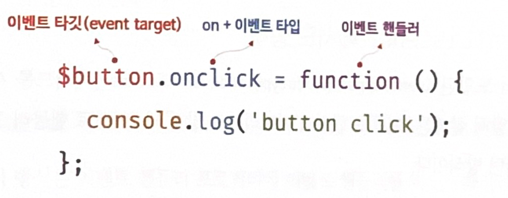
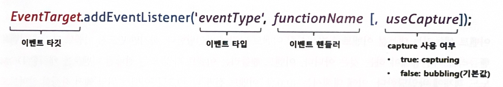

# 40. 이벤트

## 40.1 이벤트 트리븐 프로그래밍

- 브라우저는 클릭, 키보드 입력, 마우스 이동 등 처리해야 할 특정 사건이 발생하면, 이를 감지하여 이벤트를 발생시킴

- 애플리케이션이 특정 타입의 이벤트에 대해 반응하여 어떤 일을 하고 싶다면, 해당하는 타입의 이벤트가 발생했을 때 호출될 함수를 브라우저에게 알려 호출을 위임

  - 이벤트 핸들러 : 이벤트가 발생했을 때 호출될 함수
  - 이벤트 핸들러 등록 : 이벤트가 발생했을 때 브라우저에게 이벤트 핸들러의 호출을 위임

- 예제 : 버튼 클릭을 감지하여 이벤트 발생

  ```html
  <!DOCTYPE html>
  <html>
  <body>
    <button>Click me!</button>
    <script>
      const $button = document.querySelector('button');
  
      // 사용자가 버튼을 클릭하면 함수를 호출하도록 요청
      $button.onclick = () => { alert('button click'); };
    </script>
  </body>
  </html>
  ```

  - button의 onclick 프로퍼티에 함수를 할당
  - window, Document, HTMLElement 타입의 객체는 onclick과 같이 특정 이벤트에 대응하는 다양한 이벤트 핸들러 프로퍼티를 가지고 있음
    이벤트 핸들러 프로퍼티에 함수를 할당하면, 해당 이벤트가 발생했을 때 할당한 함수가 브라우저에 의해 호출됨

- 프로그램의 흐름을 이벤트 중심으로 제어하는 프로그래밍 방식을 **이벤트 트리븐 프로그래밍** 이라 함

## 40.2 이벤트 타입

- 이벤트 타입은 **문자열** 
  - `'click'` : 사용자가 마우스 버튼을 클릭했을 때 발생하는 이벤트 타입
- 이벤트 타입은 200여 가지가 존재함

### 40.2.1 마우스 이벤트

| 이벤트 타입 | 이벤트 발생 시점                               |
| ----------- | ---------------------------------------------- |
| click       | 마우스 버튼 클릭                               |
| dbclick     | 마우스 버튼 더블 클릭                          |
| mousedown   | 마우스 버튼 누름                               |
| mouseup     | 누르고 있던 마우스 버튼 놓음                   |
| mousemove   | 마우스 커서 움직였을 때                        |
| mouseenter  | 마우스 커서를 HTML 요소 안으로 이동 (버블링 X) |
| mouseover   | 마우스 커서를 HTML 요소 안으로 이동 (버블링 O) |
| mouseleave  | 마우스 커서를 HTML 요소 밖으로 이동 (버블링 X) |
| mouseout    | 마우스 커서를 HTML 요소 밖으로 이동 (버블링 O) |


### 40.2.2 키보드 이벤트

| 이벤트 타입 | 이벤트 발생 시점                                             |
| ----------- | ------------------------------------------------------------ |
| keydown     | 모든 키를 눌렀을 때 발생<br />- control, option, shift, tab, delete, enter, 방향키, 문자, 숫자, 특수문자<br />- 단, 문자, 숫자, 특수문자, enter 키를 눌렀을 때는 연속으로 발생하지만, 그 외의 키는 단 한번만 발생 |
| keypress    | 문자 키를 눌렀을 때 연속적으로 발생<br />-  control, option, shift, tab, delete, 방향키 를 눌었을 때는 발생하지 않음<br />- 문자, 숫자, 특수문자, enter 키를 눌렀을 때만 발생<br />- deprecated 되었기 때문에 사용하지 않을 것을 권장 |
| keyup       | 눌렀던 키를 놓았을 때 한 번만 발생<br />- keydown과 마찬가지로 control, option, shift, tab, delete, enter, 방향키, 문자, 숫자, 특수문자 키를 놓았을 때 발생 |


### 40.2.3 포커스 이벤트

| 이벤트 타입 | 이벤트 발생 시점                        |
| ----------- | --------------------------------------- |
| focus       | HTML 요소가 포커스를 받을 때 (버블링 X) |
| blur        | HTML 요소가 포커스를 잃을 때 (버블링 X) |
| focusin     | HTML 요소가 포커스를 받을 때 (버블링 O) |
| focusout    | HTML 요소가 포커스를 잃을 때 (버블링 O) |


### 40.2.4 폼 이벤트

| 이벤트 타입 | 이벤트 발생 시점                         |
| ----------- | ---------------------------------------- |
| submit      | form 요소 내의 submit 버튼을 클릭했을 때 |
| reset       | form  요소 내의 reset  버튼을 누를 때    |


### 40.2.5 값 변경 이벤트

| 이벤트 타입      | 이벤트 발생 시점                                             |
| ---------------- | ------------------------------------------------------------ |
| input            | input(text, checkbox, radio), select, textarea 요소의 값이 입력되었을 때 |
| change           | input(text, checkbox, radio), select, textarea 요소의 값이 변경되었을 때<br />- change 이벤트는 input과는 달리 HTML 요소가 포커스를 잃었을 때 사용자입력이 종료되었다고 인식하여 발생 |
| readystatechange | HTML 문서의 로드와 파싱 상태를 나타내는 document.readyState  프로퍼티 값(loading, interactive, complete)이 변경될 때 |


### 40.2.6 DOM 뮤테이션 이벤트

| 이벤트 타입      | 이벤트 발생 시점                                            |
| ---------------- | ----------------------------------------------------------- |
| DOMContentLoaded | HTML 문서의 로드와 파시잉 완료되어 DOM 생성이 완료되었을 때 |


### 40.2.7 뷰 이벤트

| 이벤트 타입 | 이벤트 발생 시점                                             |
| ----------- | ------------------------------------------------------------ |
| resize      | 브라우저 윈도우의 크키를 변경할 때 연속적으로 발생<br />- window 객체에서만 발생 |
| scroll      | 웹페이지(document) 또는 HTML 요소를 스크롤할 때 연속적으로 발생 |


### 40.2.8 리소스 이벤트

| 이벤트 타입 | 이벤트 발생 시점                                             |
| ----------- | ------------------------------------------------------------ |
| load        | DOMContentLoaded 이후, 모든 리소스의 로딩이 완료 됐을 때<br />- 주로 window 객체에서 발생 |
| unload      | 리소스가 언로드될 때(주로 새로운 웹페이지를 요청한 경우)     |
| abort       | 리소스 로딩이 중단된 경우                                    |
| error       | 리소스 로딩이 실패한 경우                                    |


## 40.3 이벤트 핸들러 등록

- 이벤트 핸들러 : 이벤트가 발생했을 때 브라우저에 호출을 위함한 함수 (브라우저에 의해 호출됭 함수)
- 이벤트 핸들러 등록 : 브라우저에게 이벤트 핸들러의 호출을 위임하는 것
  - 3가지 방법

### 40.3.1 이벤트 핸들러 어트리뷰트 방식

HTML 요소의 어트리뷰트 중에는 이벤트에 대응하는 이벤트 핸들러 어트리뷰트가 존재함

- 이벤트 핸들러 어트리뷰트: onclick과 같이 on 접두사와 이벤트의 종류를 나타내는 이벤트 타입

```html
<!DOCTYPE html>
<html>
<body>
  <button onclick="sayHi('Lee')">Click me!</button>
  <script>
    function sayHi(name) {
      console.log(`Hi! ${name}.`);
    }
  </script>
</body>
</html>
```

- 주의) 이벤트 핸들러 어트리뷰트 값으로 함수 참조가 아닌 함수 호출문 등의 **문을 할당**

  - 이벤트 핸들러 등록은 함수 호출을 브라우저에게 위임하는 것
  - 등록할 때 콜백 함수와 마찬가지로 함수 참조를 등록해야 브라우저가 이벤트 핸들러를 호출할 수 있음
  - 만약, 함수 호출문을 이벤트 핸들러로 등록하면, 호출문의 평가 결과가 이벤트 핸들러로 등록됨
  - 함수를 반환하는 고차함수 호출문을 이벤트 핸들러로 등록하면 문제는 없겠지만, 값을 반환하는 함수 호출문을 이벤트 핸들러로 등록하면 브라우저가 이벤트 핸들러를 호출할 수 없음
  - 위의 예제는 `함수 호출문` 을 할당함
  - 이벤트 핸들러 어트리뷰트 값은 사실 암묵적으로 생성될 이벤트 핸들러의 함수 몸체를 의미함

- `onclick="sayHi('Lee')` 는 암묵적으로 아래와 같은 함수를 생성하여, 이벤트 핸들러 프로퍼티에 할당한다.

  ```html
  function onclick(event) {
    sayHi('Lee');
  }
  ```

- 만약, 이벤트 핸들러에 함수 참조를 할당하면, 이벤트 핸들러에 인수를 전달하기 어려워지기 떄문에 함수 호출문을 사용한다.

  ```html
  <!-- 이벤트 핸들러에 인수를 전달하기 곤란하다. -->
  <button onclick="sayHi">Click me!</button>
  ```

- 핸들러 어트리뷰트 값으로 할당한 문자열은 암묵적으로 생성되는 이벤트 핸들러의 함수 몸체이기 떄문에, 여러 개의 문을 할당할 수 있다.

  ```html
  <button onclick="console.log('Hi! '); console.log('Lee');">Click me!</button>
  ```

- 이벤트 핸들러 어트리뷰트 방식은 오래된 코드에서 간혹 보이지만, 더 이상 사용하는 것을 자제하는 것이 좋다. (html과 javascript의 관심사를 분리)

  - 하지만, 모던 자바스크립트에서는 이벤트 핸들러 어트리뷰트 방식을 사용하는 경우도 많음.
  - CBD(Component Based Develeopment) 방식의 Angular/React/Svelte/Vue.js 같은 프레임워크/라이브러리에서는 이벤트 핸들러 어트리뷰트 방식으로 이벤트를 처리하는데, 이는 CBD 컨셉에서 html,css,js를 뷰를 구성하는 구성요로 보기 때문에 동일한 관심사로 취급한다.

  ```html
  <!-- Angular -->
  <button (click)="handleClick($event)">Save</button>
  
  { /* React */ }
  <button onClick={handleClick}>Save</button>
  
  <!-- Svelte -->
  <button on:click={handleClick}>Save</button>
  
  <!-- Vue.js -->
  <button v-on:click="handleClick($event)">Save</button>
  ```

  

### 40.3.2 이벤트 핸들러 프로퍼티 방식

- window객체와 Document, HTMLElement 타입의 DOM 노드객체는 이벤트에 대응하는 이벤트 핸들러 프로퍼티를 가지고 있음

  - 이벤트 핸들러 프로퍼티의 키 : 이벤트 핸들러 어트리뷰트와 마찬가지로 onclick과 같이 on접두사와 이벤트의 종류를 나타내는 이벤트 타입으로 이루어져 있음

  - 이벤트 핸들러프로퍼티에 함수를 바인딩하면 이벤트 핸들러가 등록됨

  ```html
  <!DOCTYPE html>
  <html>
  <body>
    <button>Click me!</button>
    <script>
      const $button = document.querySelector('button');
  
      // 이벤트 핸들러 프로퍼티에 이벤트 핸들러를 바인딩
      $button.onclick = function () {
        console.log('button click');
      };
    </script>
  </body>
  </html>
  
  ```

  

- 보통은 이벤트를 발생시킬 이벤트 타깃에 이벤트 핸들러를 바인딩 하지만, 전파된 이벤트를 캐치할 DOM 노드 객체에 바인딩 할 수도 있음

- 이벤트 핸들러 어트리뷰트 방식도 결국에는 DOM 노드 객체의 이벤트 핸들러 프로퍼티로 변환되기 때문에 근본적으로는 동일한 방식이라 볼 수 있음

-  이벤트 핸들러 프로퍼티 방식은 html과 자바스크립트가 뒤섞이는 문제를 해결할 수 있음

- 하지만, 하나의 이벤트만 바인딩 할 수 있다는 단점이 있음

  ```html
  <!DOCTYPE html>
  <html>
  <body>
    <button>Click me!</button>
    <script>
      const $button = document.querySelector('button');
  
      // 이벤트 핸들러 프로퍼티 방식은 하나의 이벤트에 하나의 이벤트 핸들러만을 바인딩할 수 있다.
      // 첫 번째로 바인딩된 이벤트 핸들러는 두 번째 바인딩된 이벤트 핸들러에 의해 재할당되어
      // 실행되지 않는다.
      $button.onclick = function () {
        console.log('Button clicked 1');
      };
  
      // 두 번째로 바인딩된 이벤트 핸들러
      $button.onclick = function () {
        console.log('Button clicked 2');
      };
    </script>
  </body>
  </html>
  ```

  

### 40.3.3 addEventListener 메서드 방식

- `EventTarget.prototype.addEventListener` 메서드를 사용하여 이벤트 핸들러를 등록할 수 있음

  - DOM Level2에서 도입된 방법

  

  - 이벤트 타입에는 접두사 on을 붙이지 않음
  - useCapture는 이벤트 전파를 지정한다. 생략할 수 있고, false를 지정하면 버블링, true를 지정하면 캠처링 단계에서 이벤트를 캡쳐함

  ```html
  <!DOCTYPE html>
  <html>
  <body>
    <button>Click me!</button>
    <script>
      const $button = document.querySelector('button');
  
      // 이벤트 핸들러 프로퍼티 방식
      // $button.onclick = function () {
      //   console.log('button click');
      // };
  
      // addEventListener 메서드 방식
      $button.addEventListener('click', function () {
        console.log('button click');
      });
    </script>
  </body>
  </html>
  ```

- 바인딩 방식의 차이

  - 이벤트 핸들러 프로퍼티 방식 : **이벤트 핸들러 프로퍼티에 이벤트 핸들러를 바인딩**
  - addEventListener 메서드 : **이벤트 핸들러를 인수로 전달**

  ```html
  <!DOCTYPE html>
  <html>
  <body>
    <button>Click me!</button>
    <script>
      const $button = document.querySelector('button');
  
      // 이벤트 핸들러 프로퍼티 방식
      $button.onclick = function () {
        console.log('[이벤트 핸들러 프로퍼티 방식]button click');
      };
  
      // addEventListener 메서드 방식
      $button.addEventListener('click', function () {
        console.log('[addEventListener 메서드 방식]button click');
      });
    </script>
  </body>
  </html>
  ```

  - 이렇게 두개의 방식을 모두 사용하여 호출하는 경우
  - addEventListener 메서드 방식은 이벤트 핸들러프로퍼티에 바인딩된 이벤트 핸들러에 아무런 영향을 주지 않음
  - 따라서, 버튼 요소에서 클릭 이벤트가 발생하면 2개의 이벤트 핸들러가 모두 호출됨

- addEventListener 메서드는 하나 이상의 이벤트 핸들러를 등록할 수 있으며, 등록된 순서대로 호출됨

  ```html
  <!DOCTYPE html>
  <html>
  <body>
    <button>Click me!</button>
    <script>
      const $button = document.querySelector('button');
  
      // addEventListener 메서드는 동일한 요소에서 발생한 동일한 이벤트에 대해
      // 하나 이상의 이벤트 핸들러를 등록할 수 있다.
      $button.addEventListener('click', function () {
        console.log('[1]button click');
      });
  
      $button.addEventListener('click', function () {
        console.log('[2]button click');
      });
    </script>
  </body>
  </html>
  ```

- 단 동일한 이벤트 핸들러를 중복 등록하면, 하나의 핸들러만 등록됨

  ```html
  <!DOCTYPE html>
  <html>
  <body>
    <button>Click me!</button>
    <script>
      const $button = document.querySelector('button');
  
      const handleClick = () => console.log('button click');
  
      // 참조가 동일한 이벤트 핸들러를 중복 등록하면 하나의 핸들러만 등록된다.
      $button.addEventListener('click', handleClick);
      $button.addEventListener('click', handleClick);
    </script>
  </body>
  </html>
  ```

  

## 40.4 이벤트 핸들러 제거

- addEventListener로 등록한 이벤트 핸들러 제거 : `EventTarget.prototype.removeEventListener` 메서드 사용

- 이벤트 핸들러를 제거할 때는 등록했을 때와 완전히 동일한 인수들을 전달해야 함

  ```html
  <!DOCTYPE html>
  <html>
  <body>
    <button>Click me!</button>
    <script>
      const $button = document.querySelector('button');
  
      const handleClick = () => console.log('button click');
  
      // 이벤트 핸들러 등록
      $button.addEventListener('click', handleClick);
  
      // 이벤트 핸들러 제거
      // addEventListener 메서드에 전달한 인수와 removeEventListener 메서드에
      // 전달한 인수가 일치하지 않으면 이벤트 핸들러가 제거되지 않는다.
      $button.removeEventListener('click', handleClick, true); // 실패
      $button.removeEventListener('click', handleClick); // 성공
    </script>
  </body>
  </html>
  ```

- 무명함수를 이벤트핸들러로 등록한 경우 제거할 수 없음

  ```javascript
  // 이벤트 핸들러 등록
  $button.addEventListener('click', () => console.log('button click'));
  // 등록한 이벤트 핸들러를 참조할 수 없으므로 제거할 수 없다.
  ```

- 단, 기명 이벤트 핸들러 내부에서 removeEventListener 메서드를 호출하여 이벤트 핸들러를 제거하는 것은 가능

  ```javascript
  // 기명 함수를 이벤트 핸들러로 등록
  $button.addEventListener('click', function foo() {
    console.log('button click');
    // 이벤트 핸들러를 제거한다. 따라서 이벤트 핸들러는 단 한 번만 호출된다.
    $button.removeEventListener('click', foo);
  });
  ```

- 기명 함수를 이벤트 핸들러로 등록할 수 없다면 호출된 함수, 즉 함수 자신을 가리키는 `arguments.callee`를 사용

  ```html
  // 무명 함수를 이벤트 핸들러로 등록
  $button.addEventListener('click', function () {
    console.log('button click');
    // 이벤트 핸들러를 제거한다. 따라서 이벤트 핸들러는 단 한 번만 호출된다.
    // arguments.callee는 호출된 함수, 즉 함수 자신을 가리킨다.
    $button.removeEventListener('click', arguments.callee);
  });
  ```

  - arguments.callee는 코드 최적화를 방해하므로 strict mode에서 사용이 금지
  - 변수나 자료구조에 이벤트 핸들러를 저장하여 제거하는 편이 좋다.

- 이벤트 핸들러 프로퍼티 방식으로 등록한 이벤트의 삭제

  - removeEventListener 메서드로 제거할 수 없음
  - 이벤트 핸들러 프로퍼티방식으로 등록한 이벤트 핸들러를 제거하려면 이벤트 핸들러 프로퍼티에 `null` 을 할당

  ```html
  <!DOCTYPE html>
  <html>
  <body>
    <button>Click me!</button>
    <script>
      const $button = document.querySelector('button');
  
      const handleClick = () => console.log('button click');
  
      // 이벤트 핸들러 프로퍼티 방식으로 이벤트 핸들러 등록
      $button.onclick = handleClick;
  
      // removeEventListener 메서드로 이벤트 핸들러를 제거할 수 없다.
      $button.removeEventListener('click', handleClick);
  
      // 이벤트 핸들러 프로퍼티에 null을 할당하여 이벤트 핸들러를 제거한다.
      $button.onclick = null;
    </script>
  </body>
  </html>
  ```