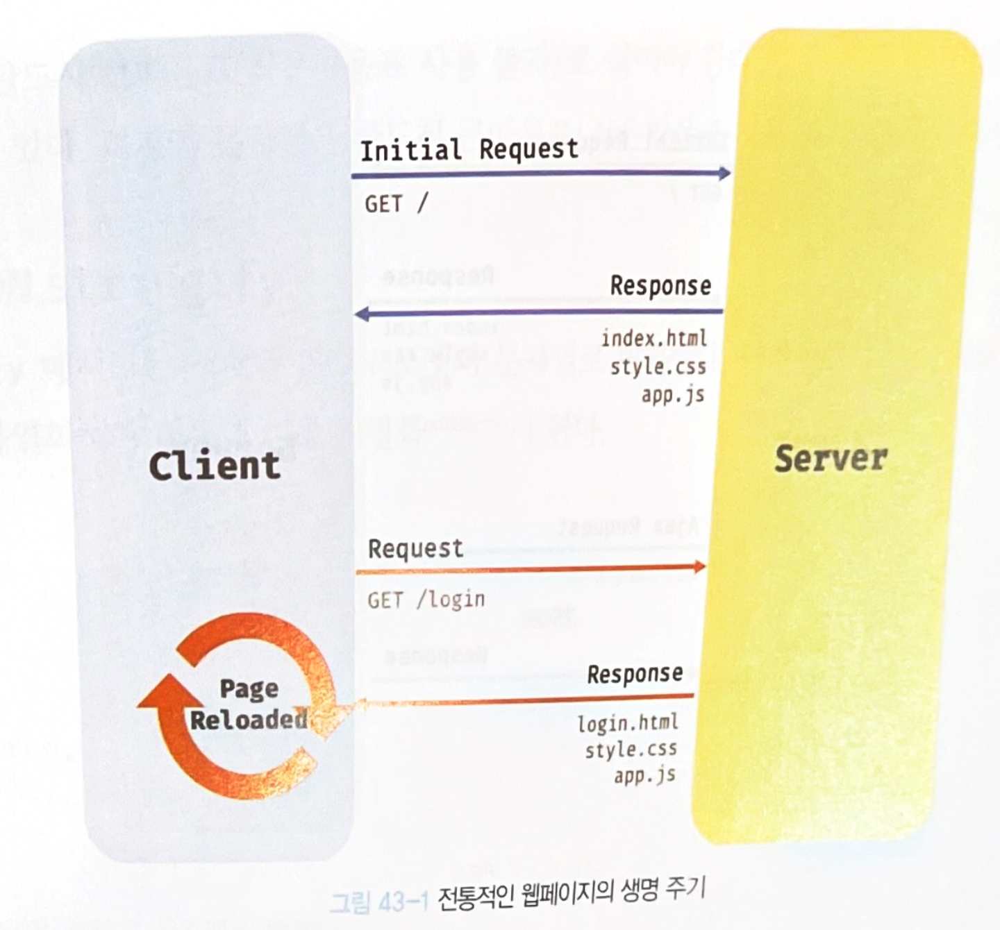
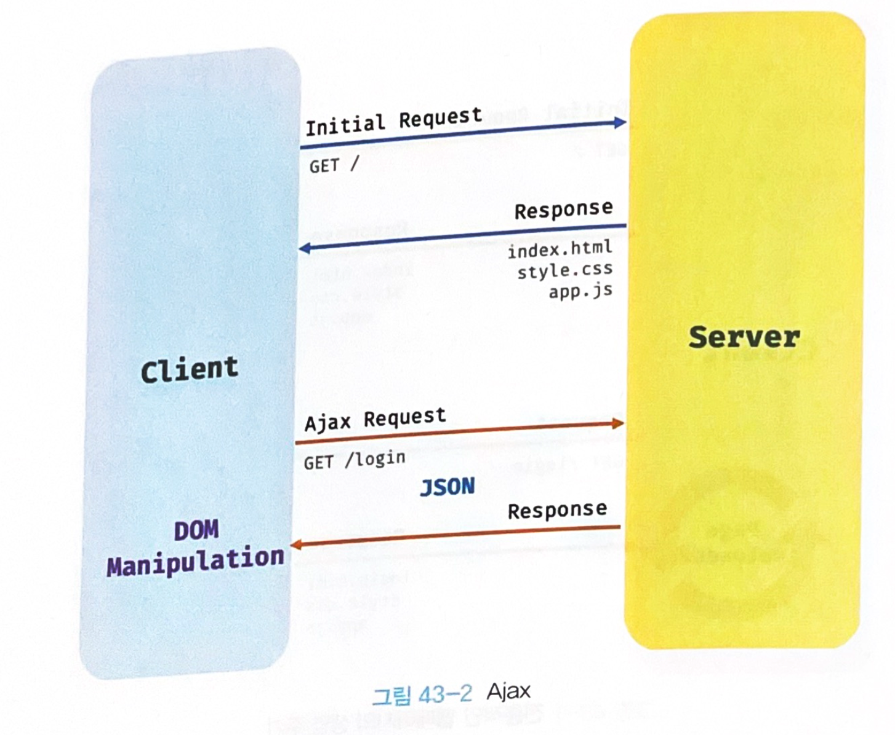
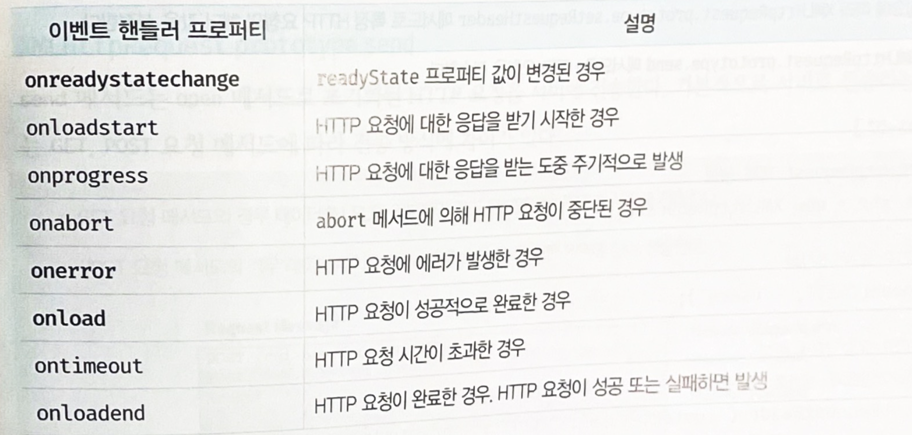
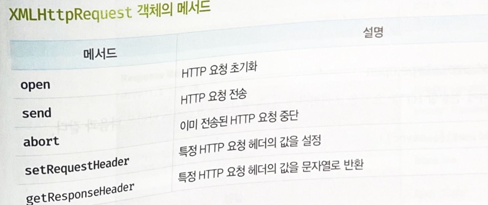
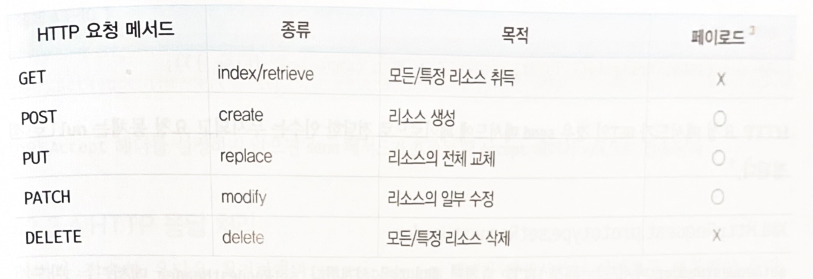
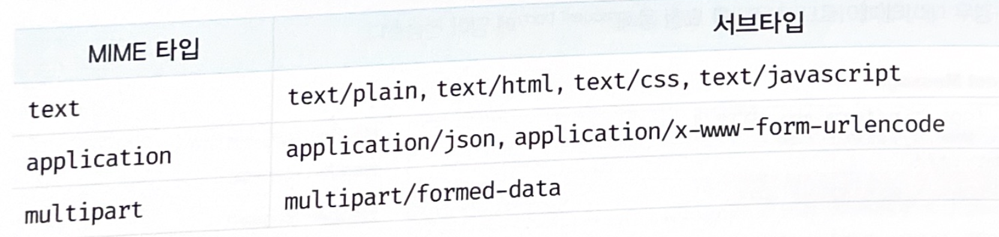

# 43. Ajax

## 43.1 Ajax란?

**Asynchronous JavaScript and XML**

-  자바스크립트를 사용하여 브라우저가 서버에게 **비동기 방식**으로 데이터를 요청하고, 서버가 응답한 데이터를 수신하여 **웹페이지를 동적으로 갱신**하는 프로그래밍 방식

- Ajax는 브라우저에서 제공하는 **Web API인 XMLHttpRequest 객체를 기반**으로 동작

**XMLHttpRequest**

- HTTP 비동기 통신을 위한 **메서드와 프로퍼티를 제공**


렌더링 방식의 변화

- 과거 : 완전한 html파일을 받아서 전체를 계속 다시 렌더링 하는 방식

  

  

  - 이전 웹페이지와 차이가 없어서 변경할 필요가 없는 부분까지 다시 렌더링하게 되고, 불필요한 데이터 통신이 발생함
  - 변경할 필요가 없는 부분까지 처음부터 다시 렌더링하면서, 화면 전환이 일어나면 순간적으로 깜빡이는 현상이 발생함
  - 클라이언트와 서버와의 통신이 동기 방식으로 동작하기 때문에 서버로부터 응답이 있을 떄까지 다음 처리는 블로킹됨

- 현재 : Ajax의 등장으로 서버에서 변경이 필요한 데이터만 비동기식으로 전송받아 변경이 필요한 부분만 한정적으로 렌더링하는 방식

  

  

  - 변경할 부분을 갱신하는 데 필요한 데이터만 서버로 전송받기 떄문에 불필요한 데이터 통신이 발생하지 않음
  - 변경할 필요가 없는 부분은 다시 렌더링 하지 않기 때문에 깜빡이는 현상이 발생하지 않음
  - 클라이언트와 서버와의 통신이 비동기 방식으로 동작하기 떄문에, 서버에게 요청을 보낸 이후 블로킹이 발생하지 않음

## 43.2 JSON

**JavaScript Object Notation** 

- 클라이언트와 서버간의 HTTP통신을 위한 텍스트 데이터 포맷

- 자바스크립트 이외의 대부분의 언어에서도 사용가능

### 43.2.1 JSON 표기 방식

객체 리터럴과 유사하게, 키와 값으로 구성된 순수한 텍스트

```json
{
  "name": "Lee",
  "age": 20,
  "alive": true,
  "hobby": ["traveling", "tennis"]
}
```

- 키는 반드시 큰따옴표로 묶어야 함
- 값은 객체 리터럴과 같은 표기법 그대로 사용할 수 있음 (문자열은 반드시 큰 따옴표로 사용)

### 43.2.2 JSON.stringify

**JSON.stringify** 메서드: 객체를 JSON 포맷의 **문자열로 변환** 함

- 클라이언트가 서버로 객체를 전송하려면 객체를 문자열화 해야하는데 이를 **직렬화(serializing)**라한다.

```json
const obj = {
  name: 'Lee',
  age: 20,
  alive: true,
  hobby: ['traveling', 'tennis']
};

// 객체를 JSON 포맷의 문자열로 변환한다.
const json = JSON.stringify(obj);
console.log(typeof json, json);
// string {"name":"Lee","age":20,"alive":true,"hobby":["traveling","tennis"]}

// 객체를 JSON 포맷의 문자열로 변환하면서 들여쓰기 한다.
const prettyJson = JSON.stringify(obj, null, 2);
console.log(typeof prettyJson, prettyJson);
/*
string {
  "name": "Lee",
  "age": 20,
  "alive": true,
  "hobby": [
    "traveling",
    "tennis"
  ]
}
*/

// replacer 함수. 값의 타입이 Number이면 필터링되어 반환되지 않는다.
function filter(key, value) {
  // undefined: 반환하지 않음
  return typeof value === 'number' ? undefined : value;
}

// JSON.stringify 메서드에 두 번째 인수로 replacer 함수를 전달한다.
const strFilteredObject = JSON.stringify(obj, filter, 2);
console.log(typeof strFilteredObject, strFilteredObject);
/*
string {
  "name": "Lee",
  "alive": true,
  "hobby": [
    "traveling",
    "tennis"
  ]
}
*/
```

- 객체뿐만 아니라 배열도 JSON 포맷의 문자열로 변환함

```json
const todos = [
  { id: 1, content: 'HTML', completed: false },
  { id: 2, content: 'CSS', completed: true },
  { id: 3, content: 'Javascript', completed: false }
];

// 배열을 JSON 포맷의 문자열로 변환한다.
const json = JSON.stringify(todos, null, 2);
console.log(typeof json, json);
/*
string [
  {
    "id": 1,
    "content": "HTML",
    "completed": false
  },
  {
    "id": 2,
    "content": "CSS",
    "completed": true
  },
  {
    "id": 3,
    "content": "Javascript",
    "completed": false
  }
]
*/
```

### 43.2.3 JSON.parse

**JSON.parse** 메서드 : JSON 포맷의 문자열을 객체로 변환

- 서버로부터 클라이언트에게 전송된 JSON 데이터는 문자열
- 문자열을 객체로서 사용하려면 JSON 포맷의 문자열을 객체화해야 하는데 이를 **역직렬화deserializing**라 함

```json
const obj = {
  name: 'Lee',
  age: 20,
  alive: true,
  hobby: ['traveling', 'tennis']
};

// 객체를 JSON 포맷의 문자열로 변환한다.
const json = JSON.stringify(obj);

// JSON 포맷의 문자열을 객체로 변환한다.
const parsed = JSON.parse(json);
console.log(typeof parsed, parsed);
// object {name: "Lee", age: 20, alive: true, hobby: ["traveling", "tennis"]}
```

- 배열

```json
const todos = [
  { id: 1, content: 'HTML', completed: false },
  { id: 2, content: 'CSS', completed: true },
  { id: 3, content: 'Javascript', completed: false }
];

// 배열을 JSON 포맷의 문자열로 변환한다.
const json = JSON.stringify(todos);

// JSON 포맷의 문자열을 배열로 변환한다. 배열의 요소까지 객체로 변환된다.
const parsed = JSON.parse(json);
console.log(typeof parsed, parsed);
/*
 object [
  { id: 1, content: 'HTML', completed: false },
  { id: 2, content: 'CSS', completed: true },
  { id: 3, content: 'Javascript', completed: false }
]
*/
```

## 43.3 XMLHttpRequest

브라우저 : 주소창이나 HTML의 **form태그** 또는 **a태그**를 통해 HTTP요청 전송기능을 기본제공함

자바스크립트 : **XMLHttpRequest** 객체를 사용하여 HTTP요청 전송기능을 사용함

- Web API인 XMLHttpRequest객체는 HTTP 요청 전송과 HTTP 응답 수신을 위한 다양한 메서드와 프로퍼티를 제공

### 43.3.1 XMLHttpRequest 객체 생성

XMLHttpRequest 객체는 **XMLHttpRequest 생성자 함수**를 호출하여 생성

XMLHttpRequest 객체는 브라우저에서 제공하는 Web API이므로 **브라우저 환경에서만** 정상적으로 실행됨

```json
// XMLHttpRequest 객체 생성
const xhr = new XMLHttpRequest();
```

### 43.3.2 XMLHttpRequest 객체의 프로퍼티와 메서드

- 프로토 타입 프로퍼티

  - readyState

    - HTTP 요청의 현재 상태를 나타내는 정수

      - UNSENT: 0
      - OPENED: 1
      - HEADERS_RECEIVED:2

      - LOADING: 3
      - DONE: 4

  - status

    - HTTP요청에 대한응답 상태 (HTTP 상태 코드) 
    - 예) 200

  - statusText

    - HTTP 요청에 대한 응답 메시지를 나타내는 문자열
    - 예)"OK"

  - responseType

    - HTTP 응답타입
    - 예) document, json, text, blob, arraybuffer

  - response

    - HTTP 요청에 대한 응답 body
    - responseType에 따라 타입이 다름

  - responseText

    - 서버가 전송한 HTTP요청에 대한 응답 문자열

- 이벤트 핸들러 프로퍼티

  

- 메서드

  

- 정적 프로퍼티

  - UNSENT: 0  // open 메서드 호출 이전
  - OPENED: 1 // open 메서드 호출 이후
  - HEADERS_RECEIVED: 2 // send 메서드 호출 이후

  - LOADING: 3 // 서버 응답 중 (응답 데이터 미완성 상태)
  - DONE: 4 // 서버 응답 완료

### 43.3.2 HTTP 요청 전송

- http 요청 순서

  1. XMLHttpRequest.prototype.**open**메서드로 HTTP 요청을 초기화 
  2. 필요에 따라 XMLHttpRequest.prototype.**setRequestHeader** 메서드로 특정 HTTP 요청의 헤더값을 설정
  3. XLHttpRequest.prototype.**send** 메서드로 HTTP 요청을 전송

  ```js
  // XMLHttpRequest 객체 생성
  const xhr = new XMLHttpRequest();
  
  // HTTP 요청 초기화
  xhr.open('GET', '/users');
  
  // HTTP 요청 헤더 설정
  // 클라이언트가 서버로 전송할 데이터의 MIME 타입 지정: json
  xhr.setRequestHeader('content-type', 'application/json');
  
  // HTTP 요청 전송
  xhr.send();
  ```

- open : 서버에전송할HTTP요청을초기화

  - `xhr.open(method, url[, async])`

    - method : http 요청 메서드 ("GET", "POST" 등)
    - url :  요청을 전송할 url
    - async : 비동기 요청 여부, 기본값은 true

  - 메서드는 클라이언트가 서버에게 요청의 종류와 목적(리소스에 대한 행위)를 알리는 방법

  - 주로 5가지 요청 메서드를 사용하여 CRUD를 구현

    

- send : open메서드로 초기화된 HTTP요청을 서버에 전송

  - 기본적으로 서버로 전송하는데이터 는 GET, POST 요청 메서드에 따라 전송 방식에 차이가 있음

  - GET :  데이터를 URL의 일부분인 **쿼리 문자열** 로 서버에 전송

  - POST : 데이터(페이로드)를 **요청 body**에 담아 전송

  - 요청 몸체에 담아 전송할 데이터(페이로드) 를 인수로 전달할 수 있음

  - 페이로드가 객체인 경우 반드시 JSON.stringify 메서드를 사용하여 직렬화한 다음 전달해야 함

    ```js 
    xhr.send(JSON.stringify({ id: 1, content: 'HTML', completed: false }));
    ```

- setRequestHeader : HTTP 요청의 헤더 값을 설정

  - setRequestHeader 메서드는 반드시 open메서드를 호출한 이후에 호출 해야함

  - Content-type 헤더 : 요청 몸체에 담아 전송할 데이터의 MIME 타입의 정보를 표현

    - 자주 사용되는 MIME 타입

      

      ```js
      // XMLHttpRequest 객체 생성
      const xhr = new XMLHttpRequest();
      
      // HTTP 요청 초기화
      xhr.open('POST', '/users');
      
      // HTTP 요청 헤더 설정
      // 클라이언트가 서버로 전송할 데이터의 MIME 타입 지정: json
      xhr.setRequestHeader('content-type', 'application/json');
      
      // HTTP 요청 전송
      xhr.send(JSON.stringify({ id: 1, content: 'HTML', completed: false }));
      ```

    - 클라이언트가 서버에 요청할 때 서버가 응답할 데이터의 MIME 타입을 Accept 헤더로 지정할 수 있음

      ```js
      // 서버가 응답할 데이터의 MIME 타입 지정: json
      xhr.setRequestHeader('accept', 'application/json');
      ```

### 43.3.2 HTTP 응답 처리

서버의 응답을 처리하려면, XMLHttpRequest 객체가 발생시키는 이벤트를 캐치해야 함

이벤트 핸들러 프로퍼티 중 onreadystatechange 를 가지는데, readyState 프로퍼티 값이 변경된 경우 readystatechage 이벤트를 발생시키고, 캐치하여 처리할 수 있다.

```js
// XMLHttpRequest 객체 생성
const xhr = new XMLHttpRequest();

// HTTP 요청 초기화
// https://jsonplaceholder.typicode.com은 Fake REST API를 제공하는 서비스다.
xhr.open('GET', 'https://jsonplaceholder.typicode.com/todos/1');

// HTTP 요청 전송
xhr.send();

// readystatechange 이벤트는 HTTP 요청의 현재 상태를 나타내는 readyState 프로퍼티가
// 변경될 때마다 발생한다.
xhr.onreadystatechange = () => {
  // readyState 프로퍼티는 HTTP 요청의 현재 상태를 나타낸다.
  // readyState 프로퍼티 값이 4(XMLHttpRequest.DONE)가 아니면 서버 응답이 완료되지 상태다.
  // 만약 서버 응답이 아직 완료되지 않았다면 아무런 처리를 하지 않는다.
  if (xhr.readyState !== XMLHttpRequest.DONE) return;

  // status 프로퍼티는 응답 상태 코드를 나타낸다.
  // status 프로퍼티 값이 200이면 정상적으로 응답된 상태이고
  // status 프로퍼티 값이 200이 아니면 에러가 발생한 상태다.
  // 정상적으로 응답된 상태라면 response 프로퍼티에 서버의 응답 결과가 담겨 있다.
  if (xhr.status === 200) {
    console.log(JSON.parse(xhr.response));
    // {userId: 1, id: 1, title: "delectus aut autem", completed: false}
  } else {
    console.error('Error', xhr.status, xhr.statusText);
  }
};
```

send 메서드를 통해 HTTP 요청을 서버에 전송하면 서버는 응답을 반환 하지만 언제 응답이 클라이언트에 도달할지는 알 수 없음

- readystatechange 이벤트를 통해 HTTP 요청의 현재 상태를 확인
- readystatechange 이벤트는 HTTP 요청의 현재 상태를 나타내는 readyState 프로퍼티가 변경될 때마다 발생

- onreadystatechange 이벤트 핸들러 프로퍼티에 할당한 이벤트 핸들러는 HTTP 요청의 현재 상태를 나타내는 xhr.readyState가XMLHttpRequest.DONE인지 확인하여 서버의 응답이 완료되었는지 확인

정상처리 및 에러처리

- 서버의 응답이 완료되면 HTTP 요청에 대한 응답 상태(HTTP 상태 코드)를 나타내는 xhr.status가 200인 지 확인하여 정상 처리와 에러 처리를 구분
- HTTP 요청에 대한 응답이 정상적으로 도착했다면 요청에 대한 응답 몸체를 나타내는 xhr.response에서 서버가 전송한 데이터를 취득
- 만약 xhr.status가 200이 아니면 에러가 발생한 상태이므로 필요한 에러 처리

load 이벤트

- readystatechange 이벤트대신 load 이벤트를 캐치해도 됨
- load이벤트는 HTTP요청이 성공적으로 완료된 경우 발생
- load 이벤트를 캐치하는 경우 xhr.readyState가 XMLHttpRequest.DONE인지 확인할 필요가 없음

```js
// XMLHttpRequest 객체 생성
const xhr = new XMLHttpRequest();

// HTTP 요청 초기화
// https://jsonplaceholder.typicode.com은 Fake REST API를 제공하는 서비스다.
xhr.open('GET', 'https://jsonplaceholder.typicode.com/todos/1');

// HTTP 요청 전송
xhr.send();

// load 이벤트는 HTTP 요청이 성공적으로 완료된 경우 발생한다.
xhr.onload = () => {
  // status 프로퍼티는 응답 상태 코드를 나타낸다.
  // status 프로퍼티 값이 200이면 정상적으로 응답된 상태이고
  // status 프로퍼티 값이 200이 아니면 에러가 발생한 상태다.
  // 정상적으로 응답된 상태라면 response 프로퍼티에 서버의 응답 결과가 담겨 있다.
  if (xhr.status === 200) {
    console.log(JSON.parse(xhr.response));
    // {userId: 1, id: 1, title: "delectus aut autem", completed: false}
  } else {
    console.error('Error', xhr.status, xhr.statusText);
  }
};
```

