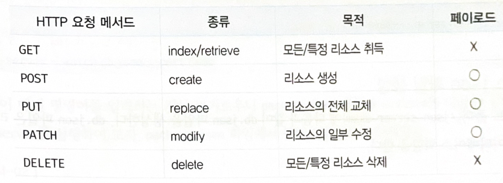

# 44장 REST API

REST(REpresentational State Transfer)

- 웹이  HTTP를 제대로 사용하지 못하고 있는 상황을 보고  HTTP 의 장점을 최대한 활용할 수 있는 아키텍쳐로 로이 필딩의 논문에서 처음 소개
- HTTP 프로토콜을 의도에 맞게 디자인하도록 유도
- REST의 기본 원칙을 성실히 지킨 서비스 디자인을 RESTful 이라고 표현함
- REST는 HTTP를 기반으로 클라이언트가 서버의 리소스에 접근하는 방식을 규정한 아키텍처이고, REST API는 REST를 기반으로 서비스 API를 구현한 것을 의미

## 44.1 REST API의 구성

- REST는 자원, 행위, 표현 3가지 요소로 구성 (자체 표현 구조로 REST API 만으로 HTTP 요청의 내용일 이해할 수 있음)

  - 자원(Resouce) 
    - URI (엔드포인트)

  - 행위(Verb)
    - 자원에 대한 행위
    - HTTP 요청 메서드

  - 표현(Representations)
    - 자원에 대한 행위의 구체적 내용
    - 페이로드

## 44.2 REST API  설계 원칙

REST에서 가장 중요한 기본 원칙 2가지

- **URI는 리소스를 표현**

  - URI는 리소스를 표현하는 데 중점

  - 동사보다는 명사를 사용
  - get 같은 행위에 대한 표현이 들어가서는 안 됨

  ```
  # bad
  GET /getTodos/1
  GET /todos/show/1
  
  # good
  GET /todos/1

- **리소스에 대한 행위는 HTTP요청 메서드로 표현**

  - HTTP 요청 메서드는 클라이언트가 서버에게 요청의 종류와 목적(리소스에 대한 행위)을 알리는 방법
  - 주로 5가지 요청 메서드(GET, POST, PUT, PATCH, DELETE 등)를 사용하여 CRUD를 구현

​			

## 44.3 JSON Server를 이용한  REST API 실습

http 요청을 전송하고 응답을 받으려면 서버가 필요함

### 44.3.1  JSON Server 설치

- npm을 이용하여 json-server 설치

  ```bash
  mkdir json-server-exam && cd json-server-exam
  npm init -y
  npm install json-server --save-dev
  ```

  > npm은 자바스크립트 패키지 매니저로, Node.js에서 사용할 수 있는 모듈들을 패키지화하여 모아둔 저장소 역할과 패키지 설치 및 관리를 위한 CLI를 제공함

### 44.3.2 db.json 파일 생성

```json
{
  "todos": [
    {
      "id": 1,
      "content": "HTML",
      "completed": true
    },
    {
      "id": 2,
      "content": "CSS",
      "completed": false
    },
    {
      "id": 3,
      "content": "Javascript",
      "completed": true
    }
  ]
}
```

### 44.3.3 JSON Server  실행

- 실행방법

  - `npx json-server db.json`
  - 변경을 감지하려면 `--watch` 옵션을 준다.
    - ` npx json-server --watch db.json`
  - 기본 port(3000)을 다른 port로 변경하려면 --port 옵션 사용
    - ` npx json-server --watch db.json --port 5000 `

- package.json 파일에 script로 추가

  ```json
  {
    "name": "json-server-exam",
    "version": "1.0.0",
    "scripts": {
      "start": "json-server --watch db.json"
    },
    "devDependencies": {
      "json-server": "^0.16.1"
    }
  }
  ```

  - `npm start` 로 실행

### 44.3.4 GET  요청

public 디렉토리를 생성하고, get_index.html 을 생성한다.

```html
<!DOCTYPE html>
<html>
<body>
  <pre></pre>
  <script>
    // XMLHttpRequest 객체 생성
    const xhr = new XMLHttpRequest();

    // HTTP 요청 초기화
    // todos 리소스에서 모든 todo를 취득(index)
    xhr.open('GET', '/todos');

    // HTTP 요청 전송
    xhr.send();

    // load 이벤트는 요청이 성공적으로 완료된 경우 발생한다.
    xhr.onload = () => {
      // status 프로퍼티 값이 200이면 정상적으로 응답된 상태다.
      if (xhr.status === 200) {
        document.querySelector('pre').textContent = xhr.response;
      } else {
        console.error('Error', xhr.status, xhr.statusText);
      }
    };
  </script>
</body>
</html>
```

-  http://127.0.0.1:3000/get_index.html 로 접속한다.


특정 id의 리소스를 취득하도록, get_retrieve.html 을 작성한다.

```html
<!DOCTYPE html>
<html>
<body>
  <pre></pre>
  <script>
    // XMLHttpRequest 객체 생성
    const xhr = new XMLHttpRequest();

    // HTTP 요청 초기화
    // todos 리소스에서 id를 사용하여 특정 todo를 취득(retrieve)
    xhr.open('GET', '/todos/1');

    // HTTP 요청 전송
    xhr.send();

    // load 이벤트는 요청이 성공적으로 완료된 경우 발생한다.
    xhr.onload = () => {
      // status 프로퍼티 값이 200이면 정상적으로 응답된 상태다.
      if (xhr.status === 200) {
        document.querySelector('pre').textContent = xhr.response;
      } else {
        console.error('Error', xhr.status, xhr.statusText);
      }
    };
  </script>
</body>
</html>
```

-  http://127.0.0.1:3000/get_retrieve.html 로 접속한다.

### 44.3.5 POST 요청

post.html

```html
<!DOCTYPE html>
<html>
<body>
  <pre></pre>
  <script>
    // XMLHttpRequest 객체 생성
    const xhr = new XMLHttpRequest();

    // HTTP 요청 초기화
    // todos 리소스에 새로운 todo를 생성
    xhr.open('POST', '/todos');

    // 요청 몸체에 담아 서버로 전송할 페이로드의 MIME 타입을 지정
    xhr.setRequestHeader('content-type', 'application/json');

    // HTTP 요청 전송
    // 새로운 todo를 생성하기 위해 페이로드를 서버에 전송해야 한다.
    xhr.send(JSON.stringify({ id: 4, content: 'Angular', completed: false }));

    // load 이벤트는 요청이 성공적으로 완료된 경우 발생한다.
    xhr.onload = () => {
      // status 프로퍼티 값이 200(OK) 또는 201(Created)이면 정상적으로 응답된 상태다.
      if (xhr.status === 200 || xhr.status === 201) {
        document.querySelector('pre').textContent = xhr.response;
      } else {
        console.error('Error', xhr.status, xhr.statusText);
      }
    };
  </script>
</body>
</html>
```

- http://localhost:3000/post.html
- POST 요청 시 setRequestHeader메서드를 사용하여 요청 몸체에 담아 서버로 전송할 페이로드의 MIME 타입을 지정해야 함

### 44.3.6 PUT 요청

PUT은 특정 리소스 전체를 교체할 떄 사용

MIME 타입을 지정

```html
<!DOCTYPE html>
<html>
<body>
  <pre></pre>
  <script>
    // XMLHttpRequest 객체 생성
    const xhr = new XMLHttpRequest();

    // HTTP 요청 초기화
    // todos 리소스에서 id로 todo를 특정하여 id를 제외한 리소스 전체를 교체
    xhr.open('PUT', '/todos/4');

    // 요청 몸체에 담아 서버로 전송할 페이로드의 MIME 타입을 지정
    xhr.setRequestHeader('content-type', 'application/json');

    // HTTP 요청 전송
    // 리소스 전체를 교체하기 위해 페이로드를 서버에 전송해야 한다.
    xhr.send(JSON.stringify({ id: 4, content: 'React', completed: true }));

    // load 이벤트는 요청이 성공적으로 완료된 경우 발생한다.
    xhr.onload = () => {
      // status 프로퍼티 값이 200이면 정상적으로 응답된 상태다.
      if (xhr.status === 200) {
        document.querySelector('pre').textContent = xhr.response;
      } else {
        console.error('Error', xhr.status, xhr.statusText);
      }
    };
  </script>
</body>
</html>
```

-  http://localhost:3000/put.html

### 44.3.7 PATCH 요청

PATCH는 특정 리소스의 일부를 수정할 때 사용

MIME 타입을 지정

```html
<!DOCTYPE html>
<html>
<body>
  <pre></pre>
  <script>
    // XMLHttpRequest 객체 생성
    const xhr = new XMLHttpRequest();

    // HTTP 요청 초기화
    // todos 리소스의 id로 todo를 특정하여 completed만 수정
    xhr.open('PATCH', '/todos/4');

    // 요청 몸체에 담아 서버로 전송할 페이로드의 MIME 타입을 지정
    xhr.setRequestHeader('content-type', 'application/json');

    // HTTP 요청 전송
    // 리소스를 수정하기 위해 페이로드를 서버에 전송해야 한다.
    xhr.send(JSON.stringify({ completed: false }));

    // load 이벤트는 요청이 성공적으로 완료된 경우 발생한다.
    xhr.onload = () => {
      // status 프로퍼티 값이 200이면 정상적으로 응답된 상태다.
      if (xhr.status === 200) {
        document.querySelector('pre').textContent = xhr.response;
      } else {
        console.error('Error', xhr.status, xhr.statusText);
      }
    };
  </script>
</body>
</html>
```

-  http://localhost:3000/patch.html

### 44.3.8 DELETE 요청

```html
<!DOCTYPE html>
<html>
<body>
  <pre></pre>
  <script>
    // XMLHttpRequest 객체 생성
    const xhr = new XMLHttpRequest();

    // HTTP 요청 초기화
    // todos 리소스에서 id를 사용하여 todo를 삭제한다.
    xhr.open('DELETE', '/todos/4');

    // HTTP 요청 전송
    xhr.send();

    // load 이벤트는 요청이 성공적으로 완료된 경우 발생한다.
    xhr.onload = () => {
      // status 프로퍼티 값이 200이면 정상적으로 응답된 상태다.
      if (xhr.status === 200) {
        document.querySelector('pre').textContent = xhr.response;
      } else {
        console.error('Error', xhr.status, xhr.statusText);
      }
    };
  </script>
</body>
</html>
```

-  http://localhost:3000/delete.html